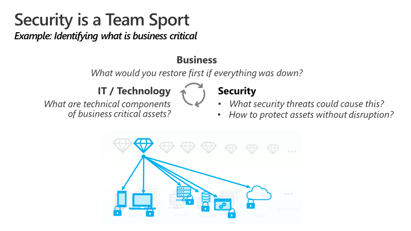

Shifting to the cloud for security is more than a simple technology
change, it's a generational shift in technology akin to moving from
mainframes to desktops and onto enterprise servers. Successfully
navigating this change requires fundamental shifts in expectations and
mindset by security teams. Adopting the right mindsets and expectations
reduces conflict within your organization and increases the
effectiveness of security teams.

While these could be part of any security modernization plan, the rapid
pace of change in the cloud makes adopting them an urgent priority.

-   Partnership with shared goals. In this age of fast paced decisions
    and constant process evolution, security can no longer adopt an
    "arms-length" approach to approving or denying changes to the
    environment. Security teams must partner closely with business and
    IT teams to establish shared goals around productivity, reliability,
    and security and work collectively with those partners to achieve
    them.

-   This partnership is the ultimate form of "shift left"---the
    principle of integrating security earlier in the processes to make
    fixing security issues easier and more effective. This requires a
    culture change by all involved (security, business, and IT),
    requiring each to learn the culture and norms of other groups while
    simultaneously teaching others about their own. Security teams must:

    -   Learn the business and IT objectives and why each is important
        and how they're thinking about achieving them as they
        transform.

    -   Share why security is important in the context of those business
        goals and risks, what other teams can do to meet security goals,
        and how they should do it.

-   Security is an ongoing risk, not a problem. You can't "solve"
    crime. At its core, security is just a risk management discipline,
    which happens to be focused on malicious actions by humans rather
    than natural events. Like all risks, security isn't a problem that
    can be fixed by a solution, it's a combination of the likelihood
    and impact of damage from a negative event, an attack. It's most
    comparable to traditional corporate espionage and criminal
    activities where organizations face motivated human attackers who
    have financial incentive to successfully attack the organization.

-   Success in either productivity or security requires both. An
    organization must focus on both security and productivity in
    today's "innovate or become irrelevant" environment. If the
    organization isn't productive and driving new innovation, it could
    lose competitiveness in the marketplace that causes it to weaken
    financially or eventually fail. If the organization isn't secure
    and loses control of assets to attackers, it could lose
    competitiveness in the marketplace that causes it to weaken
    financially and eventually fail.

-   No organization is perfect at adopting the cloud, not even
    Microsoft. Microsoft's IT and security teams grapple with many of
    the same challenges that our customers do such as figuring out how
    to structure programs well, balancing supporting legacy software
    with supporting cutting-edge innovation, and even technology gaps in
    cloud services. As these teams learn how to better operate and
    secure the cloud, they're actively sharing their lessons learned
    via documents like this along with others on the IT showcase site,
    while continuously providing feedback to our engineering teams and
    third-party vendors to improve their offerings.

-   Opportunity in transformation. It's important to view digital
    transformation as a positive opportunity for security. While it's
    easy to see the potential downsides and risk of this change, it's
    easy to miss the massive opportunity to reinvent the role of
    security and earn a seat at the table where decisions are made.
    Partnering with the business can result in increased security
    funding, reduce wasteful repetitive efforts in security, and make
    working in security more enjoyable as they will be more connected to
    the organization's mission.

As an architect you need to ensure all teams are aligned to a single
strategy that both enables and secures enterprise systems and data.

#### Security strategy principles

Watch the video below for an overview about the Security Strategy
principles:

> [!VIDEO https://www.microsoft.com/videoplayer/embed/RWtT8S]

#### Security roles and responsibilities

Business and technology outcomes are traditionally driven using a
plan/build/run framework (which is becoming increasingly agile for
digital transformation with rapid iteration through all stages).
Security Outcomes are driven through a similar framework of governance,
prevention and response that maps to that framework. This also maps to
the NIST Cybersecurity framework of identify, protect, detect, respond,
and recover functions. The diagram below shows how security roles map
to business outcome enablement:

 

Security Leadership Roles and Security Architect Roles provide vision,
guidance, and coordination across the organization and technical estate.

Security Posture and Compliance Roles focus on identifying security
risks across the enterprise and work with subject matter experts to
ensure the top risks are mitigated. The responsibility of these roles
typically includes Security Compliance Management, Policy and Standards,
and Posture management.

Platform Security Engineers are security subject matter experts (SMEs)
that focus on enterprise-wide systems like identity and key management,
and various infrastructure and endpoint disciplines like Network
security, Server/VM security, and Client endpoints/devices. 

Application Security Engineers are security SMEs that focus on securing
individual workload and applications, often as they're developed. These
responsibilities include per-workload application of infrastructure and
endpoint skills as well as application security & DevSecOps and Data
security. We expect that demand will continue to increase for these
skillsets as digital transformation increases adoption of Cloud
technology, DevOps/DevSecOps models, and Infrastructure as Code
approaches. 

People Security is an emerging discipline that focuses on educating
people, protecting them, and protecting the organization against insider
risks. 

The operational phase is executed by a combination of operations teams
who are responsible for the production environments (IT & OT Operations,
DevOps) + Security Operations teams. 

Security Operations typically focuses on reactive Incident monitoring &
response and proactive Threat Hunting for adversaries that slipped past
detections. Threat Intelligence and Incident preparation functions are
often incubated in security operations, but then shift to a broader
scope as they mature and become integrated into technology and
organizational processes. 

Creating a healthy Feedback loop is critical to effectiveness in all
parts of security (and in maturing security processes). We expect the
relationship between prevention and response to continue to get closer
as teams increasingly automate technical processes and adopt DevOps
style processes focused on rapid agile iteration.

#### Security strategy considerations

Security helps create assurances of confidentiality, integrity, safety,
and availability for a business. Security efforts have a critical focus
on protecting against the potential impact to operations caused by both
internal and external malicious and unintentional acts. The diagram
below shows that security is integrated as part of the cloud adoption
process and from the beginning (defining the strategy), security is
taking into consideration.

 

Adhering to these steps will help you integrate security at critical
points in the process. The goal is to avoid obstacles in cloud adoption
and reduce unnecessary business or operational disruption.

Effective security in the cloud requires a strategy that reflects the
current threat environment and the nature of the cloud platform that's
hosting the enterprise assets. A clear strategy improves the effort of
all teams to provide a secure and sustainable enterprise cloud
environment. The security strategy must enable defined business
outcomes, reduce risk to an acceptable level, and enable employees to be
productive.

A cloud security strategy provides guidance to all teams working on the
technology, processes, and people readiness for this adoption. The
strategy should inform the cloud architecture and technical
capabilities, guide the security architecture and capabilities, and
influence the training and education of teams.

Build and implement a security strategy for cloud that includes the
input and active participation of all teams. While the process
documentation format can vary, it always includes:

-   **Active input from teams:** Strategies typically fail if people in
    the organization don't buy into them. Ideally, get all teams in the
    same room to collaboratively build the strategy. In the workshops we
    conduct with customers, we often find organizations have been
    operating in de facto silos and these meetings often result in
    people meeting each other for the first time. We find that
    inclusiveness is a requirement. If some teams aren't invited, this
    meeting typically has to be repeated until all participants join it.
    If they don't join, then the project doesn't move forward.

-   **Documented and communicated clearly:** All teams must have
    awareness of the security strategy. Ideally, the security strategy
    is a security component of the overall technology strategy. This
    strategy includes why to integrate security, what is important in
    security, and what security success looks like. This strategy
    includes specific guidance for application and development teams so
    they can get clear, organized guidance without having to read
    through non-relevant information.

-   **Stable, but flexible:** Keep strategies relatively consistent and
    stable, but the architectures and the documentation might need to
    add clarity and accommodate the dynamic nature of cloud. For
    example, filtering out malicious external traffic would stay
    consistent as a strategic imperative even if you shift from the use
    of a third-party next generation firewall to Azure Firewall and
    adjust diagrams and guidance on how to do it.

-   **Start with business alignment:** Security teams will address many
    strategy issues large and small, but you need to start somewhere. We
    recommend establishing alignment to business goals and risk as the
    north star and starting point for the security strategy. This may be
    challenging at first, but by starting with concrete questions like
    "what would you restore first if all business systems were down?"
    you can start building relationships while establishing quick wins.

 

#### Deliverables 
The strategy step should result in a document that can easily be communicated to many stakeholders within the organization. The stakeholders can potentially include executives on the organization's leadership team.

We recommended capturing the strategy in a presentation to facilitate
easy discussion and updating. This presentation can be supported with a
document, depending on the culture and preferences.

-   Strategy presentation: You might have a single strategy presentation, or you might choose to also create summary versions for leadership audiences.

    -   Full presentation: This should include the full set of elements for the security strategy in the main presentation or in optional reference slides.

    -   Executive summaries: Versions to use with senior executives and board members might contain only critical elements relevant to their role, such as risk appetite, top priorities, or accepted risks.

-   You can also record motivations, outcomes, and business justifications in the [strategy and plan template](https://raw.githubusercontent.com/microsoft/CloudAdoptionFramework/master/plan/cloud-adoption-framework-strategy-and-plan-template.docx).

#### Best practices for building security strategy
Successful programs incorporate these elements into their security strategy process:

-   Align closely to business strategy: Security's charter is to protect business value. It's critical to align all security efforts to that purpose and minimize internal conflict.

    -   Build a shared understanding of business, IT, and security requirements.

    -   Integrate security early into cloud adoption to avoid last-minute crises from avoidable risks.

    -   Use an agile approach to immediately establish minimum security requirements and continuously improve security assurances over time.

    -   Encourage security culture change through intentional proactive leadership actions.

-   Modernize security strategy: The security strategy should include considerations for all aspects of modern technology environment, current threat landscape, and security community resources.

    -   Adapt to the shared responsibility model of the cloud.

    -   Include all cloud types and multicloud deployments.

    -   Prefer native cloud controls to avoid unnecessary and harmful friction.

    -   Integrate the security community to keep up with the pace of attacker evolution.

| Accountable team                                                                   | Responsible and supporting teams              |
|------------------------------------------------------------------------------------|-----------------------------------------------|
| Security leadership team (chief information security officer (CISO) or equivalent) | Cloud strategy team                           
|                                                                                    | Cloud security team                           
|                                                                                    | Cloud adoption team                           
|                                                                                    | Cloud center of excellence or central IT team |

#### Strategy approval

Executives and business leaders with accountability for outcomes or
risks of business lines within the organization should approve this
strategy. This group might include the board of directors, depending on
the organization.

