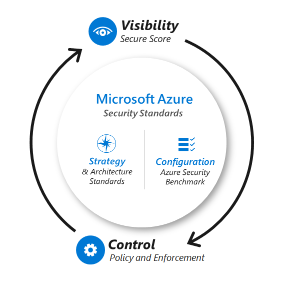
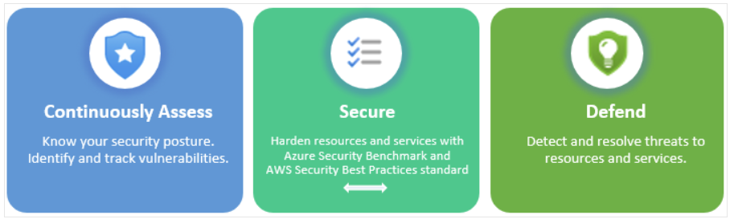

Planning puts the security strategy into action by defining outcomes,
milestones, timelines, and task owners. Security planning and cloud
adoption planning should not be done in isolation. It's critical to
invite the cloud security team into the planning cycles early, to avoid
work stoppage or increased risk from security issues being discovered
too late.

#### Security planning considerations

Security planning works best with in-depth knowledge and awareness of
the digital estate and existing IT portfolio that comes from being fully
integrated into the cloud planning process.

### Deliverables:

-   Security plan: A security plan should be part of the main planning documentation for the cloud. It might be a document that uses the [strategy and plan template](https://raw.githubusercontent.com/microsoft/CloudAdoptionFramework/master/plan/cloud-adoption-framework-strategy-and-plan-template.docx), a detailed slide deck, or a project file. Or it might be a combination of these formats, depending on the organization's size, culture, and standard practices. The security plan should include all of these elements:

    -   Organizational functions plan, so teams know how current security roles and responsibilities will change with the move to the cloud.

    -   Security skills plan to support team members as they navigate the significant changes in technology, roles, and responsibilities.

    -   Technical security architecture and capabilities roadmap to guide technical teams.

-   Security awareness and education plan, so all teams have basic critical security knowledge.

-   Asset sensitivity marking to designate sensitive assets by using a taxonomy aligned to business impact. The taxonomy is built jointly by business stakeholders, security teams, and other interested parties.

-   Security changes to the cloud plan: Update other sections of the cloud adoption plan to reflect changes triggered by the security plan.

### Best practices for security planning:

Your security plan is likely to be more successful if your planning
takes the approach of:

-   Assume a hybrid environment: That includes software as a service (SaaS) applications and on-premises environments. It also includes multiple cloud infrastructure as a service (IaaS) and platform as a service (PaaS) providers, if applicable.

-   Adopt agile security: Establish minimum security requirements first and move all noncritical items to a prioritized list of next steps. This should not be a traditional, detailed plan of 3-5 years. The cloud and threat environment changes too fast to make that type of plan useful. Your plan should focus on developing the beginning steps and end state:

    -   Quick wins for the immediate future that will deliver a high impact before longer-term initiatives begin. The time frame can be 3-12 months, depending on organizational culture, standard practices, and other factors.

    -   Clear vision of the desired end state to guide each team's planning process (which might take multiple years to achieve).

-   Share the plan broadly: Increase awareness of, feedback from, and buy-in by stakeholders.

-   Meet the strategic outcomes: Ensure that your plan aligns to and accomplishes the strategic outcomes described in the security strategy.

-   Set ownership, accountability, and deadlines: Ensure that the owners for each task are identified and are committed to completing that task in a specific time frame.

-   Connect with the human side of security: Engage people during this period of transformation and new expectations by:

    -   Actively supporting team member transformation with clear communication and coaching on:

        -   What skills they need to learn.

        -   Why they need to learn the skills (and the benefits of doing so).

        -   How to get this knowledge (and provide resources to help them learn).

    -   Making security awareness engaging to help people genuinely connect with their part of keeping the organization safe.

-   Review Microsoft learnings and guidance: Microsoft has published insights and perspectives to help your organization plan its transformation to the cloud and a modern security strategy. The material includes recorded training, documentation, and security best practices and recommended standards.

Microsoft has built capabilities and resources to help accelerate your
implementation of this security guidance on Microsoft Azure. The
following diagram shows a holistic approach for using security guidance
and platform tooling to establish security visibility and control over
your cloud assets in Azure.

 

You can use this model to proactively and continuously monitor the
evolution of a security strategy, which includes evaluating new security
capabilities that may be added over time. The arrows represent the
continuous assessment of workloads to bring visibility, in this case
using Secure Score from Defender for Cloud and enforcing controls using
policies.

### Establish essential security practices

Security in the cloud starts with applying the most important security
practices to the people, process, and technology elements of your
system. Additionally, some architectural decisions are foundational and
are very difficult to change later so should be carefully applied.

Whether you're already operating in the cloud or you're planning for
future adoption, we recommend that you follow these 11 essential
security practices (in addition to meeting any explicit regulatory
compliance requirements).

**People:**

-   Educate teams about the cloud security journey

-   Educate teams on cloud security technology

**Process:**

-   Assign accountability for cloud security decisions

-   Update incident response processes for cloud

-   Establish security posture management

**Technology:**

-   Require passwordless or multifactor authentication

-   Integrate native firewall and network security

-   Integrate native threat detection

**Foundational architecture decisions:**

-   Standardize on a single directory and identity

-   Use identity-based access control (instead of keys)

-   Establish a single unified security strategy

Each organization should define its own minimum standards. Risk posture
and subsequent tolerance to that risk can vary widely based on industry,
culture, and other factors. For example, a bank might not tolerate any
potential damage to its reputation from even a minor attack on a test
system. Some organizations would gladly accept that same risk if it
accelerated their digital transformation by three to six months.

### Security management strategy

The ultimate objectives for a security organization don't change with adoption of cloud services, but how those objectives are achieved will change. Security teams must still focus on reducing business risk from attacks and work to get confidentiality, integrity, and availability assurances built into all information systems and data. 

Security teams need to modernize strategies, architectures, and technology as the organization adopts cloud and operates it over time. While the size and number of changes can initially seem daunting, the modernization of the security program allows security to shed some painful burdens associated with legacy approaches. An organization can temporarily operate with legacy strategy and tooling, but this approach is difficult to sustain with the pace of change in cloud and the threat environment: 

Security teams are likely to be left out of cloud adoption decision making if they take a legacy mindset of "arms-length" security where the answer always starts with "no" (instead of working together with IT and business teams to reduce risk while enabling the business). 

Security teams will have a difficult time detecting and defending against cloud attacks if they use only legacy on-premises tooling and exclusively adhere to network perimeter-only doctrine for all defenses and monitoring. 

### Continuous assessment

Continuous assessment and validation of these systems is essential to
ensure secure configurations remain intact and previously unknown
vulnerabilities are identified. Continuous assessment is imperative to monitor the security posture of your workloads, which can include virtual machines, networks, storage, and applications. Since Cloud Computing by nature is very dynamic, new workloads will be constantly provisioned and if your cloud adoption isn't mature, you may not have all the guardrails in place to enforce security by default, which means that continuous assessment of your workloads become even more critical.  

In an IaaS and PaaS environment you can use Defender for Cloud
capabilities for continuous security assessment of your workloads.
Defender for Cloud fills three vital needs as you manage the security of
your resources and workloads in the cloud and on-premises:

 

| Security requirement                                                 | Defender for Cloud solution                                                                                                                                                                                                                                                                                                                                              |
|----------------------------------------------------------------------|--------------------------------------------------------------------------------------------------------------------------------------------------------------------------------------------------------------------------------------------------------------------------------------------------------------------------------------------------------------------------|
| Continuous assessment - Understand your current security posture.    | Secure score - A single score so that you can tell, at a glance, your current security situation: the higher the score, the lower the identified risk level.                                                                                                                                                                                                             |
| Secure - Harden all connected resources and services.                | Security recommendations - Customized and prioritized hardening tasks to improve your posture. You implement a recommendation by following the detailed remediation steps provided in the recommendation. For many recommendations, Defender for Cloud offers a "Fix" button for automated implementation!                                                               |
| Defend - Detect and resolve threats to those resources and services. | Security alerts - With the enhanced security features enabled, Defender for Cloud detects threats to your resources and workloads. These alerts appear in the Azure portal and Defender for Cloud can also send them by email to the relevant personnel in your organization. Alerts can also be streamed to SIEM, SOAR, or IT Service Management solutions as required. |

The central feature in Defender for Cloud that enables you to achieve
those goals is secure score. Defender for Cloud continually assesses
your resources, subscriptions, and organization for security issues. It
then aggregates all the findings into a single score so that you can
tell, at a glance, your current security situation: the higher the
score, the lower the identified risk level.

Defender for Cloud continuously discovers new resources that are being
deployed across your workloads and assesses whether they're configured
according to security best practices. If not, they're flagged and you
get a prioritized list of recommendations for what you need to fix.
Recommendations help you reduce the attack surface across each of your
resources.

Deploying Microsoft Defender for Cloud enables the continuous assessment
of your organization's security posture and controls. It strengthens
the security posture of your cloud resources, and with its integrated
Microsoft Defender plans, Defender for Cloud protects workloads running
in Azure, hybrid, and other cloud platforms. Learn more about Microsoft
Defender for Cloud.

In a SaaS environment with Microsoft 365, you can use Compliance Manager
for continuous assessment. Compliance Manager automatically identifies
settings in your Microsoft 365 environment that help determine when
certain configurations meet improvement action implementation
requirements. Compliance Manager detects signals from other compliance
solutions you may have deployed, including data lifecycle management,
information protection, communication compliance, and insider risk
management, and also uses Microsoft Secure Score monitoring of
complementary improvement actions.

Your action status is updated on your dashboard within 24 hours of a
change being made. Once you follow a recommendation to implement a
control, you'll typically see the control status updated the next day.
For example, if you turn on Azure Active Directory Multi-Factor Authentication in the
Azure AD portal, Compliance Manager detects the setting and reflects it
in the control access solution details. Conversely, if you didn't turn
on MFA, Compliance Manager flags that as a recommended action for you to
take.

Continuous strategy evolution

The evolution of your security strategy over time requires you to set
high-level goals and continually assess progress towards those goals.
One method for doing this is to establish and monitor security metrics.

Microsoft recommends scorecard metrics in four main areas:

* Business enablement -- How much security friction is in user experience and business processes?
* Security Improvement -- Are we getting better every month?
* Security Posture - How good are we at preventing damage?
* Security Response -- How good are we at responding to and recovering
    from attacks?

Sample metrics in each of these categories are summarized in the
following table. These performance measurements can help get the
discussion started on how to measure success for a security program.

Ultimately these measures and the targets/thresholds/weightings will be
customized by each organization based on their business goals, risk
appetite, and technical portfolio, and more.

| Security Area        | Metric                                                        |
|----------------------|---------------------------------------------------------------|
| Business Enablement  | Mean Time for security review                                 |
|                      | # days for application security review                        |
|                      | Average boot/logon time for managed devices                   |
|                      | Number of security interruptions in user workflow             |
|                      | % of IT help desk time spent on low-value security activities |
| Security Posture     | % of new apps reviewed                                        |
|                      | Secure score                                                  |
|                      | % compliant apps                                              |
|                      | # of privileged accounts meeting 100% of requirements         |
|                      | # of accounts meeting 100% of requirements                    |
| Security Response    | Mean Time to Recover (MTTR)                                   |
|                      | Mean Time to Acknowledge (MTTA)                               |
|                      | Time to Restore Critical Systems                              |
|                      | # of high severity incidents                                  |
|                      | Incident growth rate (overall)                                |
| Security Improvement | # of modernization projects open                              |
|                      | # modernization project milestones achieved in last 60 days   |
|                      | Number of repetitive manual steps removed from workflows      |
|                      | # of Lessons learned from internal/external incidents         |
|                      |                                                               |
