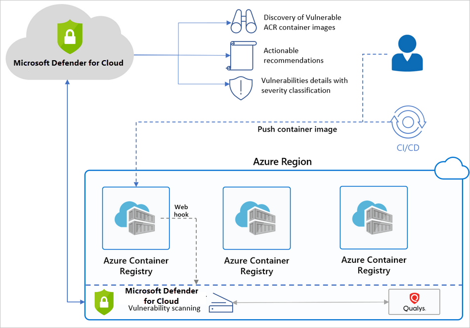

Azure Container Registry (ACR) is a managed, private Docker registry service that stores and manages your container images for Azure deployments in a central registry. It's based on the open-source Docker Registry 2.0.

To protect all the Azure Resource Manager based registries in your subscription, enable Azure Defender for container registries at the subscription level. Security Center will then scan images that are pushed to the registry, imported into the registry, or any images pulled within the last 30 days. This feature is charged per image.

## What are the benefits of Azure Defender for container registries?

Security Center identifies Azure Resource Manager based ACR registries in your subscription and seamlessly provides Azure-native vulnerability assessment and management for your registry's images.

Azure Defender for container registries includes a vulnerability scanner to scan the images in your Azure Resource Manager-based Azure Container Registry registries and provide deeper visibility into your images' vulnerabilities. The integrated scanner is powered by Qualys, the industry-leading vulnerability scanning vendor.

When issues are found by Qualys or Security Center, you'll get notified in the Security Center dashboard. Security Center provides actionable recommendations for every vulnerability, along with a severity classification and guidance for how to remediate the issue. For details of Security Center's recommendations for containers,

Security Center filters and classifies findings from the scanner. When an image is healthy, Security Center marks it as such. Security Center generates security recommendations only for images that have issues to be resolved. Security Center provides details of each reported vulnerability and a severity classification. Additionally, it gives guidance on how to remediate the specific vulnerabilities found in each image.

By only notifying when there are problems, Security Center reduces the potential for unwanted informational alerts.

## When are images scanned?

There are three triggers for an image scan:

- **On push** - Whenever an image is pushed to your registry, Security Center automatically scans that image. To trigger the scan of an image, push it to your repository.

- **Recently pulled** - Since new vulnerabilities are discovered every day, Azure Defender for container registries also scans any image that has been pulled within the last 30 days. There's no additional charge for a rescan; as mentioned above, you're billed once per image.

- **On import** - Azure Container Registry has import tools to bring images to your registry from Docker Hub, Microsoft Container Registry, or another Azure container registry. Azure Defender for container registries scans any supported images you import.

The scan typically completes within 2 minutes, but it might take up to 15 minutes. Findings are made available as Security Center recommendations.

## How does Security Center work with Azure Container Registry

Below is a high-level diagram of the components and benefits of protecting your registries with Security Center.

