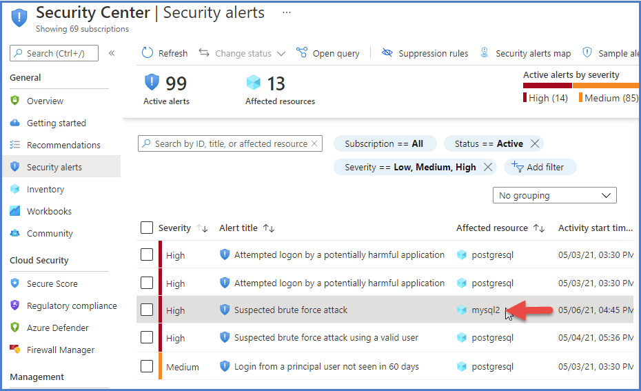

Microsoft Defender for Cloud detects anomalous activities indicating unusual and potentially harmful attempts to access or exploit databases. The plan makes it simple to address potential threats to databases without the need to be a security expert or manage advanced security monitoring systems.

This Defender for Cloud plan brings threat protections for the following open-source relational databases:

- Azure Database for PostgreSQL
- Azure Database for MySQL
- Azure Database for MariaDB

When you enable this plan, Microsoft Defender for Cloud will provide alerts when it detects anomalous database access and query patterns as well as suspicious database activities.

### Microsoft Defender alerts for open-source relational databases

Threat intelligence enriched security alerts are triggered when there are:

- **Anomalous database access and query patterns** For example, an abnormally high number of failed sign-in attempts with different credentials (a brute force attempt)
- **Suspicious database activities** For example, a legitimate user accessing an SQL Server from a breached computer that communicated with a crypto-mining C&C server
- **Brute-force attacks** With the ability to separate simple brute force from brute force on a valid user or a successful brute force.

