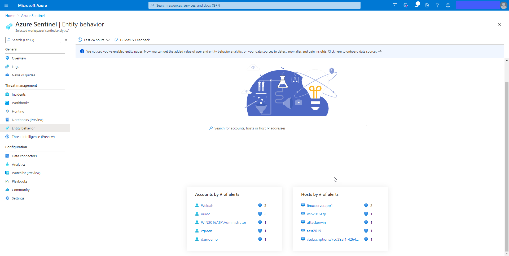

The Entity behavior page allows you to search for entities or select from the list of already displayed entities.  Once selected the Entity page is displayed with information and timeline of alerts and activities

The Incident Investigation Graph includes an option for **Insights**.  Insights display information from the Entity behavior data.