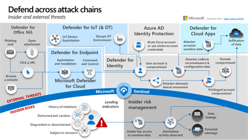
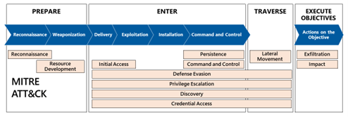

Effective security programs must protect against both insider risk as well as attacks from external threats. You can find best practices for both throughout the Microsoft Cybersecurity Reference Architecture (MCRA) and Microsoft Cloud Security Benchmark (MCSB). While all security controls should reduce risk in one or both of these scenarios, this section will focus primarily on insider risk aspects and the security operations elements of external attacks.

An attack chain describes the typical chain of events during an attack that leads to organizational damage. This includes technical and non-technical steps taken by adversaries or insiders during the attack. It's important to note that there is no single linear path for either insider risk or
external attacks. There are many common elements across attacks, but each one can take a unique path.

The MCRA includes an attack chain diagram that depicts common techniques related to both external attacks and insider risks, as shown below.

The top portion of this diagram represents common steps seen in many
external attacks and the Microsoft capabilities that map to each step.
The bottom portion shows the insider risk leading indicators and how
Microsoft Purview Insider Risk Management helps quickly identify,
triage, and act on risky user activity.

Most external attacks include common steps and follow common patterns that are depicted in the diagram above. Most of the variation in external
attacks comes from the use of different entry points. Attacks also differ based on the different objectives of the attackers like stealing data, encrypting data, or disrupting business.

Most external attacks that result in a major incident include some form
of privilege escalation using credential theft, which is mitigated by
securing privileged access. For more information, see [securing privileged access](https://aka.ms/SPA).

Lockheed Martin created one of the first adaptations of the 'kill chain' military concept to cybersecurity. This concept of a cybersecurity attack chain it helped mature how organizations understand attacks and plan security controls by viewing attacks as a sequential chain of events. Many organizations use the MITRE ATT&CK framework today for detailed control planning like threat detection coverage.

The diagram below describes how these relate to each other and to a simple
Prepare-Enter-Traverse-Execute (PETE) model that Microsoft developed to
improve communications with business leaders and non-security
professionals.

Attackers can choose different techniques to achieve each goal of prepare, enter, traverse, and execute objectives.
Attackers may also use a combination of techniques or the same technique over and over again iteratively to achieve their objectives.

All of the security best practices in the MCRA and MCSB are intended to
reduce risk of attackers succeeding. Several MCRA best practices focus directly on the security operations aspects of external attacks - detect, respond, recover.

These best practices include:

-   **Continuous improvement toward complete coverage** - Always work to continuously improve coverage of the attack
    chain to areas with no visibility and highly vulnerable
    areas with no preventive controls.

-   **Balanced control investments** - Balance investments into security controls across the full lifecycle of
    identify, protect, detect, respond, and recover

-   **From SIEM for everything to "XDR + SIEM"** - The primary tool for
    security operations to detect attacks and respond to them has been
    the Security Information and Event Management (SIEM) capability.
    Once introduced, extended detection and response (XDR) tools quickly
    became indispensable for the platforms they monitor (starting with
    Endpoint Detection and Response (EDR) for endpoints) because they
    quickly reduce false positives. These tools do not cover the breadth of sources that the
    SIEM does, but they greatly simplify and increase effectiveness of
    detection and response for technologies covered by XDR. Security
    best practices then shifted to reflect the strengths of SIEM (broad
    visibility and correlation across all tools and technology) and of
    XDR tooling (simple high quality threat detection on covered
    assets), and the collective need for both types of tooling in
    security operations.

-   **SOAR Automation and Modern Analytics** - Reduce the amount of
    manual effort in security operations by integrating the use of
    security orchestration, automation, and response (SOAR), Machine
    Learning (ML), and User Entity Behavioral Analytics (UEBA) technologies. SOAR technology
    automates manual efforts that distract and tire human analysts
    during detection, investigation, and other response tasks. ML
    greatly improves detection by allowing computers to extend human
    expertise over large datasets and spot anomalies that could be
    attacker activity. UEBA improves detection and investigation by
    profiling the individual user accounts and entities that attackers
    compromise, rather than attempting to find patterns in the full set
    of raw log data.

-   **Adapt processes to Operational Technology (OT)** - Adjust your
    tools and processes to the constraints of OT environments as you integrate them. These environments prioritize safety and
    often have older systems which don't have patches available and may
    crash from an active scan. Focusing on approaches like passive
    network detections for threats and isolation of systems is
    often the best approach.

-   **Build appropriate controls for Insider Risk as a distinct focus area** - While some of the objectives for insider risk attacks are
    similar to external attacks, reducing insider risk is different than reducing
    risk from external attacks. Insider risks can include elements like:

    -   Leaks of sensitive data and data spillage
    -   Confidentiality violations
    -   Intellectual property (IP) theft
    -   Fraud
    -   Insider trading
    -   Regulatory compliance violations

The Microsoft Cloud Security Benchmark includes many best practices that help protect from insider and
external attacks including the security controls listed in the table below focused on security operations related topics:

|      MCSB Control Domain     |      Security Controls     |
|---|---|
|     Incident Response (IR)    |     IR-1: Preparation - update incident response plan and   handling process     IR-2: Preparation - setup incident notification     IR-3: Detection and analysis - create incidents based on   high-quality alerts     IR-4: Detection and analysis - investigate an incident     IR-5: Detection and analysis - prioritize incidents     IR-6: Containment, eradication and recovery - automate the   incident handling     IR-7: Post-incident activity - conduct lesson learned and   retain evidence    |
|     Logging and Threat Detection (LT)    |     LT-1: Enable threat detection capabilities     LT-2: Enable threat detection for identity and access   management     LT-3: Enable logging for security investigation     LT-4: Enable network logging for security investigation     LT-5: Centralize security log management and analysis     LT-6: Configure log storage retention     LT-7: Use approved time synchronization sources    |

For more information on the security controls in each of these areas,
see [Microsoft cloud security benchmark docs](<https://aka.ms/benchmarkdocs>).

These best practices in MCRA and MCSB can help you improve your security
program effectiveness for both insider risk as well as attacks by
external threat actors.
