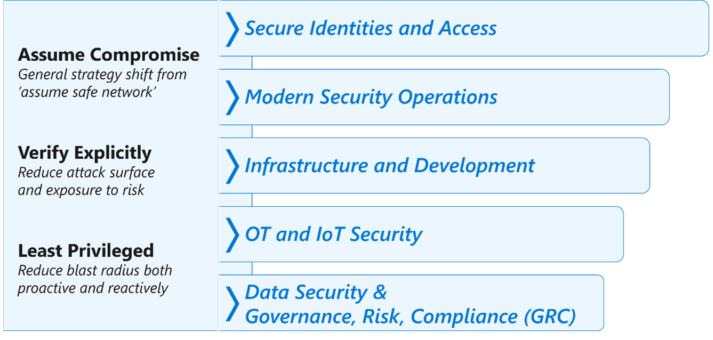

A Zero Trust approach to security is required to be effective at keeping up with threats, changes to cloud platforms, and changes in business
models responding to a rapidly evolving world. You can find best practices for adopting a Zero Trust approach to security throughout the
Microsoft Cybersecurity Reference Architecture (MCRA) and Microsoft cloud security benchmark (MCSB). Most modern security controls support a Zero Trust strategy, so this section will focus primarily on best practices related to the first and most visible priority for Zero Trust - modernizing
access control. For more information, see [Access Control discipline in the Cloud Adoption Framework Secure Methodology (CAF Secure)](https://aka.ms/CAFSecure-AccessControl).

Microsoft Zero Trust approach to security is based on three principles: assume breach, verify explicitly, and least privilege. These principles apply across the technical estate and are usually applied to a Zero Trust transformation through a series of modernization initiatives.

The initiatives include:

- **Secure Identities and Access** - This initiative focuses on modernizing access control, ensuring that users can access the resources they need securely from anywhere. Modern access control is built on explicit validation of trust signals on users and devices, rather than on traditional reliance on network location for trust. This also applies the general mindset of assuming breach/compromise, and implementing least privilege to limit who has access to resources (limiting permissions, just in time permissions, and more).
- **Modern Security Operations** - This initiative focuses on reducing organizational risk by reducing attacker dwell time. Dwell time is how long an attacker has access to resources before they are detected and removed. Reducing dwell time relies on the assume breach principle to build modern detection for attackers that try to stay hidden.
- **Infrastructure and Development Security** - This initiative focuses on integrating security into infrastructure, platforms, and applications. Security should be a part of related initiatives such as migrating existing workloads to cloud or developing new workloads using DevOps and other processes.
- **Operational Technology (OT) and Internet of Things (IoT) security** - This initiative focuses on modernizing security of OT and IoT devices and adapting Zero Trust principles within the constraints of the older technologies that have limited processing power and connectivity, stringent regulations and safety concerns, and operational uptime requirements.
- **Data Security** - This initiative focuses on enabling an organization to discover, classify, protect, and monitor critical business data.
- **Governance, Risk, and Compliance** - This initiative focuses on the modernization of the functions which ensure that the organization is    consistently meeting security and compliance requirements. These functions embed the principles of Zero Trust in processes, practices, and policies.

The MCRA includes many best practices related to the access control modernization initiative

- **Prioritize privileged access** - Protect privileged resources with elevated protections.
- **Apply Zero Trust principles to modernizing access control** - Assume breach, explicitly validate telemetry and signals during access requests and
authorized sessions, and apply least privilege to how much access accounts get (and for how long). This can be done with Azure Active Directory (Azure AD) Conditional Access and should include:
    - **Explicitly validate multi-factor authentication (MFA)** - Verify that user account authentication combines multiple types of validation and that the user is who they claim to be.
    - **Explicitly validate user trust signals** - Measure risk on the user and their session including behavior patterns, timing, and location. This can be implemented with Azure AD Identity Protection and Azure AD Conditional Access.
    - **Explicitly validate device trust signals** - device trust signals measure whether the user's device is configured properly, patched, and     whether the device is known to be compromised by an attacker. This can be implemented with Azure AD Conditional Access, Microsoft Intune, and Microsoft Defender for Endpoint.
    - **Continually improve signal coverage and fidelity** to keep up with attackers as they find new ways to evade existing controls.
    - **Enforce authentication policies consistently** - across all access requests including direct to cloud applications, remote network access through VPNs, remote access of legacy and on-premises applications through application proxies, and local wireless and wired network access. This allows people to work securely from anywhere.

- **Integrate security operations signals with access decisions.** - Access decisions should integrate current information on compromised devices, users, and other assets. Access should be blocked to and from compromised assets while they are being cleaned up by security operations. Access should be granted after the asset's integrity has been restored.

- **Simplify Identity and Access management architecture.** Complexity can degrade security because it causes human error in manual tasks and in implementing automation. These errors open up gaps and inconsistencies that attackers can exploit. The experience of general users, IT personnel, and security engineers should be simplified as much as possible. For example, using a single identity and implementing single sign-on will simplify the user experience and reduce friction and complexity in security operations workflows, administrator workflows, and more. Using a single directory will simplify architecture, operations, and security operations.

- **Go beyond VPNs to modernize access to on-premises applications** - This enables people to work from home without slowdowns and the extra steps that VPNs introduce. This concept is included in the adoption of secure access service edge (SASE) architectures that focuses heavily on identity-enabled network access technologies.

Many Zero Trust best practices can be found in the MCSB security controls including those listed in table below that focus on modernizing
access control:

|      MCSB Control Domain     |      Security Controls     |
|---|---|
|     Identity Management (IM)    |     IM-1: Use centralized identity and authentication system     IM-2: Protect identity and authentication systems     IM-3: Manage application identities securely and   automatically     IM-4: Authenticate server and services     IM-5: Use single sign-on (SSO) for application access     IM-6: Use strong authentication controls     IM-7: Restrict resource access based on conditions     IM-8: Restrict the exposure of credential and secrets     IM-9: Secure user access to existing applications    |
|     Privileged Access (PA)    |     PA-1: Separate and limit highly privileged/administrative   users     PA-2: Avoid standing access for user accounts and   permissions     PA-3: Manage lifecycle of identities and entitlements     PA-4: Review and reconcile user access regularly     PA-5: Set up emergency access     PA-6: Use privileged access workstations     PA-7: Follow just enough administration (least privilege)   principle     PA-8 Determine access process for cloud provider support    |
|     Network security (NS)    |     NS-1: Establish network segmentation boundaries     NS-2: Secure cloud services with network controls     NS-3: Deploy firewall at the edge of enterprise network     NS-4: Deploy intrusion detection/intrusion prevention   systems (IDS/IPS)     NS-5: Deploy DDOS protection     NS-6: Deploy web application firewall     NS-7: Simplify network security configuration     NS-8: Detect and disable insecure services and protocols     NS-9: Connect on-premises or cloud network privately     NS-10: Ensure Domain Name System (DNS) security    |

For more information on the security controls in each of these areas, see [Microsoft cloud security benchmark docs](https://aka.ms/benchmarkdocs)