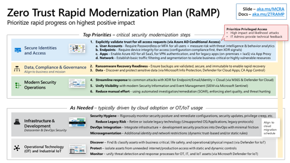

Zero Trust is a major transformation of a security program, so it's critical to start with the most impactful items that get you the most security and productivity increases with the least amount of time and resources.

The Zero Trust Rapid Modernization Plan (RaMP) is included in the Microsoft Cybersecurity Reference Architecture (MCRA) and provides best practices that help you prioritize your security modernization. This RaMP identifies the most effective controls for the most relevant and common attacks that require the least amount of investment of time, effort, and resources.

The Zero Trust RaMP aligns to the recommended security modernization initiatives, including the following:

- **Secure Identities and Access** - These quick wins focus on using cloud-based security capabilities like Azure AD, Intune, Microsoft
    Defender for Endpoints, and Azure AD App Proxy to rapidly modernize access control to increase productivity and security assurances.

- **Data Security and Governance, Risk, Compliance (GRC)** - These quick wins focus on ensuring the organization can rapidly recover
    from a ransomware/extortion attack without paying attackers and protecting the most valuable business critical data.

- **Modern Security Operations** - These quick wins focus on streamlining responses to common attacks, getting end to end
    visibility across the enterprise, and automating manual tasks that slow down analysts and cause exhaustion/burnout.

- **Infrastructure and Development Security** - These quick wins focus on security hygiene, reducing legacy risk, integrating
    security into DevOps and development processes, and applying the microsegmentation concepts to identity and network access control.

- **Operational Technology (OT) and Internet of Things (IoT) security** - These quick wins focus on quickly discovering, protecting, and monitoring these systems for attacks.

These best practices in the Zero Trust RaMP can help you accelerate your journey of Zero Trust security transformation.
