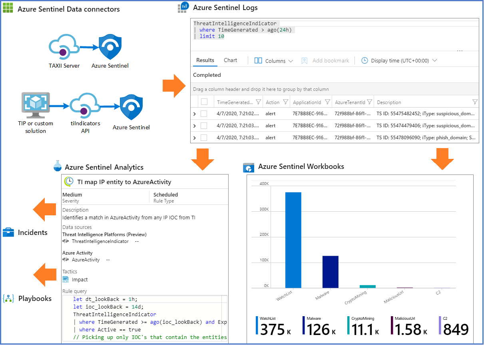

Cyber threat intelligence (CTI) can come from many sources, such as open-source data feeds, threat intelligence-sharing communities, paid intelligence feeds, and security investigations within organizations. CTI can range from written reports on a threat actor's motivations, infrastructure, and techniques, to specific observations of IP addresses, domains, and file hashes. CTI provides essential context for unusual activity, so security personnel can act quickly to protect people and assets.

The most utilized CTI in SIEM solutions like Microsoft Sentinel is threat indicator data, sometimes called Indicators of Compromise (IoCs). Threat indicators associate URLs, file hashes, IP addresses, and other data with known threat activity like phishing, botnets, or malware. This form of threat intelligence is often called tactical threat intelligence, because security products and automation can use it in large scale to protect and detect potential threats. Microsoft Sentinel can help detect, respond to, and provide CTI context for malicious cyber activity.

You can integrate threat intelligence (TI) into Microsoft Sentinel through the following activities:

- Use Data connectors to various TI platforms to import threat intelligence into Microsoft Sentinel.

- View and manage the imported threat intelligence in Logs and the new Threat Intelligence area of Microsoft Sentinel.

- Use the built-in Analytics rule templates to generate security alerts and incidents using your imported threat intelligence.

- Visualize critical information about your threat intelligence in Microsoft Sentinel with the Threat Intelligence workbook.

- Perform threat hunting with your imported threat intelligence.

