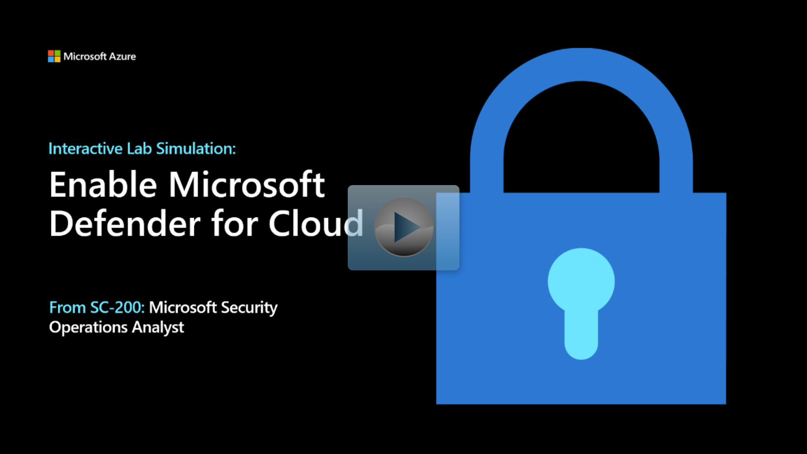

Now that you have an understanding of Microsoft Defender for Cloud see it in action.

> [!NOTE]
> Select the thumbnail image to start the lab simulation. When you're done, be sure to return to this page so you can continue learning.

