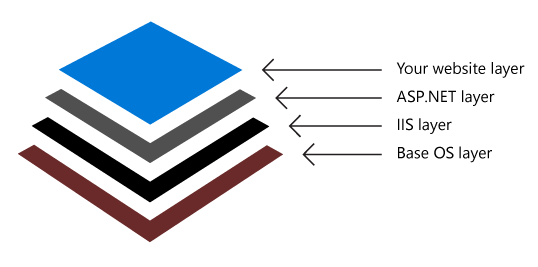

As Contoso migrates and virtualizes various workloads, an option to containerize some of the workloads might occur. The Windows Server administrator will assess containers, understand how they work and what the benefits of using them might be. Benefits might include mobility, agility, increased efficiency, and server densities. All these benefits contribute to more optimized server workloads and consistency of development environments.

**What are containers?**

A container is used to package an application along with all of its dependencies and abstract it from the host operating system (OS) in which it will run. Containers provide a lightweight development and runtime environment in which applications can be run and shared easily during development. Not only is a container isolated from the host OS, it's also isolated from other containers. Isolated containers provide a virtual runtime, which can also improve the security and reliability of the apps that run within them.

Traditionally, a software application is developed to run on a supported processor, hardware, and OS platform. Software applications typically require additional coding to provide support for the different runtime platforms. With so many diverse computing systems, a more efficient software development and management platform are needed to support portability between multiple computing environments. Containers help provide such portability.

**Benefits of using containers**

Benefits of using containers include the following:

- The ability to run anywhere. Containers can run on various platforms such as Linux, Windows, and Mac operating systems. They can be hosted on a local workstation, on servers in on-premises datacenters, or provisioned in the cloud.

- Isolation. To an application, a container appears to be a complete OS. The CPU, memory, storage, and network resources are virtualized within the container and are isolated from the host platform and other applications.

- Increased efficiency. Containers can be quickly deployed, updated, and scaled to support a more agile development, test, and production life cycle. Because they are more efficient in terms of resources they consume, their footprint is smaller, which allows for increased density on servers.

- A consistent development environment. Developers use containers as a consistent and predictable development environment that supports various development languages such as Java, .NET, Python, and Node.js. Developers know that no matter where the application is deployed, the container will ensure that the application runs as intended.

**How containers work**

The processor in a standard Windows computer has two different modes: a kernel mode and a user mode. Core OS components and most device drivers run in kernel mode, whereas applications run in user mode.

When you install container technology on a computer, each container creates an isolated, lightweight silo used for running an app on the host OS. A container builds upon and shares most of the host operating system's kernel to gain access to the file system and registry.

Each container has its own copy of the user mode system files, which are isolated from other containers and from the host's own user mode environment. The ability to isolate the user mode is provided by a container base image, which consists of the user mode system files that are needed to support a packaged app. Container base image templates provide a foundational layer of OS services used by the containerized app that aren't provided (or restricted) from the host's kernel mode layer.

The layer in which application and code changes are made sits on top of these prebuilt container base OS image layers. These base OS layers are developed and updated separately from the container layers that are used actively for application or code changes. Base layers are pulled down to the local working environment without being updated, and then work is started in container layers which run on the base layers. This allows for development environments that are smaller, more lightweight, and more portable.

When you build your own container image to host your application, you start by leveraging a container base OS image or a pre-built container image that has the dependencies you need. On top of these layers, you build your own layers with the application you want to run in a container. Each operation to create the container image builds on top of the last one. This adds to the image size, but allows you to conveniently segregate the OS, framework, dependencies, and application layers.

**Containers and micro-services**

Micro-services applications are defined as a cloud native architectural approach in which a single application is composed of many loosely coupled and independently deployable smaller components, or services. Each of these smaller components or services can be represented by a container. However, containers don't necessarily implement a micro-services architecture.

A container can host a monolithic application, but they were not designed for that intention. By default, Docker (or another container runtime) as well as the container orchestrator will assume a container can always be safely deleted/removed and another container can simply take its place if needed. On a VM, if you configure an application to write to the VM disk, you can safely stop and start the VM and the data will persist to the disk - just like the VM will safely boot and continue its operation. With containers, if you remove a container and bring another one in its place, only the existing layers of that container image will be there. On a micro-services environment, this should not be a problem if you have persistence of the state and data.

While you can run a container and manage it much like a VM, it is recommended that you adopt the practices of separation of state and data and ensure your container can sustain being deleted. This will allow you to take advantage of other practices such as DevOps.

In practice, you should not store any data or state inside the container image and its layers. Instead, you should use external persistent storage that allows any container instance to access it.