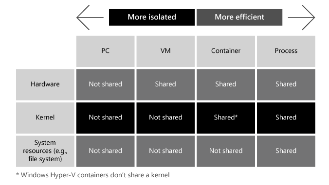

The Contoso Windows Server administrator will need to determine what workloads and scenarios are appropriate for VMs and which are more suitable for containers. They will assess the characteristics of VM and container workloads, scenarios where they can be used, and in what circumstances container workloads can be used to increase efficiency.

**VMs versus containers**

Both VMs and containers are virtualization technologies used to provide isolated and portable computing environments for applications and services:

- VMs simulate an entire computer, including virtualized hardware, the OS, user mode, and its own kernel mode. VMs are quite agile and provide tremendous support for applications; however, VMs tend to be large and consume host machine resources.

- Containers (as previously described) build upon the host operating system's kernel and contain an isolated user mode process for the packaged app. This helps to make containers very lightweight and fast to launch. Different from VMs, containers can be easily moved from development, to test, to production environments. However, because the OS is not quite the same, not all applications run the same (or at all) on a container environment.

**Similarities and differences**

The following table summarizes the similarities of and differences between features for VMs and containers.

| **Feature**| **VM**| **Container** |
| - | - | - |
| Isolation| Provides complete isolation from the host OS and other VMs.| Provides lightweight isolation from the host and other containers. |
| OS| Runs a complete OS including the kernel.| Only runs the user mode portion of an OS. |
| Guest compatibility| Able to run any supported OS inside the VM| Windows containers require matching host and container OS versions. (Please see isolation mode for more details and alternatives) |
| Deployment| Deployed by using Hyper-V manager or other VM management tools.| Deployed and managed by using Docker or another container runtime. Multiple containers can be deployed by using an orchestrator such as Kubernetes. |
| Persistent storage| Uses virtual hard disk files or Server Message Block (SMB) share.| Data doesn't persist when a container no longer exists. To persist data in a container with Windows Server, it's required to use persistent storage. |
| Load balancing and high availability| Uses a Windows failover cluster or Windows load balancer to move VMs as needed and support higher volume.| Uses a container orchestrator to automatically start and stop containers, auto-scale, and support additional traffic. |
| Networking| Uses virtual network adapters.| Different networking options are available depending on the scenario. Default is a Network Address Translation (NAT) network that uses an internal switch and maps ports from host to container. |

> [!Note]
> It is common to provision containers within a highly optimized VM to provide enhanced isolation and security.

**Advantages of containers**

At a high level, containers:

- Require relatively few resources. They are less resource-intensive than VMs.

- Start up quickly. Container startup times are roughly equivalent to the time required to start a new process.

- Improve server density. Containers enable more efficient utilization of memory, disk, and CPU from the available hardware than VMs. This results in fewer idle servers, resulting in better utilization of the existing compute resources. This is especially important for cloud providers and users because it can reduce costs.

- Portability. Containers behave the same regardless of the environment they are running. A container will have the dependencies for an application to work. This allows a container to perform the same between dev, test, and production as well as between on-premises and cloud.

The following graphic provides a comparison of isolation and efficiency between PCs, VMs, containers, and processes, and illustrates that:

- PCs provide the greatest degree of isolation. Isolation is progressively less for VMs, containers, and processes.

- Processes provide the greatest degree of efficiency, and in turn possible density. Containers, VMs, and PCs are progressively less efficient.

- Hardware, kernel, and system resources (such as a file system) are shared:

	- VMs share only hardware.

	- Containers share hardware and a kernel (except Windows Hyper-V containers, which don't share a kernel).

	- Processes share hardware, a kernel, and system resources.

	- PCs don't share any of these.

> [!Tip]
> For persistent storage, you can use a bind mount to mount a location on the local machine. Files within the location will be available when you restart a container, or if you want to share the files with multiple containers. If you want a container to run on multiple machines with access to the same files, then a named volume or SMB mount should be used instead.

Orchestrators such as Kubernetes have its own implementation of persistent storage.

> [!Caution]
> Do not bind mount sensitive directories such as C:\ into an untrusted container. This would allow the untrusted container to change files on the host that it wouldn't normally have access to and could create a security breach. Furthermore, make sure your container will work properly when moving to a different environment. This means avoiding binding a container to specific drive on a specific host.

**When to choose a VM**

Use a VM when you:

- Need to manage multiple operating systems.

- Need to run an app that requires all the resources and services of a full OS, such as a graphical user interface (GUI).

- Need an environment that preserves changes and is persistent. Example: Databases are not good candidates to run on containers.

- Require full isolation and security.

**When to choose a container**

Use a container when you:

- Need a lightweight application package that starts quickly.

- Need to deploy multiple instances of a single app - auto-scale and/or horizontal scale are needed.

- Need to run an app or process that's nonpersistent in an on-demand basis.

- Need to deploy an app that can run on any underlying infrastructure.