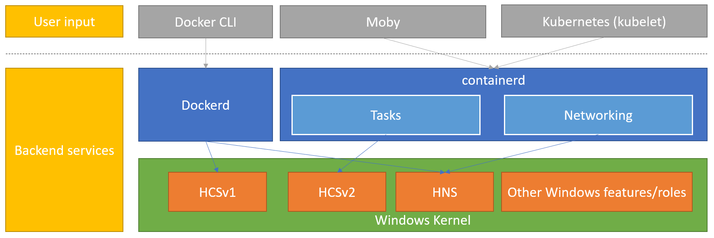

The Contoso Windows Server administrator needs to understand Docker, Docker containers, container runtimes, and how they can be run on Windows Server.

**Overview of Docker and container runtimes**

Docker Inc. is a company that has put together a collection of open-source tools, solutions, and cloud-based services that provide a common model for packaging (also known as containerizing) app code into a standardized unit for software development. This standardized unit, called a Docker container, is software wrapped in a complete file system that includes everything it needs to run: code, runtime, system tools, system libraries, and anything you can install on a server.

To support a Docker container, there are two underlying components that come into play which are usually hidden or unnoticed by the user running a container. These two components are the container runtime and the OS features to support containers. On Windows Server, the feature that supports Docker container is simply called "Containers". This feature interacts with a component called Host Compute Service (HCS). HCS is responsible for orchestrating the virtualization platform on Windows Server and is the lower API that supports both containers and Hyper-V VMs.

Above the OS feature that schedules containers, is a container runtime. A container runtime sits between the CLI, UI, or container orchestrator and the underlying OS feature. It's the container runtime's job to translate commands from the user or container orchestrator to the OS platform capabilities. For example, when you ask the Docker CLI to run a new container, the CLI will interact with the container runtime, which in turn sends the command to the OS in a way that it understands. Container runtimes exist so the above layers don't have to know how the OS expects to receive commands. From a user standpoint, this is important because different container runtimes will have different features and capabilities.

There are many different container runtimes available for running containers on Windows Server. The most common ones are:

- Moby Project. Moby is the open-source project from which Docker builds its commercial projects. On Windows Server, Moby is a community-supported project that leverages dockerd as the container runtime. Moby is ideal for testing containers on Windows Server. When installed, Moby provides not only the dockerd container runtime, but also the CLI to interact with containers on Windows Server.

> [!Caution]
> Dockerd on Windows and Windows Server uses HCSv1. On Linux, Moby has shifted to use containerd as the container runtime. There is currently work happening to move Moby to containerD on Windows, leveraging the newer and improved HCSv2 interface.

 

- ContainerD. ContainerD is an open-source container runtime and has recently been established as the preferred container runtime for Kubernetes environments. ContainerD can be used in production environments and is the default container runtime for Windows Server 2022 when running on Kubernetes environments. When installed, ContainerD does not provide a CLI for interacting with containers. Other open-source CLIs such as CRICTL or NerdCTL can be used instead.

- Mirantes Container Runtime (MCR). MCR, formally known as Docker Enterprise Edition (Docker EE), provides the same functionality as Docker CE plus extra features built specifically for enterprise deployments. MCR is recommended when using Docker Swarm as the container orchestrator. When installed, MCR provides the container runtime and the same CLI experience than Docker and Moby.

> [!Note]
> **Another component called the Docker Desktop for Windows can be used on Windows 10 and 11 for development purposes.**

**Run containers on Windows Server**

Before you run containers on Windows Server, you need to figure out which container runtime you want to use on your environment. The container runtime will dictate the installation process that you need to follow. For more information on the options on Windows Server and how to install each, see [how to prepare your Windows Server host for containers](/virtualization/windowscontainers/quick-start/set-up-environment?tabs=dockerce).

> [!Important]
> If you plan to use Hyper-V isolation mode for your containers, you'll also need to install the Hyper-V server role on the host server. Also, if the host server is itself a VM, you need to enable nested virtualization before you install the Hyper-V role. Because Windows 10 and 11 runs Windows-based containers by default in Hyper-V isolation mode, to support this default mode the Hyper-V feature must be installed on the Windows 10 and 11 host environment.

**The Docker Hub**

Containers are built on container images, and these images can be stored in repositories. Repositories act as a location where you can build, store, secure and share container images. The Docker Hub is a web-based online library service, managed by Docker, in which you can:

- Register, store, and manage your own Docker images in an online repository and then share them with others.

- Access over 100,000 container images from software vendors, open-source projects, and other community members.

**Microsoft Container Registry**

Microsoft provides container images through the Microsoft Container Registry (MCR) at mcr.microsoft.com. This is the official source of Microsoft-provided container images. Regardless of where Microsoft container images are discovered, the pull source is mcr.microsoft.com.

> [!Note]
> **Azure Container Registry** is an Azure service which you can use to build your own container image repository. You can use this repository to store and manage images for all types of container deployment.