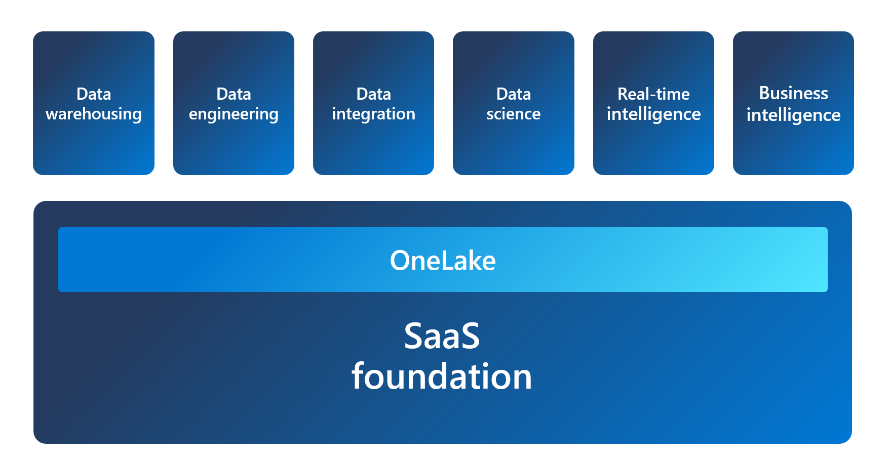

---
ms.custom:
  - build-2023
---
Microsoft Fabric is an all-in-one analytics solution for enterprises that covers everything from data movement to data science, real-time analytics, and business intelligence. It offers a comprehensive suite of services, including:

- data warehousing
- data engineering
- data integration
- data science
- real-time analytics
- business intelligence

The foundation of the platform is based on Software as a Service (SaaS), which provides a simple and integrated approach. The image below shows the Fabric architecture, with OneLake as the foundation, and each *experience* built on top.

All of the Fabric experiences use OneLake as their native store without needing any additional configuration. OneLake is hierarchical in nature to simplify management across your organization. There's only one OneLake per tenant and it provides a single-pane-of-glass file-system namespace that spans across users, regions and even clouds. The data in OneLake is divided into manageable containers for easy handling.

## Understand Fabric concepts: tenant, capacity, domain, workspace, and item

A Fabric *tenant* is a dedicated space for organizations to create, store, and manage Fabric items. There's often a single instance of Fabric for an organization, and it's aligned with Azure Active Directory. The Fabric *tenant* maps to the root of OneLake and is at the top level of the hierarchy.

*Capacity* is a dedicated set of resources that is available at a given time to be used. A tenant can have one or more capacities associated with it.  Capacity defines the ability of a resource to perform an activity or to produce output. Different items consume different capacity at a certain time. Fabric offers capacity through the Fabric SKU and Trials.

A *domain* is a logical grouping of workspaces. Domains are used to organize items in a way that makes sense for your organization. You can group things together in a way that makes it easier for the right people to have access to the right workspaces. For example, you might have a domain for sales, another for marketing, and another for finance. 

A *workspace* is a collection of items that brings together different functionality in a single tenant. It acts as a container that leverages capacity for the work that is executed, and provides controls for who can access the items in it. For example, in a sales workspace, users associated with the sales organization can create a data warehouse, run notebooks, create datasets, create reports, etc.

Fabric *items* are the building blocks of the Fabric platform. They're the objects that you create and manage in Fabric. There are different types of items, such as data warehouses, data pipelines, datasets, reports, and dashboards.

Understanding Fabric concepts is important for you as an admin, because it helps you understand how to manage the Fabric environment.

> [!NOTE]
> See [Enable Microsoft Fabric for your organization](https://learn.microsoft.com/fabric/admin/fabric-switch) to learn how to opt in to the Fabric public preview.
