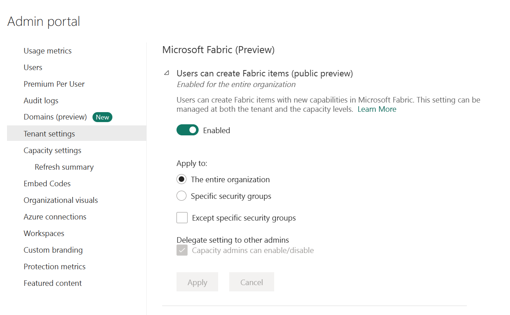
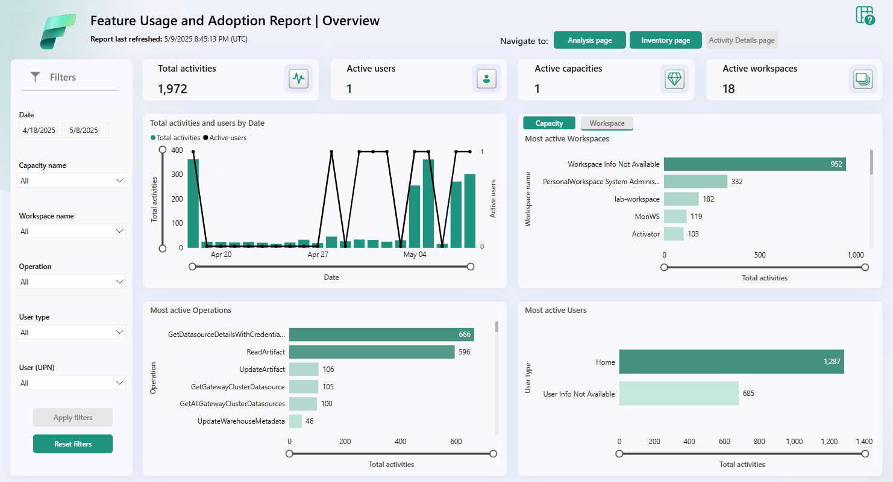

---
ms.custom:
  - build-2023
---
Now that you understand the Fabric architecture and what you and your colleagues may be doing with the product, let's look at the admin role and the tools you use to manage the platform.

There are several roles that work together to administer Microsoft Fabric for your organization. If you're a Microsoft 365 admin, a Power Platform admin, or a Fabric capacity admin, you are involved in administering Fabric. The Power BI admin role will transition to become the Fabric admin.

> [!NOTE]
> See [What is Microsoft Fabric administration?](/fabric/admin/microsoft-fabric-admin) for specific details on the different admin roles and responsibilities.

As a Fabric admin, you work primarily in the Fabric admin portal. You may also need to familiarize yourself with: the [Microsoft 365 admin center](/microsoft-365/admin/admin-overview/admin-center-overview), the [Microsoft 365 Security & Microsoft Purview compliance portal](/microsoft-365/compliance/microsoft-365-compliance-center), [Azure Active Directory in the Azure portal](/azure/active-directory/fundamentals/active-directory-whatis), [PowerShell cmdlets](/powershell/power-bi/overview), and [administrative APIs and SDK](/rest/api/power-bi/admin).

## Describe admin tasks

As an admin, you may be responsible for a wide range of tasks to keep the Fabric platform running smoothly. These tasks include:

**Security and access control**: One of the most important aspects of Fabric administration is managing security and access control to ensure that only authorized users can access sensitive data. You can use role-based access control (RBAC) to define who can view and edit content, set up data gateways to securely connect to on-premises data sources, and use Azure Active Directory (Azure AD) to manage user access.  

**Data governance**: Effective Fabric administration requires a solid understanding of data governance principles. You should know how to secure inbound and outbound connectivity in your tenant and how to monitor usage and performance metrics. You should also know how to apply data governance policies to ensure data within your tenant is only accessible to authorized users.

**Customization and configuration**: Fabric administration also involves customizing and configuring the platform to meet the needs of your organization. This could include configuring private links to secure your tenant, defining data classification policies, and adjusting the look and feel of reports and dashboards.
  
**Monitoring and optimization**: As a Fabric admin, you need to know how to monitor the performance and usage of the platform, optimize resources, and troubleshoot issues. This includes configuring monitoring and alerting settings, optimizing query performance, managing capacity and scaling, and troubleshooting data refresh and connectivity issues.

Specific tasks may vary depending on the needs of your organization and the complexity of your Fabric implementation.

## Describe admin tools

You need to familiarize yourself with a few tools to effectively implement the tasks outlined above. Fabric admins can perform most admin tasks using one or more of the following tools: the Fabric admin portal, PowerShell cmdlets, admin APIs and SDKs, and the admin monitoring workspace.

### Fabric admin portal

Fabric's *admin portal* is a web-based portal where you can manage all aspects of the platform. In the admin portal you can centrally manage, review, and apply settings for the entire tenant or by capacity. You can also manage users, admins and groups, access audit logs, and monitor usage and performance.

> [!IMPORTANT]
> The Power BI admin portal has now extended to become the Fabric admin portal. See [What is the Microsoft Fabric admin portal?](/fabric/admin/admin-center) for more information.
The admin portal enables you to turn settings on and off. There are many settings located in the admin portal, but there's one setting that we'd like to call out which may change how you and your users experience Fabric.

The Fabric on/off switch, located in tenant settings let's organizations that use Power BI opt into Fabric. Here, you can enable Fabric for your tenant or allow capacity admins to enable Fabric.

### PowerShell cmdlets

Fabric provides a set of *[PowerShell cmdlets](/powershell/scripting/powershell-commands)* that you can use to automate common administrative tasks. A PowerShell cmdlet is a simple command that can be executed in PowerShell.

For example, you can use cmdlets in Fabric to systematically create and manage groups, configure data sources and gateways, and monitor usage and performance. You can also use the cmdlets to manage the Fabric admin APIs and SDKs.

> [!NOTE]
> See [Microsoft Power BI Cmdlets for Windows PowerShell and PowerShell Core](/powershell/power-bi/overview) for more resources on PowerShell cmdlets that work with Fabric.

### Admin APIs and SDKs

An admin *API and SDK* are tools that allow developers to interact with a software system programmatically. An API (Application Programming Interface) is a set of protocols and tools that enable communication between different software applications. An SDK (Software Development Kit) is a set of tools and libraries that helps developers create software applications that can interact with a specific system or platform. You can use APIs and SDKs to automate common administrative tasks and integrate Fabric with other systems.

For example, you can use the APIs and SDKs to create and manage groups, configure data sources and gateways, and monitor usage and performance. You can also use the APIs and SDKs to manage the Fabric admin APIs and SDKs.

You can make these requests using any HTTP client library that supports OAuth 2.0 authentication, such as Postman, or you can use PowerShell scripts to automate the process. For more information, see [Microsoft Power BI REST APIs](/rest/api/power-bi/).

### Admin monitoring workspace

Fabric tenant admins will have access to the new *admin monitoring workspace*. You can choose to share access to the workspace or specific items within it with other users in your organization. The admin monitoring workspace includes the Feature Usage and Adoption dataset and report, which together provide insights on the usage and performance of your Fabric environment. You can use this information to identify trends and patterns, and troubleshoot issues.

