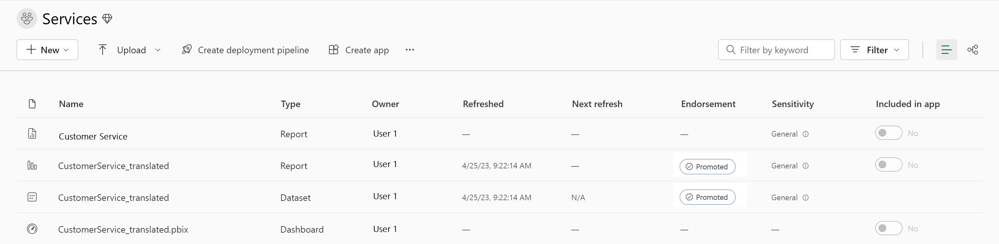

---
ms.custom:
  - build-2023
---
Fabric has a few built-in governance features to help you manage and control your data. *Endorsement* is a way for you as an admin to designate specific Fabric items as trusted and approved for use across the organization.

Admins can also make use of the *scanner API* to scan Fabric items for sensitive data, and the *data lineage* feature to track the flow of data through Fabric.

## Endorse Fabric content

Content endorsement is an essential governance feature that helps you establish trust in your data assets by *promoting* and *certifying* specific Fabric items as trusted and approved for use across the organization. All Fabric items can be endorsed except dashboards.

Endorsed assets are identified with a badge that indicates they have been reviewed and approved. Endorsement helps your users know which assets they can trust and rely on for accurate information, and it also helps you as an admin manage the overall growth of items across your environment.

*Promoted* Fabric content appears with a Promoted badge in the Fabric portal. Workspace members with the contributor or admin role can promote content within a workspace. The Fabric admin can promote content across the organization.

Content *certification* is a more formal process that involves a review of the content by a designated reviewer. Certified Fabric content appears with a Certified badge in the Fabric portal. The certification process is managed by you, the admin, and can be customized to meet the needs of your organization.

If you aren't an admin, you need to request item certification from an admin. You can do request certification by selecting the item in the Fabric portal, and then selecting **Request certification** from the **More** menu.

> [!NOTE]
> For more detailed information on the content endorsement process, see [Promote or certify content](https://learn.microsoft.com/fabric/get-started/endorsement-promote-certify).

## Scan for sensitive data

*Metadata scanning* facilitates governance of data by enabling cataloging and reporting on all the metadata of your organization's Fabric items. The *scanner API* is a set of Admin REST APIs that allows you to scan Fabric items for sensitive data. Use the scanner API to scan data warehouses, data pipelines, datasets, reports, and dashboards for sensitive data. The scanner API can be used to scan both structured and unstructured data.

> [!IMPORTANT]
> Before metadata scanning can be run, it needs to be set up in your organization by an Admin. For more information, see the [Metadata scanning overview](https://learn.microsoft.com/fabric/governance/metadata-scanning-overview).

## Track data lineage

*Data lineage* is the ability to track the flow of data through Fabric. Data lineage allows you to see where data comes from, how it's transformed, and where it goes. This helps you understand the data that is available in Fabric, and how it's being used.
