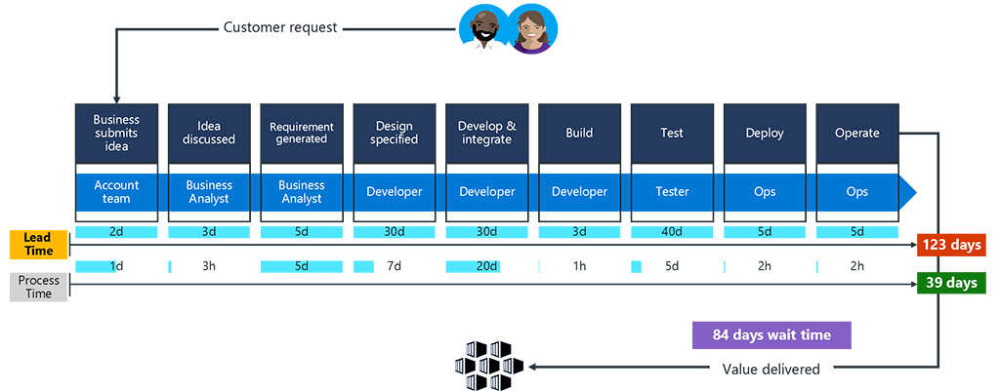
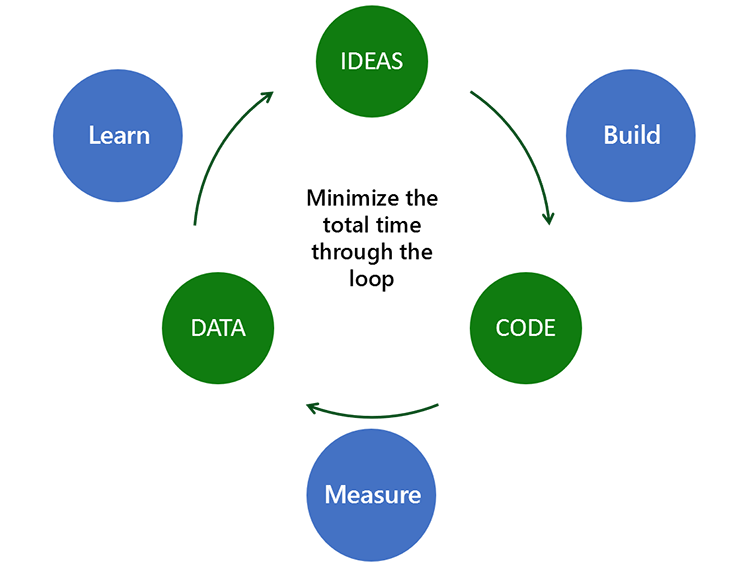
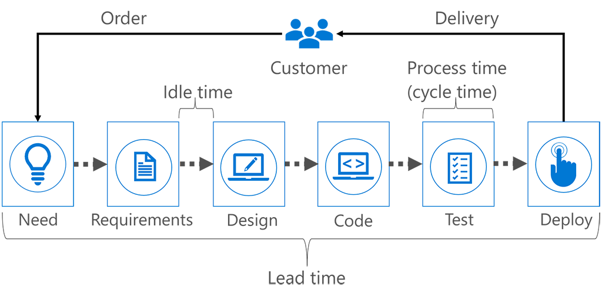
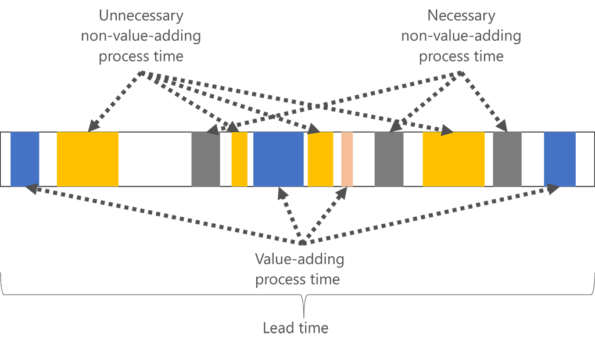

Continuous Improvement is one of the eight capabilities in the DevOps taxonomy.

### Discover why Continuous Improvement is necessary

Continuous Improvement involves and requires measurement. How do you identify improvement if you don't measure?

The Forrester report *Faster Software Delivery Will Accelerate Digital Transformation*, published in 2017, shows significant waste between the lead time and process time. It reminds us that if you don’t measure, you can’t know the difference – or how much waste your organization is creating.

After measuring the impact that specific wastes have on the process, it becomes easy to prioritize work to make improvements.

*Source: Forrester, Faster Software Delivery Will Accelerate Digital Transformation, March 9, 2017 by Diego Lo Giudice, Christopher Condo with Christopher Mines, Luis Deya*

But how do you improve customer experience if you don’t measure? Forrester research has shown that “A small overlap between features tested and used means that developers need better customer insight.” The overlap between the application features tested and application features used is about 35%.

How can you build the right software if you don’t measure the usage and impact of new features?  With a 65% chance of getting it wrong, knowing the difference is essential.

### What is Continuous Improvement?

Continuously and candidly observing your DevOps process allows teams to identify possible improvement points.

All improvement requires change, but not all change is improvement. This is why measurement is a critical success factor to organizations using DevOps. As Peter Drucker says, “If you can’t measure it, you can’t improve it.”

The lack of an effective feedback mechanism makes it difficult to improve the impact of apps on business. That's why it's important to create an environment that fosters a learning-centric approach for DevOps Improvement, with a focus on making data-based adjustments.

#### Measurement and metrics

First, let’s consider **measurement**. According to the book *Accelerate* by Nicole Forsgren, Jez Humble and Gene Kim, the four most important measures of software delivery performance are:

- **Lead time for change**: a measure of software delivery performance tempo. The time it takes for a bug fix, new feature, or any other change to go from idea to deployment to production.
- **Deployment frequency**: a direct or indirect measure of response time, team cohesiveness, developer capabilities, development tool effectiveness, and overall DevOps team efficiency.
- **Mean time to restore**: how long it generally takes to restore a primary app or service when a service incident occurs.
- **Change fail percentage**: the percentage of changes to production (including, for example, software releases and infrastructure configuration changes) that fail.

It’s the responsibility of DevOps leadership to measure things like **operational health metrics**, **usage**, **velocity**, and **live site health**. In other words, measure IMPACT, not ACTIVITY. A metric is only useful if it is actionable.

Although scrum teams measure team capacity, team velocity, burndown, and number of bugs, these metrics are only relevant within the context of the team. But it’s important for DevOps leadership to remain focused on impact.

>[!IMPORTANT]
>Measure **impact**, not **activity**!

**Things we measure**:

:::row:::
   :::column span="":::
      **Usage**
   :::column-end:::
   :::column span="":::
      **Velocity**
   :::column-end:::
   :::column span="":::
      **Live site health**
   :::column-end:::
:::row-end:::
:::row:::
   :::column span="":::

- Acquisition
- Engagement
- Satisfaction
- Churn
- Feature usage

   :::column-end:::
   :::column span="":::

- Time to build
- Time to self-test
- Time to deploy
- Time to learn

   :::column-end:::
   :::column span="":::

- Time to detect
- Time to communicate
- Time to mitigate
- Customer impact
- Incident prevention items
- Aging live site problems
- SLA per customer
- Customer support metrics

   :::column-end:::
:::row-end:::

**Things we don't watch:**

- Original estimate
- Completed hours
- Lines of code
- Team capacity
- Team burndown
- Team velocity
- Number of bugs found

>[!IMPORTANT]
>Metrics affect business outcomes.

Aligning KPIs with habits is important. It helps to achieve positive business outcomes.

Important habits to reinforce the KPIs and set teams up for success should include:

- **Team autonomy and organization alignment**: What, how, and why we build. You need a common cadence, or heartbeat, across your organization to enable all leadership and feature teams to collaborate transparently and effectively.
- **Customer focus**: All efforts must have direct or indirect impact on client value.
- **Production-first mindset**: A mindset that does not differentiate how features and bugs are handled during development, testing, and operational support. Everything should be automated, versioned, and fine-tuned in production.
- **Shift quality left and fail fast**: Encourage reviews, validations, and approvals for both testing and security as early as possible in the feature delivery cycle to drive quality and a fail-fast mindset.

![Diagram shows the relation between metrics, KPIs, habits and business outcomes. Metrics support KPIs, which should align with habits to achieve the business outcomes. KPI examples include lead time, deployment frequency, mean time to restore, and change fail rate. These KPIs should be aligned to habits like: team autonomy and organization alignment, customer focus, production-first mindset, and shift quality left and fast. This alignment helps achieve business outcomes like a quicker time to market, higher quality, less waste, and end-to-end security.](../media/6-3-kpi.png)

#### Continuous feedback

Next, let’s consider how to use **continuous feedback** for collaboration.

The most talked about modern app developers come from startups. Why are they so successful? Because their lean practices are unencumbered by years of refined processes.

Lean startups have established an optimal path to getting ideas developed, delivered, and refined – by creating an incredible positive continuous feedback culture:

- Release early, release often
- Start with a minimum viable product
- Use hypothesis-driven development
- Continuous improvement through customer feedback

#### Continuous Improvement through value stream mapping

When we have measurement and feedback, improvement becomes a data-driven exercise.

One effective way to support Continuous Improvement is through value stream mapping. A **value stream** is a sequence of activities an organization undertakes to deliver on a customer request.

Value stream mapping is a highly effective way to learn to see and resolve disconnects, redundancies, and gaps in how work gets done. It isn't merely a tool, but a team-based methodology that we believe is the foundation of a proven management practice.

Value stream analysis allows you to break down the delivery process and measure lead time, cycle time, and idle time, which helps teams make data-based adjustments to the workflow.

These measures help teams plan, spot variations in efficiency, and identify potential process issues.

>[!TIP]
>The lower the lead and cycle times, the faster the throughput your team has.

We need to be able to identify the difference between **unnecessary** non-value-add work and **necessary** non-value-add work to help identify future changes for process improvement.

Unnecessary non-value-add work is true waste: the customer doesn’t value it, and the organization doesn’t have to do it to remain a viable enterprise. It consumes resources without adding any value to the product.

#### Data-driven DevOps: metrics help guide your journey

DevOps transformation is a journey, and the best and the most effective way to guide yourself through the DevOps journey is through data-driven DevOps.

![Diagram shows the flow of the DevOps journey. Teams begin transformation and identify quick wins. Automation helps low performers progress to medium performers. Automation increases test requirements, which are dealt with manually. A mountain of technical debt blocks progress. Technical debt and increased complexity cause additional manual controls and layers of process around changes, slowing work. Relentless improvement work leads to excellence and high performance! High and elite performers leverage expertise and learn from their environments to see jumps in productivity.](../media/6-3-devops.png)

We suggest you establish a holistic approach to measure the DevOps effectiveness and deliver transparency on DevOps transformation initiatives. Create a culture that promotes the learning and experimentation that DevOps requires by focusing on metrics that highlight success. Acknowledge those successes by celebrating the right behavior rather than punishing the wrong.
