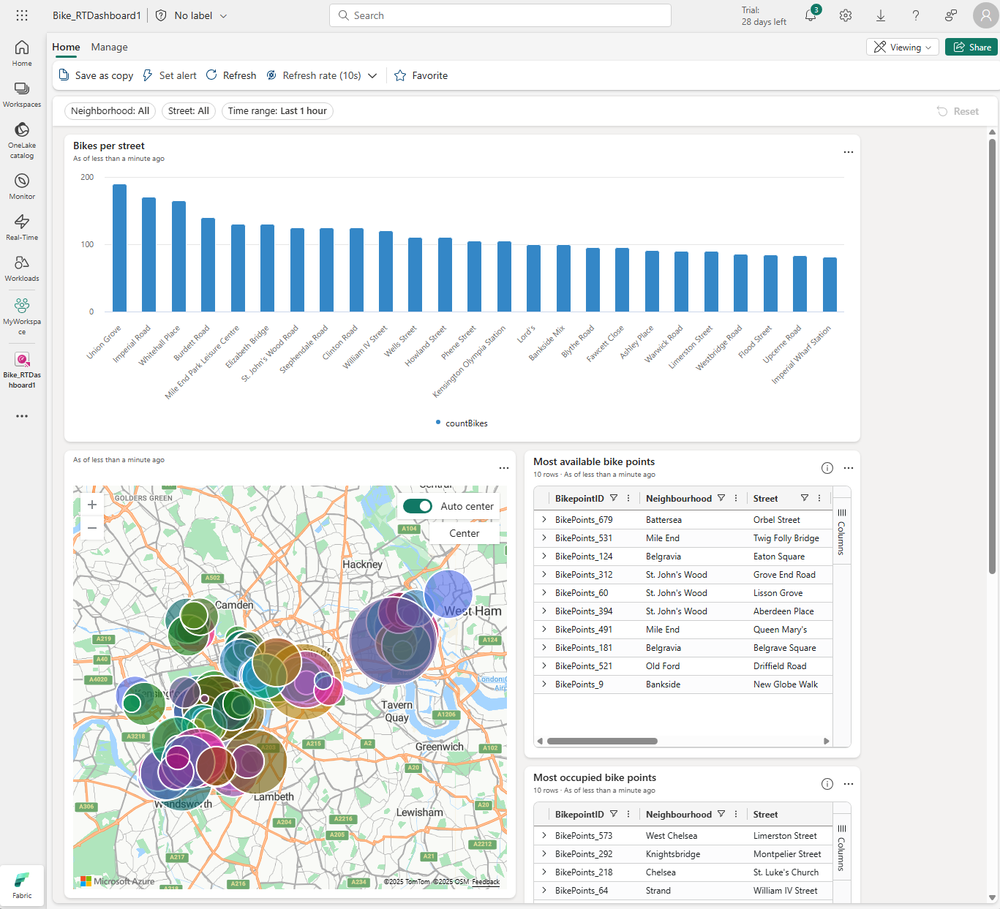
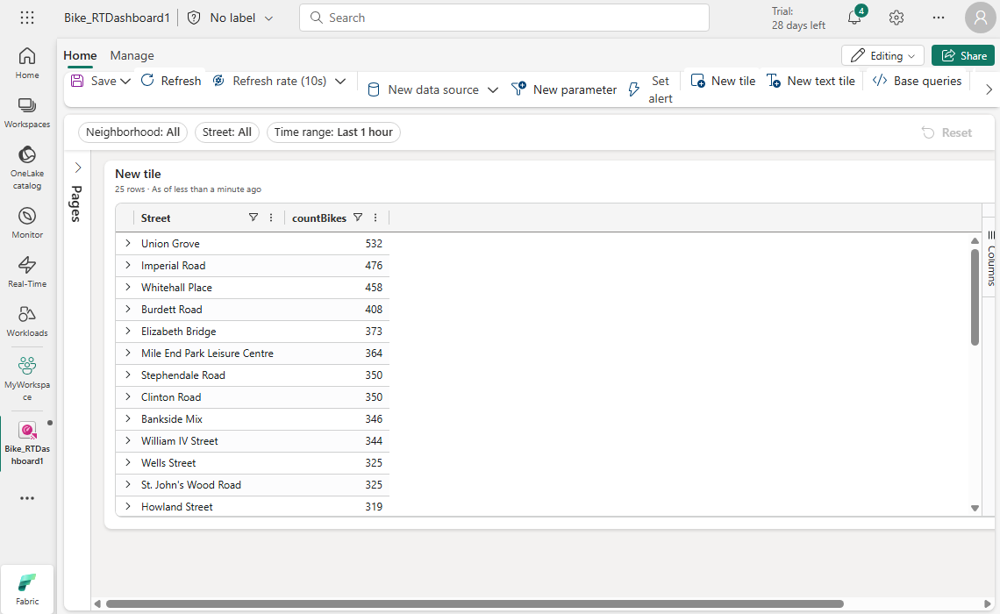
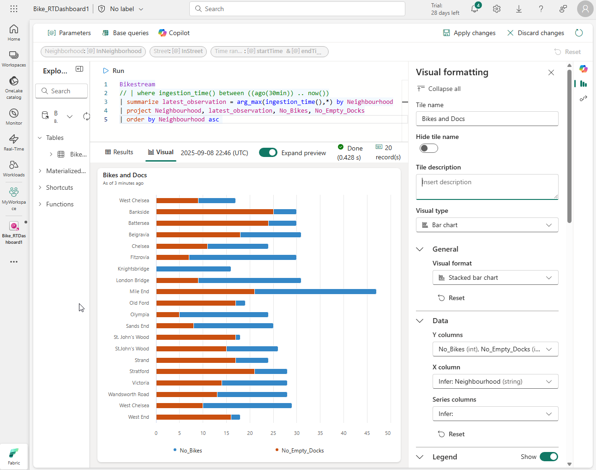

Real-Time dashboards in Microsoft Fabric are built on real-time streaming data sources, such as tables in an *Eventhouse* that are populated by an *eventstream*. Each dashboard consists of one or more *tiles*, each displaying a real-time data visualization.



## Creating a real-time dashboard

To create a real-time dashboard, you'll need a source of real-time data; such as an Eventhouse containing a KQL database. You can then create a real-time dashboard with a *data source* that references the real-time data.

### Configuring authorization for data sources

When connecting the dashboard to the data source, you can specify one of two authorization schemes:

- **Pass-through identity** - The data in the dashboard is accessed using the identity of the user viewing the dashboard.
- **Dashboard editor's identity** - The data in the dashboard is accessed using the identity of the user who created the dashboard.

### Creating tiles

A dashboard contains at least one tile, in which the results of a KQL query are displayed.

#### Specifying a query

When you first add a tile, you can enter and test the query you want to use to query the underlying data source. For example, you might use a KQL query similar to the following example to query a table named **bikes** and retrieve details of available bikes and empty bike parking docks for a bike rental system in a city:

```kql
bikes
| where ingestion_time() between (ago(30min) .. now())
| summarize latest_observation = arg_max(ingestion_time(), *) by Neighbourhood
| project Neighbourhood, latest_observation, No_Bikes, No_Empty_Docks
| order by Neighbourhood asc
```

> [!TIP]
> The query in the example retrieves the most recent observation (the latest record ingested into the source table) within the last 30 minutes for each neighborhood.

Initially, the tile displays the results of the query as a table.



#### Visualizing the data

After creating a tile, you can edit it to define a visual in which the data is represented as a chart, map or other data visualization. For example, it may make more sense to display the rental bike data as a bar chart that shows the number of bikes and empty parking docks in each neighborhood.



You can add multiple tiles to a dashboard and arrange them to organize the way the data is visualized. You can also add *text tiles* to provide additional information.

