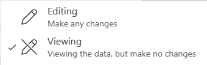
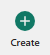
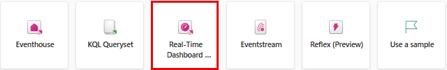
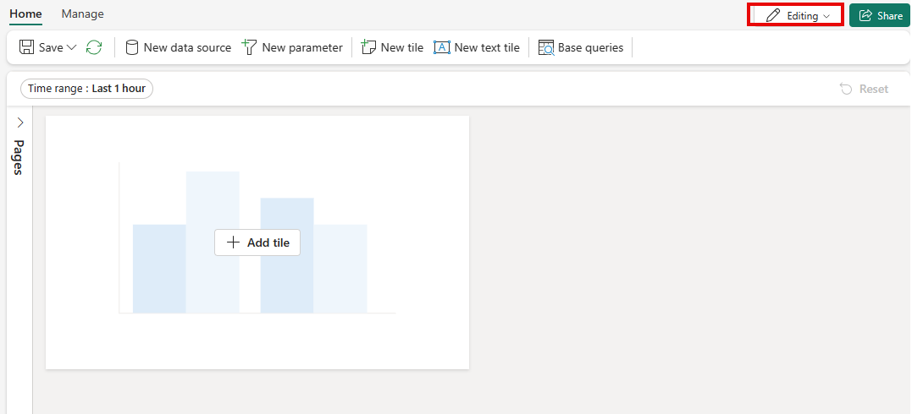
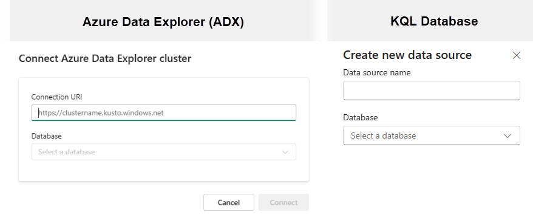

When you create a Real-Time Dashboard, you find an experience similar to any other Office 365 document where you have the ability to edit or view the dashboard based upon your permission settings. 

### Create a new Real-Time Dashboard

The Real-Time Dashboard is integrated within a workspace environment. Whenever you create a new Real-Time Dashboard, it's inherently linked to the workspace currently in use. If you're creating a new dashboard, then it starts in the editing mode. However, when you open an existing dashboard you are in viewing mode and need to switch to editing mode to modify its contents.

To ***create*** a new report, you navigate to the Real-Time Intelligence section of Power BI and when presented with the ***New*** selection list, select the Real-Time Dashboard button. You can also select the ***Create*** button  on the left side of the canvas and then scroll in the various services, then select the Real-Time Dashboard card.

Give it a name per the standards established within your organization. Once you have given it a name and clicked ***Create***, you'll see a new dashboard in your workspace that is opened up in ***Editing*** mode.

The next step is to connect to a data source to query data from. In this context, a data source is a reusable reference to a database in Azure Data Explorer Cluster with the path being a connection URI in the format of ***https://clustername.kusto.windows.net*** and then selecting a database from the cluster. You can also select an existing KQL database in the OneLake data hub. In this case, you give it a ***Data source name*** and then select a OneLake KQL database in your environment.

Once you have filled out the properties for the appropriate source, select ***Create***

### Add a Tile to the Dashboard

Dashboard tiles are designed to utilize snippets from the Kusto Query Language to fetch data and produce visual representations. Each individual tile or query is configured to support only one type of visual. 

1. Either select on the dashboard within the canvas, or choose ***New text tile*** or ***New tile*** from the menu bar located at the top of the canvas to add a new tile.
1. In the ***Query pane***
    1. Select the data source created earlier
    1. Enter or type your query and then select ***Run***.
    1. Select the ***+ Add visual***

    

1. We can now add a visual by going into the ***Visual formatting tab*** by selecting ***Add visual***.

    > [!NOTE]
    > The query was modified in this example to make it more user friendly. 

     
    

1. When you're happy with the visualization and the formatting of it, select ***Apply Changes*** to add more visualizations, adjust its size, or rearrange your visualization on the canvas.

    