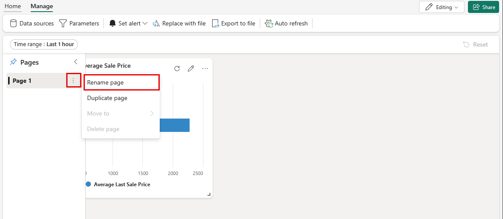
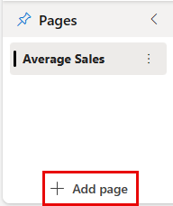
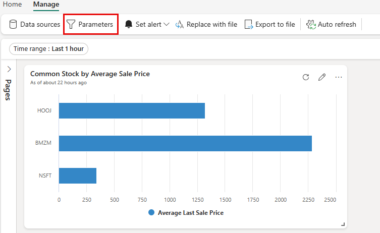
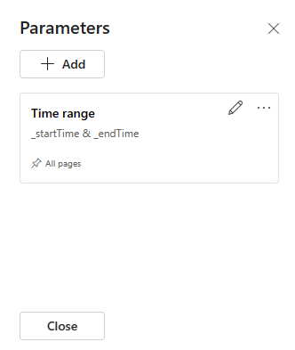
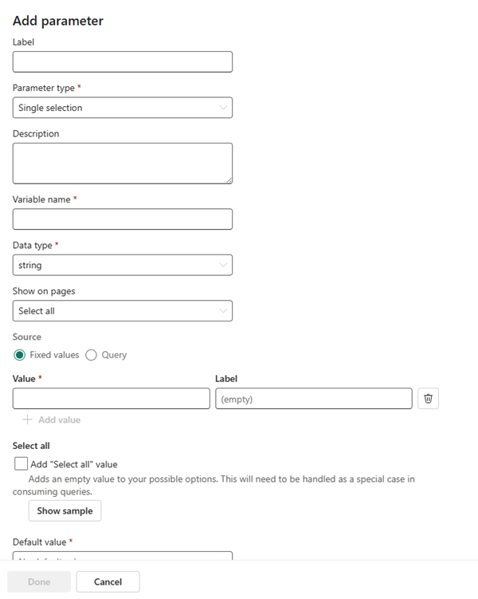
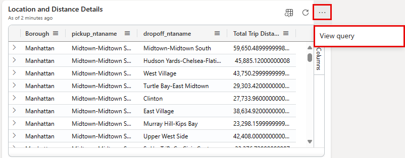
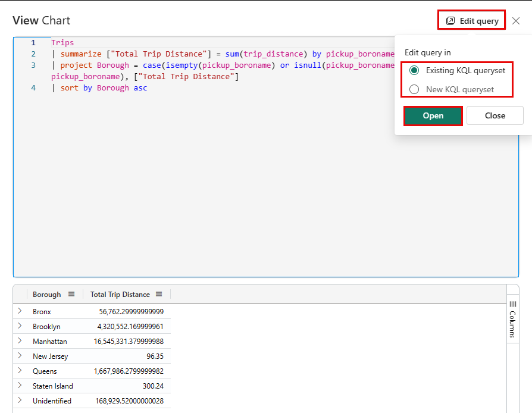
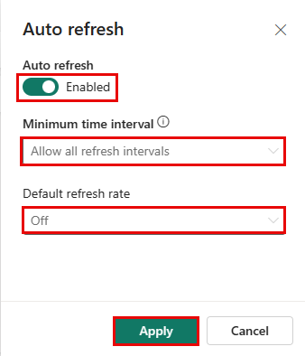

### Additional and advanced features of Real-Time Dashboards

Some other features of Real-Time Dashboards allow you to add more functionality and flexibility for the end-user, such as data exploration. The explore data feature simplifies the process of digging deeper into Real-Time Dashboard data. This service is designed for users who need to go beyond the surface-level information displayed. Even with viewer-only access, you can interact with the dashboard to discover more insights by manipulating filters and visualizations, all without requiring Kusto Query Language (KQL) expertise.

### Add page

Pages give you the ability to create optional containers for more tiles. It's a great way to create logical groups of organization by items, such as data source, subject area, or even aggregation level. Like Power BI, the pages also give you drill-through capabilities from a summary or details page.

One of the first things you might need to do is to rename the existing page, select the elipses ***...*** and then choose the ***Rename page*** option.

Once done, you can select ***+ Add page*** below your newly named page on the bottom part of the canvas.

Then follow the procedure again to rename the page as you continue.

### Use parameters

In many cases, you're dealing with large amounts of data and you can improve the performance of the rendering process with the use of parameters. Parameters apply filtering at the query level when your tiles are populated which simplify the results to the user and provide them with a way to explorer your data more effectively.

1. Locate and select the ***Parameters*** button on the tool bar.

    

2. When the side panel expands, select the ***+ Add parameter***.

    

3. Configure the parameter to apply a filter to the base query. For more information about the use and configuration of the different kinds of parameters, see [Use parameters in Real-Time Dashboards.](/fabric/real-time-intelligence/dashboard-parameters?branch=main)

    

### View query

You can review the query in two modes: viewing and editing. However, you can only modify the underlying query of a tile when in editing mode.

1. Select a tile you want to explore and select the ***[...]***> ***View query***.

    

1. Select the ***Edit query*** option.
1. You can choose either the option of editing the ***Existing Queryset*** or a ***New Queryset***

    
    
    > [!NOTE]
    > When you edit a query with this approach, the changes won't appear int eh original Real-Time Dashboard.

### Enable the auto refresh

Auto refresh automatically updates dashboard data, eliminating the need for manual page reloads or refresh actions. Editors can set a default refresh rate, which both editors and viewers can adjust during dashboard viewing. However, editors have the authority to establish a minimum refresh rate to manage cluster workload, preventing users from setting a rate below this threshold. 

1. Select the ***Manage tab > Auto refresh***.

    > [!NOTE]
    > If you don't see any options when selecting the ***Manage*** in the menu bar. Check to be sure you're in ***Editing Mode***. 

1. Toggle the option to enable the auto refresh option
1. Choose values for ***Minimum time interval*** and ***Default refresh interval***.
1. Select ***Apply*** and then be sure to ***Save*** the dashboard.

    