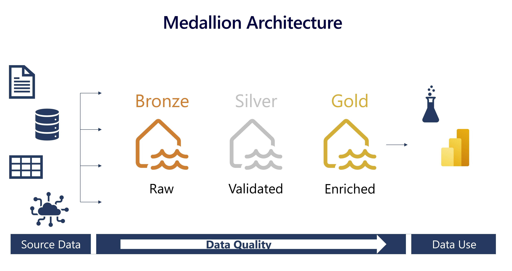

Data lakehouses in Fabric are built on the [Delta Lake format](/azure/synapse-analytics/spark/apache-spark-what-is-delta-lake), which natively supports ACID (Atomicity, Consistency, Isolation, Durability) transactions. Within this framework, the *medallion architecture* is a recommended data design pattern used to organize data in a lakehouse logically. It aims to improve data quality as it moves through different layers. The architecture typically has three layers – bronze (raw), silver (validated), and gold (enriched), each representing higher data quality levels. Some people also call it a "multi-hop" architecture, meaning that data can move between layers as needed.

This architecture ensures that data is reliable and consistent as it goes through various checks and changes. It also guarantees that the data will be safely stored in a way that makes it easier and faster to analyze.

The medallion architecture complements other data organization methods,  rather than replacing them. You can think of the medallion architecture as the framework for data cleaning, rather than a data architecture or model. It ensures compatibility and flexibility for businesses to adopt its benefits alongside existing data models, allowing you to customize data solutions and preserve expertise while remaining adaptable in the ever-changing data landscape.

## Understand the medallion architecture format

### Bronze layer

The bronze or raw layer of the medallion architecture is the first layer of the lakehouse. It's the landing zone for all data, whether it's structured, semi-structured, or unstructured. The data is stored in its original format, and no changes are made to it.

### Silver layer

The silver or validated layer is the second layer of the lakehouse. It's where you'll validate and refine your data. Typical activities in the silver layer include combining and merging data and enforcing data validation rules like removing nulls and deduplicating. The silver layer is can be thought of as a central repository across an organization or team, where data is stored in a consistent format and can be accessed by multiple teams. In the silver layer you're cleaning your data enough so that everything is in one place and ready to be refined and modeled in the gold layer.

<!-- are those last 2 sentences repetitive? -->

### Gold layer

The gold or enriched layer is the third layer of the lakehouse. In the gold layer, data undergoes further refinement to align with specific business and analytics needs. This could involve aggregating data to a particular granularity, such as daily or hourly, or enriching it with external information. Once the data reaches the gold stage, it becomes ready for use by downstream teams, including analytics, data science, or MLOps.

### Customize your medallion architecture

Depending on your organization's specific use case, you may have a need for additional layers. For example, you might have an additional "raw" layer for landing data in a specific format before it's transformed into the bronze layer. Or you might have a "platinum" layer for data that's been further refined and enriched for a specific use case. Regardless of the names and number of layers, the medallion architecture is flexible and can be tailored to meet your organization's particular requirements.