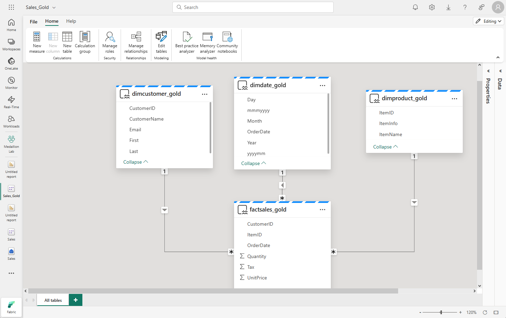

Now that your medallion architecture is in place, data teams and the business can start using it to query and report on data. Fabric has several tools and technologies that enable you to query and report on data in your lakehouse, including SQL analytics endpoints and Direct Lake mode in Power BI semantic models.

## Query data in your lakehouse

Teams can use SQL to explore and query data in the gold layer. You can analyze data in delta tables at any layer of the medallion architecture using the T-SQL language, save functions, generate views, and apply SQL security. You can also use the SQL analytics endpoint to connect to your lakehouse from querying tools and applications.

The SQL analytics endpoint in Fabric enables you to write queries,  manage the semantic model, and query data using the visual query experience.

> [!NOTE]
> The SQL analytics endpoint operates in **read-only** mode over lakehouse delta tables. To modify data in your lakehouse you can use dataflows, notebooks, or pipelines.

In addition to using the SQL analytics endpoint for data exploration, you can use a Power BI semantic model to explore data. A semantic model is a way of viewing data using business friendly terminology.  It's typically represented as a star schema with facts that represent a domain of data relevant to a particular business area, and dimensions that allow you to analyze data in the data domain. A default semantic model is created automatically when you create a lakehouse. You can also create a non-default, custom Power BI semantic model.

Data analysts can connect to the semantic model using **Direct Lake** mode, in which the semantic model accesses data directly from Delta tables in a lakehouse. In Direct Lake mode, data doesn't have to be imported or duplicated into a semantic model, making data more quickly available for analysis.

## Tailor your medallion layers for different needs

Tailoring medallion layers to different needs allows you to optimize data processing and access for specific use cases. By customizing these layers, you can ensure that each layer's structure and organization align with the requirements of different user groups, improving performance, ease of use, and data relevance for diverse stakeholders.

Creating multiple Gold layers tailored for diverse audiences or domains highlights the flexibility of the medallion architecture. Finance, sales, data science – each can have its optimized Gold layer, serving specific analytical requirements.

Some applications, third-party tools, or systems require specific data formats. You can utilize your medallion architecture to generate cleansed and properly formatted data.
