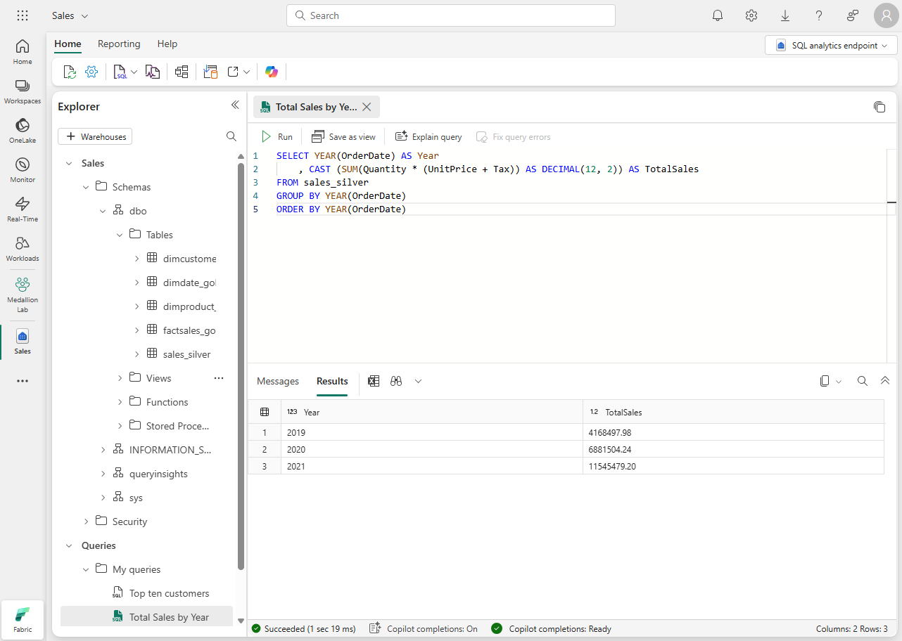

Now that your medallion architecture is in place, data teams and the business can start using it to query and report on data. Fabric has several tools and technologies that enable you to query and report on data in your lakehouse, including SQL endpoints and Direct Lake mode in Power BI datasets.

## Query data in your lakehouse

Teams can use SQL to explore and query data in the gold layer. You can analyze data in delta tables at any layer of the medallion architecture using the T-SQL language, save functions, generate views, and apply SQL security. You can also use the SQL endpoint to connect to your lakehouse from third-party tools and applications.

The SQL endpoint in Fabric enables you to write queries,  manage the data model, and query data using the new visual query experience.

> [!NOTE]
> The SQL endpoint operates in **read-only** mode over lakehouse delta tables. To modify data in your lakehouse you can use dataflows, notebooks, or pipelines.

In addition to using the SQL endpoint for data exploration, you can also create a Power BI dataset in Direct Lake mode to query data in your lakehouse. When you create a lakehouse, the system also provisions an associated default dataset. The default dataset is a semantic model with metrics on top of lakehouse data.

When a Power BI report displays a data element, it fetches it from the underlying dataset, which in turn accesses a lakehouse for data retrieval. To enhance efficiency, the default dataset preloads frequently requested data into the cache and updates it as necessary. This approach is called Direct Lake mode and truly gives you the best of both worlds: the performance of a semantic model and the freshness of lakehouse data.

## Tailor your medallion layers for different needs

Tailoring medallion layers to different needs allows you to optimize data processing and access for specific use cases. By customizing these layers, you can ensure that each layer's structure and organization align with the requirements of different user groups, improving performance, ease of use, and data relevance for diverse stakeholders.

Creating multiple Gold layers tailored for diverse audiences or domains highlights the flexibility of the medallion architecture. Finance, sales, data science – each can have its optimized Gold layer, serving specific analytical requirements.

Some applications, third-party tools, or systems require specific data formats. You can utilize your medallion architecture to generate cleansed and properly formatted data.
