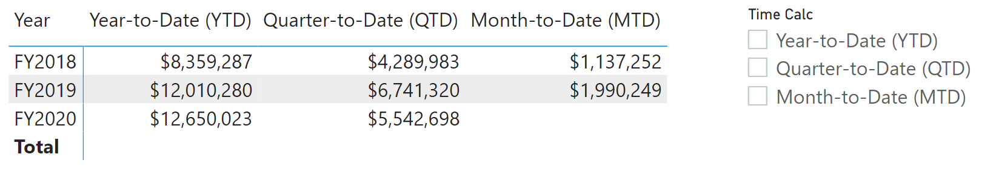
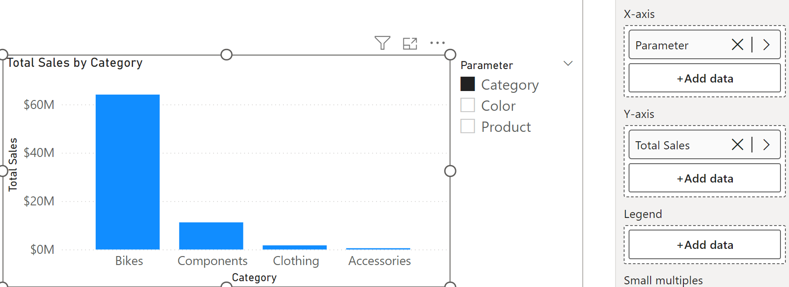

Static calculations and visuals can present issues for report performance, but you can add flexibility to your semantic model by using calculation groups, dynamic format strings, and field parameters. These features make your reports scalable and user-friendly by simplifying calculations and reducing report visualizations.

## Calculation groups

Calculation groups allow you to define reusable calculations that apply across multiple measures, which reduce redundancy and simplifies the maintenance of your semantic models. You can use calculation groups to streamline complex calculations, such as time intelligence functions, across your entire model.

Consider you need to calculate Year-to-Date (YTD), Quarter-to-Date (QTD), and Month-to-Date (MTD) sales data. Instead of creating separate measures for each time intelligence function, you decide to use calculation groups to streamline these calculations.

For this example, we have a calculation group called **Time Intelligence** with the following calculation items.

```DAX
   Year-to-Date (YTD) = 
   CALCULATE(
       SELECTEDMEASURE(),
       DATESYTD('Date'[Date])
   )
//
   Quarter-to-Date (QTD) = 
   CALCULATE(
       SELECTEDMEASURE(),
       DATESQTD('Date'[Date])
   )
//
   Month-to-Date (MTD) = 
   CALCULATE(
       SELECTEDMEASURE(),
       DATESMTD('Date'[Date])
   )
```

Now you can use the calculation group in the filter pane, a slicer, a visual, and even in reference in a measure. The different calculation items (YTD, QTD, MTD) automatically appear to filter or expand in the visual.

In the following image, we have a matrix with the three fiscal years with the total sales across YTD, QTD, and MTD. There's also a slicer for the calculation group to allow users to toggle between the different choices. The visual is configured as:

- Rows: **Date[Year]** field
- Columns: **Time Calc** calculation group
- Values: **Total Sales** measure



Without calculation groups, you need to create YTD, QTD, and MTD measures for each calculation you need, such as Total Sales, Profit, Target, and so on. Instead, create your visuals and add the calculation group and the other measures.

The dynamic and reusable nature of calculation groups makes them incredibly powerful to scale your semantic models.

> [!TIP]
> See the documentation to learn more about how to [Create calculations groups in Power BI](/power-bi/transform-model/calculation-groups).

## Field parameters

Field parameters allow you to create interactive reports by enabling users to select different fields or measures dynamically. This feature is useful for creating customizable reports where users can choose the data they want to see.

In our scenario, we created a new parameter to include the Product, Category, and Color fields. Now we use our Total Sales measure and add the parameter in a visual instead of those individual fields. We also add a slicer with the parameter so users can switch between the selected fields. The following image shows a column chart for Total Sales by Category configured with the parameter in the X-axis and Total Sales in the Y-axis. A slicer is also present to dynamically switch between the Total Sales by Product, Category, and Color.



Before field parameters, report developers might create a visual for Total Sales by Product and repeat for Category and Color. Users could switch between the different visuals in a similar experience by overlaying the visuals on top of each other and adding bookmarks and buttons. However, the more visuals you add to a report page might affect performance.

> [!TIP]
> See the documentation to learn more about how to [Let report readers use field parameters to change visuals](/power-bi/create-reports/power-bi-field-parameters).

## Dynamic format strings

Dynamic format strings let you adjust the format of a measure based on conditions, improving data readability and presentation.

Consider you want to display sales figures in different formats based on their value:

- Millions (M) for sales over 1,000,000.
- Thousands (K) for sales between 1,000 and 1,000,000.
- Exact value for sales under 1,000.

The following code uses the `SWITCH` function to apply the different formats based on the sales amount:

```DAX
Total Sales with Format = 
SWITCH(
    TRUE(),
    [Total Sales] > 1000000, FORMAT([Total Sales], "$#,##0,,M"),
    [Total Sales] > 1000, FORMAT([Total Sales], "$#,##0,K"),
    FORMAT([Total Sales], "$#,##0")
)
```

Dynamic format strings simplify your data presentation, reducing the need for multiple calculations or visuals, and can be used with calculation groups to reduce complexity and maintenance for your code.

> [!TIP]
> See the documentation to learn more about how to [Create dynamic format strings for measures](/power-bi/create-reports/desktop-dynamic-format-strings).
