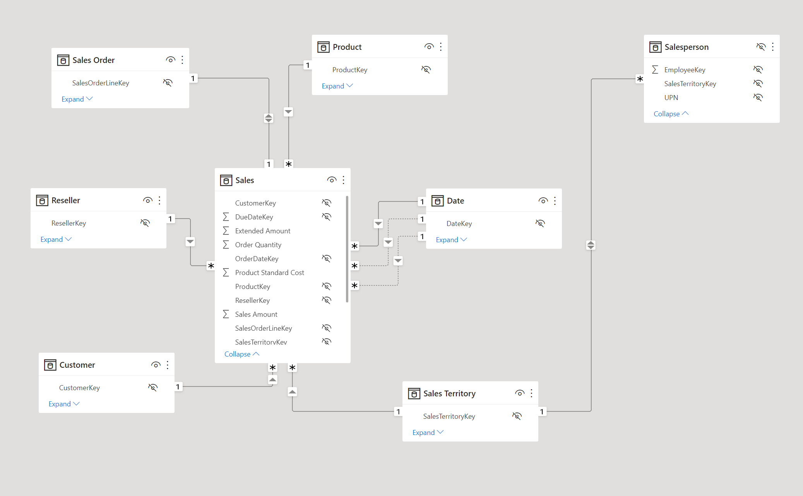
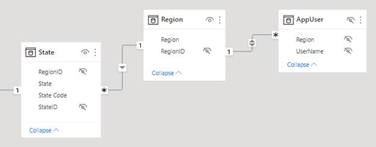
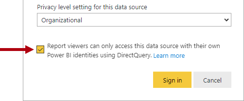

Row-level security (RLS) restricts which rows of data individual users can see when they query a semantic model. You define RLS by creating roles that contain DAX filter expressions. When a user is assigned to a role, Power BI evaluates the filter expression for each row and returns only the rows where the expression evaluates to TRUE.

Without roles, any user with query access to the semantic model sees all data. RLS applies to all consumption paths: Power BI reports, paginated reports, Copilot chat, and Fabric data agents. This means that your security configuration protects data consistently regardless of how users access it.

[](../media/introduce-row-level-security.gif#lightbox)

## Understand how RLS works with star schemas

RLS works best with star schema designs where dimension tables relate to fact tables through model relationships. You create filter expressions on dimension tables, and Power BI propagates those filters to fact tables through the relationships. This approach is more efficient than filtering fact tables directly because dimension tables typically contain far fewer rows.

For example, consider a model with a **Region** dimension table and a **Sales** fact table. When you apply an RLS filter to the **Region** table for "Midwest," Power BI follows these steps:

1. Filters the **Region** table, resulting in one visible row (for Midwest).
2. Uses the model relationship to propagate the filter to related dimension tables like **State**, resulting in only the states that belong to the Midwest region.
3. Propagates the filter to the **Sales** fact table through its relationships, resulting in only the sales records for Midwest states.

This filter propagation means you only need to write a filter on one dimension table. The model relationships handle the rest, filtering all related tables automatically.

[](../media/model-diagram-star-schema.png#lightbox)

> [!TIP]
> Filter dimension tables, not fact tables. Model relationships propagate dimension filters to fact tables efficiently, which delivers faster query performance.

## Create security roles

You create roles in Power BI Desktop from the **Modeling** tab by selecting **Manage roles**. You can also create and manage roles in the Fabric web modeling experience. Each role has a unique name and one or more DAX filter expressions applied to specific tables.

To create a role in Power BI Desktop:

1. On the **Modeling** tab, select **Manage roles**.
2. Select **New** to create a role.
3. Name the role (for example, "Regional Sales").
4. Select the table you want to filter.
5. Enter a DAX filter expression. You can use the default drop-down interface for simple filters or switch to the DAX editor for expressions that use functions like `USERPRINCIPALNAME()`.
6. Select **Save**.

A role with no rules provides access to all rows in all tables. This configuration is useful for admin roles that need unrestricted data access. You can also create a role with the expression `FALSE()` to block access to all rows in a specific table. This is useful when users should see aggregated data but not detail-level records.

## Use dynamic security with USERPRINCIPALNAME()

Dynamic security is the recommended approach for most scenarios. Instead of creating separate roles for each user or group, you create a single role with a DAX expression that evaluates the signed-in user's identity.

The `USERPRINCIPALNAME()` function returns the email address of the authenticated user in `user@domain.com` format. You use this function to match the current user against a column in your data model.

```dax
-- Filter the Salesperson table to the current user
[SalesPersonEmail] = USERPRINCIPALNAME()
```

This expression filters the **Salesperson** dimension table to the row that matches the signed-in user. Because the **Salesperson** table relates to the **Sales** fact table, only that user's sales data is visible.

Dynamic security scales because adding or removing users is a data change rather than a model change. You don't need to create new roles or republish the semantic model when team members change.

Consider an organization with 50 salespeople across five regions. With static RLS, you'd need five separate roles, one per region. With dynamic RLS, you create one role and one filter expression. The data determines which rows each user sees.

## Implement the security table pattern

For more complex authorization scenarios, create a dedicated security table that maps users to data partitions like regions, departments, or cost centers. The security table joins to a dimension table in your model and the RLS filter references the security table.

```dax
-- Filter through a security table that maps users to regions
CONTAINS(
    SecurityTable,
    SecurityTable[UserEmail], USERPRINCIPALNAME(),
    SecurityTable[Region], [Region]
)
```

This pattern maps each user to one or more regions in the security table. When a user signs in, Power BI evaluates the `CONTAINS` function against the security table and returns only the rows matching their assigned regions.

The security table pattern offers several advantages:

- **Centralized management.** All user-to-data mappings are in one table.
- **Multi-value assignments.** A single user can map to multiple regions or departments.
- **Data-driven updates.** Changing access requires updating the security table data, not the model definition.

To implement this pattern, add the security table to your model and create a relationship between the security table and the relevant dimension table. Then create a role with the `CONTAINS` filter expression. When you refresh the data, any changes to the security table take effect immediately without republishing the model.



## Understand static RLS rules

Static rules use DAX expressions that refer to constant values rather than user identity. For example, you can create a rule that restricts a role to only the Midwest region:

```dax
-- Static filter: only Midwest data is visible
[Region] = "Midwest"
```

Static rules are simple to create and understand. They work well when you have a small, fixed number of data partitions that rarely change. However, they don't scale. Each new region or data partition requires a new role or an updated rule, and you need to republish the semantic model for changes to take effect.

> [!NOTE]
> Dynamic rules with `USERPRINCIPALNAME()` are the recommended approach for most production models. Use static rules only for small, fixed scenarios where the number of partitions is unlikely to grow.

## Understand USERNAME() vs. USERPRINCIPALNAME()

Both functions return the identity of the signed-in user, but they differ in format:

| Function | Power BI Desktop | Power BI service |
|----------|-----------------|-----------------|
| `USERNAME()` | `DOMAIN\username` | `user@domain.com` |
| `USERPRINCIPALNAME()` | `user@domain.com` | `user@domain.com` |

`USERNAME()` returns different formats depending on the environment. `USERPRINCIPALNAME()` always returns the user principal name format. Use `USERPRINCIPALNAME()` for consistency when testing in Desktop and deploying to the service.

> [!NOTE]
> **Static RLS:** For small, fixed scenarios you can hardcode filters like `[Region] = "West"`. Static rules are simple but don't scale. Every new region requires a new role or rule update. Dynamic rules with `USERPRINCIPALNAME()` are the recommended approach for most production models.

## Consider DirectQuery with single sign-on

When your DirectQuery data source supports single sign-on (SSO), the source database can enforce its own row-level security. Power BI passes the user's identity to the data source, and the database evaluates security based on that identity. In this case, you don't need to define RLS roles in the semantic model.



> [!NOTE]
> When you use SSO with DirectQuery, the data source controls security enforcement. For details, see [Row-level security with Power BI](/power-bi/enterprise/service-admin-rls).

## Optimize RLS performance

Complex DAX filter expressions can affect query speed. Follow these practices to keep queries fast:

- **Filter dimension tables.** Relationships propagate filters to fact tables more efficiently than direct fact table filtering.
- **Avoid LOOKUPVALUE.** Use model relationships to propagate filters instead.
- **Test with realistic data.** A filter that performs well on a small dataset might slow down with production-scale data.
- **Measure RLS impact.** Use Performance Analyzer in Power BI Desktop to compare query durations with and without RLS enforced.

> [!TIP]
> Use Copilot to generate DAX filter expressions for RLS roles. For example, ask Copilot to create a security table filter using `USERPRINCIPALNAME()` for your specific data model.
