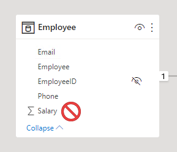
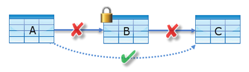
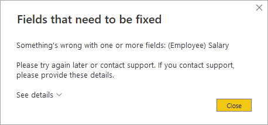

Object-level security (OLS) restricts access to specific tables and columns in a semantic model. While RLS filters which rows a user can see, OLS controls which tables and columns are visible at all. When OLS secures an object, users in that role can't see or query the object, and its metadata is also hidden.

## Understand when to use OLS

OLS is designed for scenarios where certain data elements contain sensitive information that some users shouldn't access. Common use cases include:

- **Personally identifiable information (PII).** Columns like social security numbers, personal phone numbers, or home addresses.
- **Financial data.** Salary columns, profit margins, or cost data restricted to specific business roles.
- **Development tables.** Staging or intermediate tables that shouldn't be visible to report consumers.

Consider an HR semantic model where the **Employee** table contains a **Salary** column. General managers can view employee names and contact details, but only HR payroll staff should see salary values. OLS lets you hide the **Salary** column from all roles except the payroll role.

## Configure OLS using Tabular Editor

You can't configure OLS natively in Power BI Desktop. Instead, use an external tool like Tabular Editor to define OLS rules. Tabular Editor connects directly to the Analysis Services engine that powers your semantic model.

1. In Power BI Desktop, create the roles that define your security structure from the **Modeling** tab.
2. Open Tabular Editor from the **External tools** ribbon. If you don't see Tabular Editor, install it from [tabulareditor.com](https://tabulareditor.com). Tabular Editor automatically connects to your model when it opens.
3. In the **Model** view, expand **Roles** and select the role you want to configure.
4. Expand **Table Permissions** for that role.
5. Set the permission for each table or column:
   - **None**: The object is hidden from users in this role. The object and its metadata are invisible.
   - **Read**: The object is visible to users in this role. This is the default for all objects.
6. Save the changes in Tabular Editor.
7. Publish the semantic model to the Power BI service.

After publishing, assign members to roles in the Power BI service the same way you do for RLS roles. Navigate to the semantic model, select **More options (...)**, and then select **Security** to manage role membership.

## Hide entire tables

Setting a table's permission to **None** hides the entire table from users in that role. Hiding tables is useful for tables that contain exclusively sensitive data or for development artifacts that shouldn't be exposed to consumers.

For example, a **SalaryBand** lookup table used only for payroll calculations can be hidden from all roles except the payroll team.

## Hide specific columns

You can hide individual columns while keeping the rest of the table visible. Select the column under the table in Tabular Editor and set its **Object Level Security** to **None** for the role.

This is the most common OLS pattern. It lets users query the table for general information while protecting specific sensitive fields.

## Understand OLS limitations

OLS has several limitations to consider when designing your security model:

- **Measures can't be hidden directly.** However, any measure that references a secured table or column is automatically restricted for users who don't have access to the secured object.
- **Workspace role override.** OLS applies only to users with **Viewer** permissions. Users with Admin, Member, or Contributor roles have edit permission and bypass OLS.
- **Relationship dependencies.** You can't secure a table if doing so breaks a relationship chain. For example, if tables A, B, and C are related in sequence (A to B to C), you can't secure table B because it would break the filter path from A to C. However, you can secure individual columns in table B as long as the table itself remains accessible.

  
- **Feature limitations.** Semantic models with OLS don't support Quick Insights, Smart Narrative visuals, or the Excel Data Types gallery.
- **Error experience.** When a report queries a secured object, Power BI displays an error message that says the field can't be found. This can confuse report consumers who don't know about the security configuration.

  

> [!IMPORTANT]
> If OLS would cause a poor user experience for some report consumers, consider creating separate reports or semantic models for different audience groups. A report that's designed for the audience avoids confusing error messages.

## Combine OLS with RLS

OLS and RLS address different security needs and can work together in the same model. Use separate roles for each type:

- An **RLS role** filters rows based on user identity.
- An **OLS role** hides tables or columns.

A user assigned to both roles sees only the rows permitted by RLS and only the columns permitted by OLS. This layered approach lets you implement comprehensive data protection.

> [!NOTE]
> OLS prevents Copilot and data agents from surfacing restricted columns in natural language answers. When a column is secured with OLS, AI-powered features can't access or display that data, even through conversational queries.
