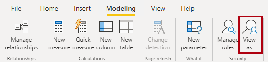

After configuring RLS and OLS, you need to verify that security works correctly and then assign users to roles. Testing before deployment prevents unauthorized data access in production.

## Test roles in Power BI Desktop

Power BI Desktop provides a **View as** feature that lets you preview reports as if you were assigned to a specific role. This is the fastest way to validate that your filter expressions work as expected.

1. On the **Modeling** tab, select **View as**.
2. Select the role you want to test.
3. For dynamic rules that use `USERPRINCIPALNAME()`, enter a test email address in the **Other user** field.
4. Review the report to confirm that only the expected data is visible.
5. Select **Stop viewing** to return to the normal view.

Test each role individually and verify that:

- Permitted data is visible and matches expected results.
- Restricted data is hidden and doesn't appear in any visual.
- Aggregations and totals reflect only the filtered data, not the full dataset.
- Visuals that reference secured OLS objects display appropriately or show an expected error message.

When testing dynamic rules, enter several different email addresses in the **Other user** field to confirm different data partitions. Include edge cases like users who aren't in the security table to verify they see no data.

> [!TIP]
> Test with multiple user identities to verify different data partitions. For a security table pattern, test with users assigned to different regions to confirm that each user sees only their authorized data.

## Test roles in the Power BI service

Testing in the service confirms that security works in the production environment. Power BI Desktop and the service can behave differently, especially with DirectQuery connections and SSO.

1. Open the semantic model in the Power BI service.
2. Select **More options (...)** next to the semantic model name.
3. Select **Security**.
4. On the security page, select the role and then select **Test as role**.
5. Verify the report displays the correct filtered data.

Always test after publishing to catch configuration issues that might not appear in Desktop. For example, model relationships might behave differently when the service resolves security filters against live data. DirectQuery connections with SSO can also produce different results in the service compared to Desktop, because the service passes the actual user identity to the data source.

## Assign role membership

After validating your roles, assign users to them in the Power BI service. Only semantic model owners and workspace admins can manage role membership.

1. In the Power BI service, navigate to the semantic model.
2. Select **More options (...)** and then **Security**.
3. Select the role.
4. In the **Members** field, enter the email address or name of the user or security group.
5. Select **Add**.

You can assign the following security objects to roles:

- Individual user accounts.
- Microsoft Entra security groups.
- Distribution groups and mail-enabled groups.
- Service principals.

> [!NOTE]
> Microsoft 365 groups aren't supported for role membership. Use Microsoft Entra security groups instead.

## Use security groups for scalable management

Map roles to Microsoft Entra security groups rather than individual users whenever possible. Security groups provide several advantages:

- **Fewer mappings.** One security group assignment covers all users in the group.
- **Delegated management.** Network administrators can manage group membership without needing access to Power BI.
- **Consistent access.** Adding or removing a user from the security group automatically updates their data access across all semantic models that reference the group.

For example, instead of adding 50 individual sales managers to a "Regional Managers" role, create a security group for regional managers and add the group to the role once.

## Understand how workspace roles and RLS interact

Workspace roles and RLS serve different purposes:

- **Workspace roles** control who can access the semantic model, reports, and other workspace items.
- **RLS** controls what data a user sees within a semantic model.

Both layers must be configured correctly. A user with Viewer permissions in a workspace is subject to RLS. However, users with Admin, Member, or Contributor roles have edit permissions and bypass RLS entirely. They see all data regardless of role assignments.

This means that workspace role assignment is critical. Don't grant Admin, Member, or Contributor roles to users who should be subject to data-level security.

## Avoid common mistakes

Security misconfigurations can lead to unauthorized data access. Watch for these common issues:

- **Forgetting to assign users to roles.** If a user has Viewer access but isn't assigned to any RLS role, they see all data. Always assign Viewer users to appropriate roles.
- **Circular filters from bidirectional relationships.** Bi-directional relationships can create unexpected filter paths that expose data across security boundaries. Enable the **Apply security filter in both directions** option only when necessary and test thoroughly.
- **Broken relationship chains.** If a relationship between dimension and fact tables is inactive or misconfigured, RLS filters won't propagate, and users might see unfiltered data. Verify that all relationships in the filter path are active and properly configured.
- **Not testing after publish.** Desktop and service environments can behave differently. Always validate security in the service after publishing.
- **Multiple role memberships.** When a user is assigned to multiple roles, RLS filters are additive. The user sees the union of all rows permitted by each role. This can unintentionally expose data if roles overlap. Design roles carefully to avoid conflicts.

## Security enables trusted AI

Your security configuration directly affects AI-powered features in Microsoft Fabric and Power BI. When RLS is properly configured:

- **Copilot chat respects RLS.** Users who ask natural language questions through Copilot in Power BI receive answers scoped to their authorized data only.
- **Fabric data agents honor security.** Fabric IQ data agents query semantic models using NL2DAX. RLS ensures agents return only authorized data for the requesting user.
- **OLS protects against AI disclosure.** Columns secured with OLS aren't accessible through natural language queries, preventing AI from exposing hidden data.
- **User context flows through AI paths.** AI agents pass the user's identity through to the semantic model, so the same RLS rules that protect report data also protect AI-generated answers.

Proper testing validates that all consumption paths, including AI, honor the same access controls as traditional reports. If a user shouldn't see certain data in a report, they shouldn't see it through Copilot or a data agent either.
