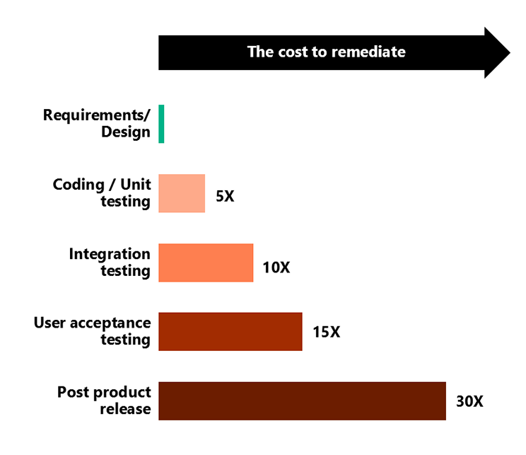
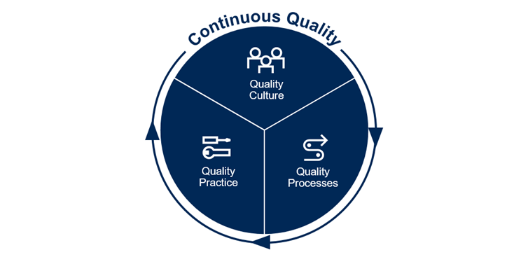

Continuous Quality is one of the eight capabilities in the DevOps taxonomy.

### Discover why Continuous Quality is necessary

Let’s consider an example of why quality and Continuous Quality are so important.

Japan adopted a rigorous quality assurance program, which affected their automakers. Because of the program, they gained a reputation for producing highly efficient and reliable cars, which set them apart from their competition.

By differentiating themselves with higher quality products, Japanese automakers were able to develop innovations in fuel efficiency, safety, and manufacturing processes. Costs also decreased because of lower failure rates that resulted from the increase in quality. Their competitors had no choice but to play catch up.

So, why do you need quality?

- To make products salable.
- To reduce costs.
- To set you apart from competition.

Key benefits of Continuous Quality include:

- A "quality-first" mindset that promotes a shared responsibility for quality.
- Reduction of waste due to frequent rework caused by defects.
- Less technical debt due to missing quality requirements accumulating over time.
- Greater customer satisfaction.
- Fewer incidents that disrupt the business.

Focusing on quality as early as possible in the development cycle results in significant savings of time and effort.

The longer it takes for code to be merged and the later the issues are found, the more costly it is to fix. Let's look at the return on investment:

- It costs 5X if defect is found in the development phase.
- It costs 10X if defect is found in integration testing.
- It costs 15X if defect is found in user acceptance testing.
- It costs 30X if defect is found in post product release.

The moral of the story is to invest in quality earlier!

### Foster a quality culture with Continuous Quality

**Continuous Quality** is about fostering a quality culture so that teams can:

- Create superior user experiences
- Build features that fit the market’s timing
- Enable the characteristics of an application that deliver value faster than they create technical debt

It’s also important to beware of the false assumption that the more bugs we find and fix, the better the quality will be.

If we didn’t create bugs to begin with, there would be no bugs to find. But we are humans, and we will make mistakes and create bugs. We should get away from the thinking that finding the bugs we created ourselves is making the quality better.

Ask yourself: Who is creating bugs? It’s the product owner, story writer, the designer, the architect, the coder, the tester... everyone, really.

In addition to fostering a quality culture, Continuous Quality is also about mindset – a passion to learn and bring our best every day to make a bigger difference in the world.

A Continuous Quality mindset:

- Encourages growth and innovation, and creates the culture that enables and nurtures quality-driven behaviors.
- Knows that quality is built-in, that it can’t be tested-in.
- Prioritizes quality over new features.
- Advocates teamwork.
- Takes responsibility for deliverables.
- Shifts testing sideways.

### Shift from quality assurance to Continuous Quality

It is a significant paradigm shift to change from traditional quality assurance to Continuous Quality. The following table illustrates the differences between the two:

|         | **Traditional quality assurance** |    **Continuous Quality**    |
|:-------:|:-----------------------------:|:------------------------:|
| **Why**     | Breaking the system           | Improving the system     |
| **What**    | Checking functionality        | System understanding     |
| **Who**     | Tester responsibility         | Entire team owns quality |
| **When**    | Testing at the end            | Testing throughout       |
| **Where**   | QA stage                      | Everywhere               |
| **How**     | Finding issues                | Preventing issues        |
| **Outcome** | Minimum quality               |    Increasing quality    |

### Be aware of the challenges and risks of Continuous Quality

|  |  |
| ------------ | -------------|
||Organizational silos and traditional top-down management structures can impede adoption rates. These challenges will be overcome only when organizational maturity and the necessary culture change takes effect across the whole organization, and as DevOps practices and projects mature.|
||Continuous Quality requires engaging all stakeholders and empowering them to push back. Lack of clearly set goals and fear of the unknown can also cause pushback. Support from senior management is essential to success when championing a Continuous Quality mindset across the organization.|
||Using Continuous Quality in software development requires changes to role responsibilities and changing organizational culture. These changes require significant investment and time, which will affect timelines and cause a decrease in productivity prior to reaching expert levels. They will also increase the quality of your digital systems.|
||Tools and technology are enablers of Continuous Quality, but you can’t just throw technology at a perceived problem and hope to solve it. Although tools automate and facilitate processes, Continuous Quality requires organizational culture to change. If you don’t have a process, you better hope that the vendor’s process works for you.|
||Continuous Quality can become a lever for broad organizational change by using new collaboration and communication models and by promoting a shared quality responsibility. However, if it remains only technically focused around continuous integration and testing, the organization will not realize the benefits it hoped for.|
||Measuring is essential, but a narrow focus on a single quality metric can drive employees to improve the metric at the expense of other corporate goals, or even customer satisfaction. If an organization doesn’t know what Continuous Quality means for them, they could experience multiple false starts while figuring it out. And a lack of early success might dissuade organizations from pursuing the beneficial cultural and collaborative changes that Continuous Quality can provide.|
