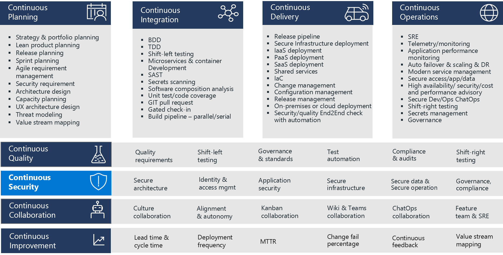
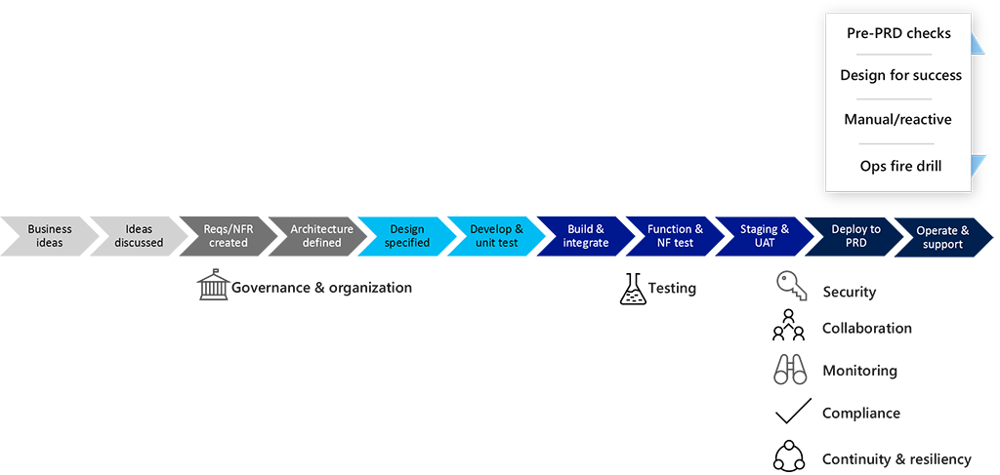
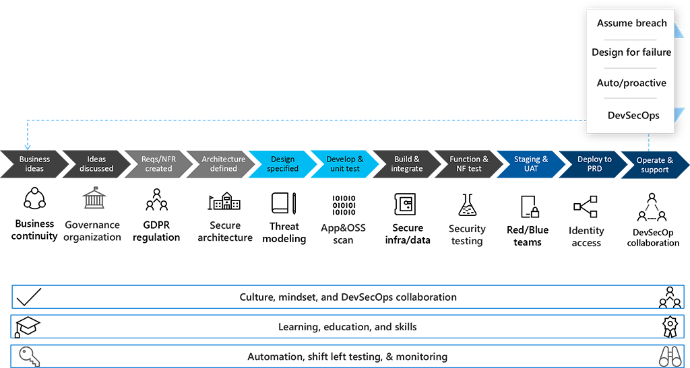

Continuous Security is one of the eight capabilities in the DevOps taxonomy.

Each capability identifies example practices. They aren't exhaustive lists.

### Discover why Continuous Security is necessary

The time between disclosure and exploit in production is shrinking. When a vulnerability is disclosed, not only does the affected party get the notice, but the hacker gets it too.

Let's look at the **Equifax breach** in 2017, which resulted from an attacker exploiting a web application using an open-source framework.

On March 6, 2017, Apache Foundation announced a new vulnerability and available patch for its Struts 2 framework. Soon after, Equifax, one of the credit reporting agencies that assess the financial health of many consumers in the US, started notifying selected customers that it suffered a breach. In September 2017, Equifax announced its breach publicly  worldwide.
The breach affected 145.4 million consumers in the US and 8000 in Canada. A total of 15.2 million records were compromised in the UK, including sensitive data affecting 700,000 consumers. In March 2018, Equifax announced that 2.4 million more US consumers were affected than originally disclosed.

All organizations need to understand that manual remediation is no longer feasible. Patching, testing, and release must be automated as much as possible to reduce fix time, especially for systems with access to critical data.

Today, the advice given by Michael Hayden (former director of the NSA and the CIA) is to **assume that you have been breached**, and that defense-in-depth at each level should be central to an organization’s security posture. According to Hayden, there are two types of companies: those that have been breached, and those that don’t know they’ve been breached.

The Product Group philosophy, which inspires their DevSecOps approach, is to assume you have been breached, the bad actors are already in the network with internal access, and that defense-in-depth is essential.

### What is Continuous Security?

Continuous Security is a practice that ensures security is an integral part of the software delivery lifecycle.

>[!IMPORTANT]
>Continuous Security maintains a holistic view of:
>
>- Secure architecture
>- Governance, risk, and compliance
>- App security – the code itself must be created with security in mind
>- Data security
>- Infrastructure security
>- Operations security
>- Endpoint security (for components such as APIs and web services), with secure access provided by credentials and client access white lists
>- Identity and access security

### Compare Continuous Security practices to the practices in a traditional software development lifecycle

In a traditional software development lifecycle, testing is done just before go-live. This approach often leads to new bugs discovered that must be fixed through code changes, redeployment, and retesting, and there is much potential for waste and delays. This approach has a direct impact on the delivery date of the functionality.

**Security** is often considered in the testing stages as part of a security resilience test. In most cases, this will lead to changes for the service in terms of hardening, which often means rework.

**Collaboration** between operations, security and compliance, and developers is often done reactively through incident management and problem management processes.

Traditionally there have been many attempts by organizations to double down on automation, led by a focus on silos and looking for areas of impact for automation. Although such programs are sure to deliver benefits, they have much less potential impact than DevOps teams have.

**Continuous Security** is holistic, shift-left, and automated. In other words, it's continuous.

>[!NOTE]
>The culture, mindset and collaboration between Development, Security, and Operations are now continuous. They don't work together just at the end of the lifecycle, in Operations. Also, when Development, Security, and Operations come together to fix production issues, they have already worked together.

Learning and education are also holistic. Instead of doing security at the last step, in Operations, it can be incorporated earlier and in an integrated way.

### Grow your security DevOps culture

Help your organization grow their security DevOps culture by promoting awareness, building your principles, and living by them.

To **promote awareness**, everyone must understand why Continuous Security is a critical aspect of a DevOps process. Organizations should:

- Use training to increase awareness.
- Ensure transparency to disclose identified security issues.
- Enable learning from previous faults and from each other.

With awareness in place, it should be simple to define **security principles**. Examples include:
- Assume a breach has already happened.
- Embrace fault and design your systems to face unexpected behaviors. Use chaos engineering or fault injection.
- Define "done" for every artifact produced and ensure the necessary security checks and practices are present.
- Align with your organization’s core values so that security concerns resonate with them and do not cause friction in the implementation.

And finally, **live by your principles**:
- Identify the non-negotiables.
- Perform regular security activities such as red-blue games.
- Perform regular chaos or alt injection exercises.
- Don’t forget the continuity of the process! Loop back your learnings for Continuous Improvement.

