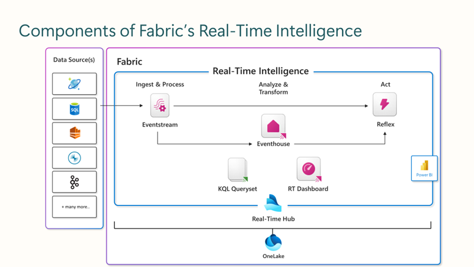

When your company chooses Real-Time Intelligence in Microsoft Fabric, the first step is seamlessly ingesting data. Event streams are a Microsoft Fabric feature that lets you handle real-time events without coding. You can set up event sources, destinations, and processors in the event stream. Event processing is another option within eventstream for collecting and aggregating, filtering, grouping, transforming, expanding, and joining other events from Microsoft Fabric event streams for extra insights into the in-flight data.

### Real-Time hub event flow

The Real-Time hub is essentially a central library within your organization that simplifies the process of accessing, adding, exploring, and sharing data in motion. It's designed to broaden your view by connecting to various data sources, providing clear insights across different areas. This hub is key to making data not just available, but also easy to use, which supports swift decision-making and informed actions. Sharing streaming data from various sources allows for a more complete understanding of your business intelligence.

Two objects that you'll notice in the Real-Time hub is that both eventstreams streams and event house tables are listed in the hub.

When you pick a data stream, either from within your organization or from external or internal sources, you can dive into the data using Real-Time Intelligence tools. These tools help you visually explore the data, allowing you to spot patterns, anomalies, and even predict trends and rates. Even if you're new to the data, these tools make it easy to grasp the structure and meaning, enabling you to make informed decisions quickly. Real-Time Dashboards are user-friendly, with built-in features that help anyone understand and act on data in motion, using visual aids, natural language, and Copilot guidance.

Moreover, you can turn these insights into immediate actions with the Data Activator, setting up reflex alerts within Data Activator to respond instantly to certain data patterns or conditions.

The eventstream main editor is the primary interface for setting up Fabric event streams and can be used to:

- Establish source and destinations
- View the data in-flight
- Capture, transform, and route data

By the end of this module, you're able to use Real-Time hub to add and explore event streams to source, transform, process, and route driven data events with Data Activator to destinations that are necessary for your workloads.