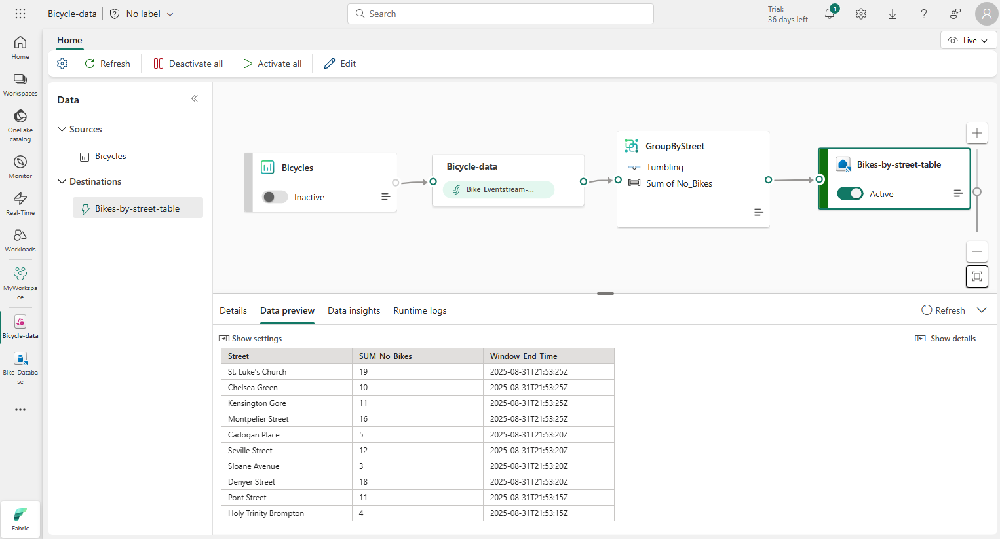

Microsoft Fabric eventstreams work by creating a pipeline of events from multiple internal and external sources to different destinations. You can think of it as a conveyor belt that moves data from one place to another. You can also add some transformations to the data along the way, such as filtering, aggregating, or enriching.

You can use the eventstream visual editor to design your pipeline by dragging and dropping different nodes, such as sources, destinations, and transformations. You can also see the event data flowing through the pipeline in real-time. Microsoft Fabric eventstream handles the scaling, reliability, and security of your event stream automatically. You don’t need to write any code or manage any infrastructure to use Microsoft Fabric Eventstream.

The main components of an eventstream are:

* **Sources**: Sources are where your event data comes from. You can pick Azure Event Hubs, sample data, or custom app as your source type. You can also choose the data format and the consumer group of your source.
- **Transformations**: You can add transformations that filter or aggregate the data as is processed from the stream. Transformations include common data operations such as filtering, joining, aggregating, and grouping as well as temporal windowing functions that enable you to analyze data events within discrete time periods.
* **Destinations**: Destinations are where your transformed event data is stored. For example, you can store the results of your stream processing in a table in an eventhouse or a lakehouse, or you could redirect data to another eventstream for further processing or to an activator to trigger an action.

You can use the eventstream editing canvas to add and manage your sources and destinations. You can also see the event data, check the data insights, and view logs for each source or destination.
