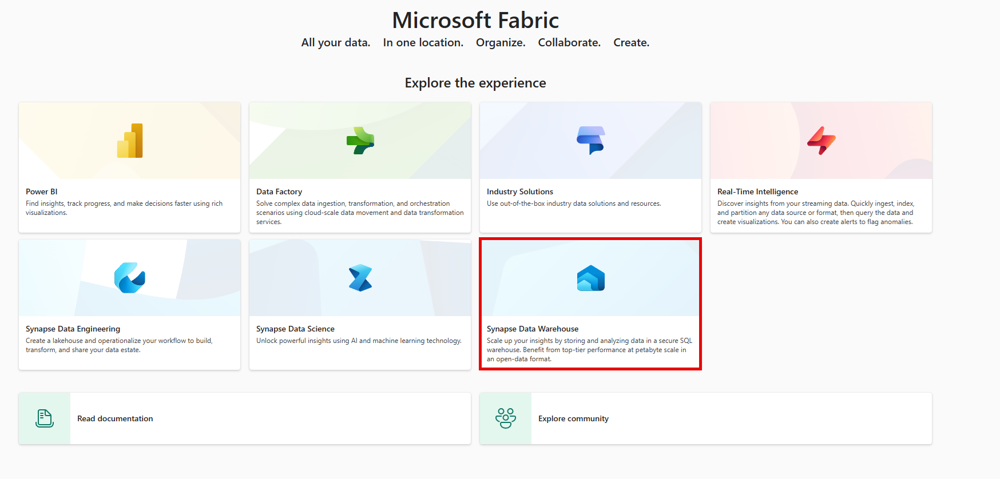

## Add and manage event sources in eventstream

Event sources are where you get your event data from. You can choose from Azure Event Hubs, sample data, or custom app as your source type. You can also specify the data format and the consumer group of your source.

To create an event source, you need to follow these steps:

1. Change your Fabric experience to Real-time Analytics and select Eventstream to create a new eventstream in **workspace** or **homepage** or **create hub**.

   

   > [!Note] 
   > As you can see from the image, there are several methods. Anytime you're in the PowerBI Service and have access to Fabric you can click on the icon in the bottom-left portion in the image to switch between fabric sources.

2. Enter a name for the new eventstream and select Create. You'll see the main editor canvas where you can add sources and destinations to your eventstream.
3. Select New source on the ribbon or  in the main editor canvas and then choose your source type. You can pick Azure Event Hubs, sample data, or custom app.
4. Enter a source name for the new source and select a cloud connection to your source. If you don’t have a cloud connection, select Create new connection to create one. You'll need to provide the information of your source, such as connection name, connection type, authentication, and privacy level.
5. Select a Data format of the incoming real-time events that you want to get from your source. The event streams feature supports the ingestion of events from Azure Event Hubs in JSON, Avro, and CSV (with header) data formats.
6. Select a Consumer group that can read the event data from your source and then select Add. You'll see the source added to your eventstream on the canvas.

## Event sources available in eventstream

The types of event sources available in EventStream are:

* **Azure Event Hubs**: This is a source that allows you to get event data from an Azure event hub. You can specify the data format and the consumer group of your Azure event hub. You can also create a cloud connection to your Azure event hub with the appropriate authentication and privacy level.
* **Sample data**: This is a source that allows you to use the out-of-box sample data provided by Microsoft Fabric. You can choose from different sample data sets, such as IoT, Retail, or Finance. You can also adjust the frequency and duration of the sample data generation.
* **Custom app**: This is a source that allows you to get event data from a custom app that you have developed. You can use the REST API or SDKs provided by Microsoft Fabric to send event data from your custom app to your eventstream. You can also specify the data format and the consumer group of your custom app.

## Configure Azure Event Hubs as an event source

Azure Event Hubs is a service that can handle large amounts of event data from different sources. You can use Azure Event Hubs as an event source for various applications and services, such as Azure Stream Analytics, Azure Functions, or Apache Spark.

To configure Azure Event Hubs as an event source in Microsoft Fabric, you need to do the following:

1. Create an Azure Event Hubs namespace and an event hub. A namespace is a container for your event hubs, and an event hub is a logical entity that receives the event data. You can create them in the Azure portal by following the steps in [this article](/fabric/real-time-analytics/event-streams/add-manage-eventstream-sources).
2. Create a shared access policy and a connection string for your event hub. A shared access policy defines the permissions for accessing your event hub, and a connection string is a string that contains the information needed to connect to your event hub. You can create them in the Azure portal by following the steps in [this article](/fabric/real-time-analytics/event-streams/add-manage-eventstream-sources).
3. Choose a data format for your event data. The data format determines how your event data is encoded and decoded. You can choose from JSON, Avro, or CSV formats.
4. Choose a consumer group for your event hub. A consumer group is a view of an event hub that enables multiple consumers to read the same stream of events at different speeds and with different offsets. You can create a consumer group in the Azure portal by following the steps in [this article](/fabric/real-time-analytics/event-streams/add-manage-eventstream-sources).
5. Create an eventstream item in Microsoft Fabric. An eventstream item is what you create in the portal to define your event data flow. You can create it by following the steps in [this article](/fabric/real-time-analytics/event-streams/transform-and-stream-real-time-events-to-lakehouse).
6. Add an Azure Event Hubs source to your eventstream item. You can add it by following the steps in [this article](/fabric/real-time-analytics/event-streams/transform-and-stream-real-time-events-to-lakehouse). You'll need to provide the connection string and the consumer group of your event hub, and select the data format of your event data.

## Use Sample data as an event source

To use sample data as an event source in Microsoft Fabric eventstreams, you need to follow these steps:

1. Change your Fabric experience to Real-time Analytics and select Eventstream to create a new eventstream in workspace or homepage or create hub.
2. Enter a name for the new eventstream and select Create. You'll see the main editor canvas where you can add sources and destinations to your eventstream.
3. Select New source on the ribbon or  in the main editor canvas and then Sample data.
4. On the right pane, enter a source name to appear on the canvas, select the sample data you want to add to your eventstream, and then select Add. You can choose from different sample data sets, such as IoT, Retail, or Finance. You can also adjust the frequency and duration of the sample data generation.
5. When the sample data source is added successfully, you can find it on the canvas and navigation pane. You can also preview the sample data by selecting the Data preview tab in the lower pane.

## How to stream events from your own application using Custom app as an event source?

This is a more advanced option but an important feature when looking

To stream events from your own application using Custom app as an event source in Fabric Eventstream, you need to follow these steps:

1. Create an eventstream item in Microsoft Fabric and add a Custom app source to it. You can do this by selecting New source on the ribbon or  in the main editor canvas and then selecting Custom app. The Custom app configuration screen appears, where you can obtain the endpoint connection string, which is an event hub compatible connection string. [This connection string is used in your application to send events to the eventstream.](https://blog.fabric.microsoft.com/blog/stream-real-time-events-to-microsoft-fabric-with-event-streams-from-custom-application/) and [this blog post](https://blog.fabric.microsoft.com/blog/stream-real-time-events-to-microsoft-fabric-with-event-streams-from-custom-application/).
2. Create an application that sends events to the eventstream using the connection string from the previous step. You can use any programming language or framework that supports event hubs or Kafka clients, such as Node.js, Python, Java, .NET, etc. You can find some examples of how to create such applications in [this article](/fabric/real-time-analytics/event-streams/stream-real-time-events-from-custom-app-to-kusto) and [this blog post](https://blog.fabric.microsoft.com/blog/stream-real-time-events-to-microsoft-fabric-with-event-streams-from-custom-application/).
3. Add one or more destinations to your eventstream to route and/or transform your event data to Fabric data sinks, such as Lakehouse, KQL Database, Power BI, etc. You can do this by selecting New destination on the ribbon or  in the main editor canvas and then selecting the destination type you want. The destination configuration screen appears, where you can specify the details of your destination, such as the name, schema, format, etc.
4. Verify that your event data is successfully streamed to your eventstream and your destinations by using the Data preview and Data insights tabs in the main editor of your eventstream. You can also query and analyze your data using various tools and services that are connected to your destinations, such as Spark SQL, Databricks, Power BI, etc.
