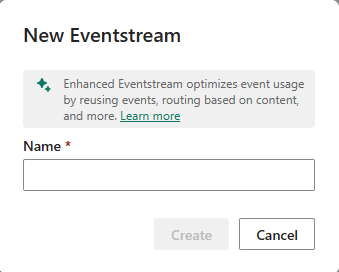
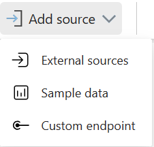

## Add and manage event sources in event stream

Event sources are where you get your event data from. You can choose from Azure Event Hubs, sample data, or custom app as your source type. You can also specify the data format and the consumer group of your source.

To create an event source, you need to follow these steps:

1. Change your Fabric experience to Real-Time Intelligence and select event stream to create a new event stream.

   > [!Note] 
   > Anytime you're in the Power BI Service and have access to Fabric you can click on the icon in the bottom-left portion in the image to switch between fabric sources.

2. Enter a name for the new event stream and ensure the enhanced capabilities box is checked then select Create. You see the main editor canvas where you can add sources and destinations to your event stream.

    

3. Select add source on the ribbon or select one of the options in the main editor canvas

    

4. Enter a source name for the new source and select a cloud connection to your source. If you don’t have a cloud connection, select Create new connection to create one. You need to provide the information of your source, such as connection name, connection type, authentication, and privacy level. 
5. Select a data format of the incoming real-time events that you want to get from your source. The event streams feature supports the ingestion of events from Azure Event Hubs in JSON, Avro, and CSV (with header) data formats.
6. Select a Consumer group that can read the event data from your source and then select Add. You see the source added to your event stream on the canvas.

## Event sources available in event stream

The types of event sources available in event stream are:

* **Azure Event Hub**: Azure Event Hubs is a source that allows you to get event data from an Azure event hub. You can specify the data format and the consumer group of your Azure event hub. You can also create a cloud connection to your Azure event hub with the appropriate authentication and privacy level.
- **Azure IoT Hub**: A SaaS service used to connect, monitor, and manage millions of IoT assets with a no-code experience. 
- **Azure SQL Database Change Data Capture (CDC)**: Software process that identifies and tracks changes to data in a database, enabling real-time or near-real-time data movement. 
- **PostgreSQL Database CDC**: The PostgreSQL Database CDC connector for Microsoft Fabric event streams captures a current snapshot and tracks future changes in a PostgreSQL database, allowing real-time processing and analysis of this data within Fabric.
- **MySQL Database CDC**: The Azure MySQL Database CDC Source connector for Microsoft Fabric event streams captures a snapshot of your MySQL database and tracks table changes, enabling real-time processing and analysis of this data in Fabric.
- **Azure Cosmos DB CDC**: The Azure Cosmos DB CDC connector for Microsoft Fabric event streams captures and tracks real-time data changes in Cosmos DB for analysis and processing within Fabric.
- **Google Cloud Pub/Sub**: A messaging service for exchanging event data among applications and services. 
- **Amazon Kinesis Data Streams**: Collect, process, and analyze real-time, streaming data. 
- **Confluent Cloud Kafka**: A fully managed service based on Apache Kafka for stream processing. 
- **Fabric workspace events**: Fabric workspace events are events triggered by changes in your Fabric Workspace, such as creating, updating, or deleting items. With Fabric event streams, you can capture, transform, and route these events for in-depth analysis and monitoring within Fabric. This integration offers enhanced flexibility in tracking and understanding workspace activities.
- **Azure blob storage events**: Azure Blob Storage events are system triggers for actions like creating, replacing, or deleting a blob. Microsoft Fabric event streams link these to Fabric events, allowing you to process Blob Storage events as continuous data streams for routing and analysis within Fabric. One unique trait of the Azure Blob Storage Events is their support for ***streamed*** or ***unstreamed*** events.
* **Custom endpoint**: You can use the REST API or SDKs provided by Microsoft Fabric to send event data from your custom app to your event stream. You can also specify the data format and the consumer group of your custom app.
* **Sample data**: Sample data is a source that allows you to use the out-of-box sample data provided by Microsoft Fabric. You can choose from different sample data sets, such as IoT, Retail, or Finance. You can also adjust the frequency and duration of the sample data generation.


## Configure Azure Event Hubs as an event source

Azure Event Hubs is a service that can handle large amounts of event data from different sources. You can use Azure Event Hubs as an event source for various applications and services, such as Azure Stream Analytics, Azure Functions, or Apache Spark.

To configure Azure Event Hubs as an event source in Microsoft Fabric, you need to:

1. Create an Azure Event Hubs namespace and an event hub. A namespace is a container for your event hubs, and an event hub is a logical entity that receives the event data. You can create them in the Azure portal by following the steps in [this linked article](/fabric/real-time-analytics/event-streams/add-manage-eventstream-sources).
2. Create a shared access policy and a connection string for your event hub. A shared access policy defines the permissions for accessing your event hub, and a connection string is a string that contains the information needed to connect to your event hub. You can create them in the Azure portal by following the steps in [this linked article](/fabric/real-time-analytics/event-streams/add-manage-eventstream-sources).
3. Choose a data format for your event data. The data format determines how your event data is encoded and decoded. You can choose from JSON, Avro, or CSV formats.
4. Choose a consumer group for your event hub. A consumer group is a view of an event hub that enables multiple consumers to read the same stream of events at different speeds and with different offsets. You can create a consumer group in the Azure portal by following the steps in [this linked article](/fabric/real-time-analytics/event-streams/add-manage-eventstream-sources)..
5. Create an event stream item in Microsoft Fabric. An event stream item is what you create in the portal to define your event data flow. You can create it by following the steps in [this linked article](/fabric/real-time-analytics/event-streams/transform-and-stream-real-time-events-to-lakehouse).
6. Add an Azure Event Hubs source to your event stream item. You can add it by following the steps in [this linked article](/fabric/real-time-analytics/event-streams/transform-and-stream-real-time-events-to-lakehouse). You need to provide the connection string and the consumer group of your event hub, and select the data format of your event data.

## Use Sample data as an event source

To use sample data as an event source in Microsoft Fabric event streams, you need to follow these steps:

1. Change your Fabric experience to Real-Time Intelligence and select event stream to create a new event stream in workspace or homepage or create hub.
2. Enter a name for the new event stream and select Create. You see the main editor canvas where you can add sources and destinations to your event stream.
3. Select New source on the ribbon or  in the main editor canvas and then Sample data.
4. On the right pane, enter a source name to appear on the canvas, select the sample data you want to add to your event stream, and then select Add. You can choose from different sample data sets, such as IoT, Retail, or Finance. You can also adjust the frequency and duration of the sample data generation.
5. When the sample data source is added successfully, you can find it on the canvas and navigation pane. You can also preview the sample data by selecting the Data preview tab in the lower panel.

## How to stream events from your own application using Custom app as an event source?

Custom app as an event source is a more advanced option but an important feature.

To stream events from your own application using Custom app as an event source in Fabric event stream, you need to follow these steps:

1. Create an event stream item in Microsoft Fabric and add a Custom app source to it. Select New source on the ribbon or  in the main editor canvas and then selecting Custom app. The Custom app configuration screen appears, where you can obtain the endpoint connection string, which is an event hub compatible connection string. [The compatible connection string is used in your application to send events to the event stream.](https://blog.fabric.microsoft.com/blog/stream-real-time-events-to-microsoft-fabric-with-event-streams-from-custom-application/) and [this blog post](https://blog.fabric.microsoft.com/blog/stream-real-time-events-to-microsoft-fabric-with-event-streams-from-custom-application/).
2. Create an application that sends events to the event stream using the connection string from the previous step. You can use any programming language or framework that supports event hubs or Kafka clients, such as Node.js, Python, Java, .NET, etc. You can find some examples of how to create such applications in [this linked article](/fabric/real-time-analytics/event-streams/stream-real-time-events-from-custom-app-to-kusto) and [this linked blog post](https://blog.fabric.microsoft.com/blog/stream-real-time-events-to-microsoft-fabric-with-event-streams-from-custom-application/).
3. Add one or more destinations to your event stream to route and/or transform your event data to Fabric data sinks, such as Lakehouse, KQL Database, Power BI, etc. Select New destination on the ribbon or  in the main editor canvas and then selecting the destination type you want. The destination configuration screen appears, where you can specify the details of your destination, such as the name, schema, format, etc.
4. Verify that your event data is successfully streamed to your event stream and your destinations by using the Data preview and Data insights tabs in the main editor of your event stream. You can also query and analyze your data using various tools and services that are connected to your destinations, such as Spark SQL, Databricks, Power BI, etc.

## Processing events within event streams

The drag and drop interface offers a straightforward and user-friendly method for constructing your event data workflows. This includes processing, transformation, and routing, all without the need for coding. An eventstream's data flow diagram provides a clear visual representation of the data's journey and structure. Additionally, the event processor editor's no-code environment enables you to design your event data processing logic simply by dragging and dropping elements into place.

- **Transformation Description**

When you create an eventstream with Enhanced capabilities enabled, all destinations support transformation operations. Without Enhanced capabilities, transformations are only available for Lakehouse and KQL Database destinations, which handle event processing before ingestion.

  - **Filter**: Use the Filter transformation to filter events based on the value of a field in the input. Depending on the data type (number or text), the transformation keeps the values that match the selected condition, such as is ```null``` or ```is not null```.
  - **Manage fields**: This transformation allows you to add, remove, change data type, or rename fields coming in from an input or another transformation.
  - **Aggregate**: Use the Aggregate transformation to calculate an aggregation (Sum, Minimum, Maximum, or Average) every time a new event occurs over a period of time. This operation also allows for the renaming of these calculated columns, and filtering or slicing the aggregation based on other dimensions in your data. You can have one or more aggregations in the same transformation.
  - **Group by**: Use the Group by transformation to calculate aggregations across all events within a certain time window. You can group by the values in one or more fields. It's like the Aggregate transformation allows for the renaming of columns, but provides more options for aggregation and includes more complex options for time windows. Like Aggregate, you can add more than one aggregation per transformation.
  - **Union**: Use the Union transformation to connect two or more nodes and add events with shared fields (with the same name and data type) into one table. Fields that don't match are dropped and not included in the output.
  - **Expand**: Use this array transformation to create a new row for each value within an array.
  - **Join**: this is a transformation to combine data from two streams based on a matching condition between them.
## Destinations for routed events

Microsoft Fabric event streams supports the ability to send data to the following destinations in the enhanced mode.

| Destination | Description |
|-------------|-------------|
| **Custom app** | With this feature, you can seamlessly direct your real-time event traffic to a bespoke application. It enables the integration of your proprietary applications with the event stream, allowing for the immediate consumption of event data. This feature is advantageous when you aim to transfer real-time data to an independent system not hosted on the Microsoft Fabric. |
| **Lakehouse** | This destination empowers you to preprocess your real-time events prior to their ingestion into your lakehouse. The events are transformed into Delta Lake format and later stored in specific lakehouse tables, facilitating your data warehousing needs. For detailed guidance on utilizing the event processor for real-time data handling, refer to the 'Process event data with event processor editor' section. |
| **KQL database** | This destination offers the capability to funnel your real-time event data into a KQL database, granting you the power to employ the robust Kusto Query Language (KQL) for data interrogation and analysis. Housing your data within the KQL database unlocks the potential for enhanced comprehension of your event data and the creation of comprehensive reports and dashboards. You have the flexibility to opt for one of two data ingestion approaches: either direct ingestion or preprocessing of events prior to ingestion.|
| **Reflex** | This destination facilitates a direct linkage of your real-time event data with a Reflex. A Reflex is an intelligent entity equipped with all necessary details to establish data connections, monitor specific conditions, and execute actions. Upon the event data meeting certain predefined criteria or identifying particular patterns, the Reflex autonomously initiates suitable responses, such as notifying users or triggering Power Automate workflows. | 

When you choose the enhanced capabilities, you're able to use the standard destinations along with ***derived stream***.

| Destination | Description |
|-------------|-------------|
| **Derived stream** | The derived stream is a specialized destination created post-application of stream operations like Filter or Manage Fields to an eventstream. It represents the altered default stream after processing, which can be routed to various destinations within Fabric and monitored in the Real-Time hub. |

You're now able to attach to multiple destinations within an event stream at the same time without impacting or colliding with each other.
