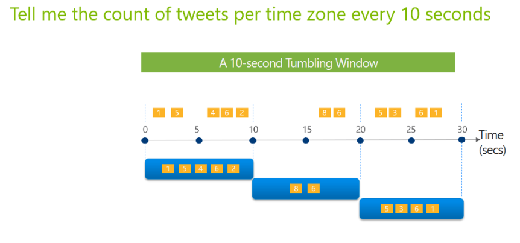
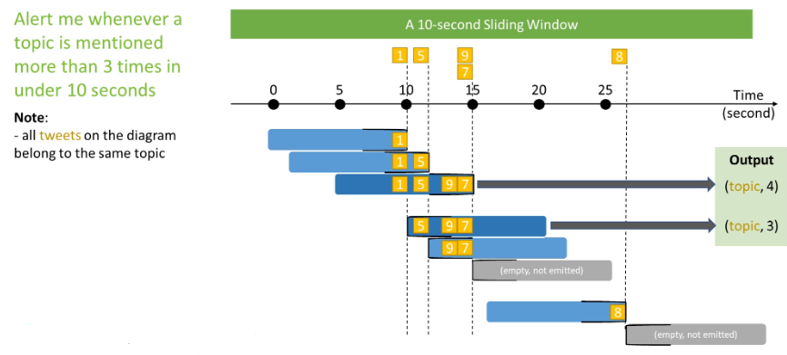
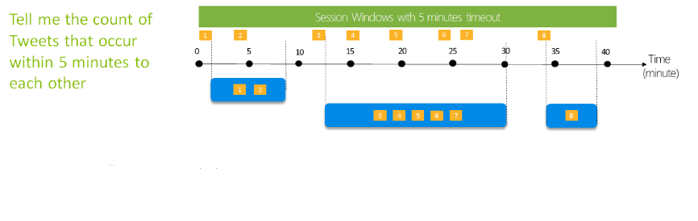
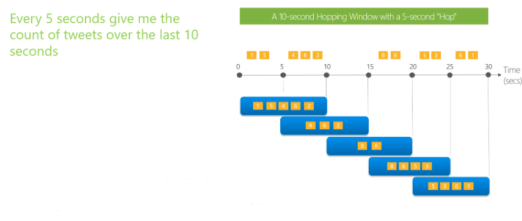
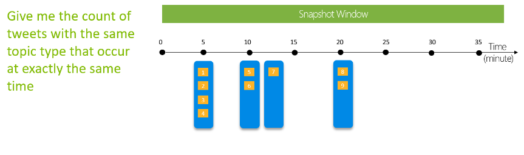

## Add and manage event destinations in event stream

To add an event stream destination in Microsoft Fabric, you need to follow these steps:

1. Select New destination on the ribbon or  in the main editor canvas and then select the type of destination you want to add. The types of destinations that you can add to your event stream are KQL Database, Lakehouse, Custom App, and Reflex. See the Supported destinations section for details.
2. Enter a destination name, select a workspace, and choose a destination from the selected workspace. Then select Add and configure.

    > [!NOTE]
    > Make sure to read any notes that might appear on the configuration panel that appears after selecting your destination type.

3. On the Ingest data page, navigate through the four tabs, which include:
  - Destination: Use an existing table of your KQL database or create a new one to route and ingest your real-time data.
  - Source: Verify the real-time data source for creating a data connection to ingest data from your event stream.
  - Schema: Select a compression type and data format, and preview how the data is sent to your selected destination. By performing this step, you can ensure you have properly formatted your data and it adheres to the expected schema, which helps prevent data loss or inaccuracies during ingestion.
  - Summary: Review the status of your data ingestion, including the table created with the schema you defined, and connection between the event stream and the selected destination.
4. Review the status of your data ingestion and select Done. A destination tile appears on the canvas, connected to your event stream.
  For more information, you can refer to [this article](/fabric/real-time-analytics/event-streams/add-manage-eventstream-destinations) that explains how to create and manage an event stream in Microsoft Fabric.

## Types of event destinations available in event stream

In event stream, there are currently four current destination types supported including:

- KQL Database
- Lakehouse
- Custom App
- Reflex


## Store events in a delta table using Lakehouse as an event destination

1. Create a lakehouse and an event stream in your workspace. 
2. Add a lakehouse destination to your event stream by selecting New destination on the ribbon or  in the main editor canvas and then selecting **Lakehouse**.

    

3. Enter a destination name, select a workspace, and choose a lakehouse from the selected workspace. Then select Add and configure.

    

4. On the Ingest data page, navigate through the tabs to complete the configuration for your destination. You can specify the destination table, source connection, schema, compression type, data format, and preview how the data is sent to your lakehouse. You can also define real-time events processing logic with event processor. 
5. Review the status of your data ingestion and select Done. A lakehouse destination tile appears on the canvas, connected to your event stream. Real-time events are converted into Delta Lake format and then stored in the designated lakehouse tables.

  > [!NOTE] 
  > The other destination types, including KQL Database, Custom App, and Reflex can be used in combination with your source or as a stand-alone event stream.

## Add event processor operators

In several destinations, you see the button for event processing. Once a destination connection is established, you're able to add or edit new or existing processing operations prior to it reaching its destination.


Within the event processing editor, you have several operations available to you to refine the data for your target sources including:


These operations include:

- **Aggregate**: This operation allows you to group the events by one or more fields and apply aggregation functions such as sum, count, average, min, max, etc. to the other fields.
- **Expand**: Use the Expand array transformation to create a new row for each value within an array.
- **Filter**: This operation allows you to filter out the events that don't meet your criteria based on the field values.
- **Group by**: Use the Group by transformation to calculate aggregations across all events within a certain time window. You can group by the values in one or more fields. It's like the Aggregate transformation but provides more options for aggregation and includes more complex options for time windows. Like Aggregate, you can add more than one aggregation per transformation.
  The aggregations available in the transformation are:

  - Average
  - Count
  - Maximum
  - Minimum
  - Percentile (continuous and discrete)
  - Standard Deviation
  - Sum
  - Variance
- **Manage fields**: This operation allows you to select the fields you want to output, rename the columns, change the data type, and add new fields with built-in functions.
- **Union**: Use the Union transformation to connect two or more nodes and add events that have shared fields (with the same name and data type) into one table. Fields that don't match are dropped and not included in the output.

This processor operation is contained within the Event Task and you can edit it by the event task icon:


## Windowing functions in event stream

Windowing functions are a way to perform operations on the data contained in temporal windows, such as aggregating, filtering, or transforming streaming events based on time. Windowing functions are useful for analyzing streaming data that changes over time, such as sensor readings, web-clicks, on-line transactions, and more and provide great flexibility to keep an accurate record of events as they occurred.

Earlier, we mentioned the **Group by** operator in the event processor editor. This graphical interface allows us to define the logic we need for processing, transforming, and routing event data. There are four parameters that need specified in the **Group by** operator settings to use these windowing functions that include:

- The **window type**, which can be **tumbling, sliding, snapshot, hopping**, or **session**.
  - **tumbling windows** divides incoming events into fixed and nonoverlapping intervals based on arrival time.

    This window shows a count of tweets per time zone every 10 seconds apart.
      
     

  - **sliding windows** takes the events into fixed and overlapping intervals based on time and divides them.
   
     A window is a 10-second sliding window that alerts the user whenever an article is mentioned more than three times in under 10 seconds
  
     
 
    > [!NOTE]
    > All of the tweets belong to the same topic in this scenario

  - **session windows** simply divides events into variable and nonoverlapping intervals that are based on a gap of lack of activity.
    
     A window, which shows the total count of tweets that occur within five minutes of one another
  
     

  - **hopping windows** hopping windows are different from **tumbling** windows as they model scheduled overlapping window.
  
     A 10 second hopping window, which refreshes every 5 seconds and provides the total count of tweets over the past 10 seconds.
    
      

  - **snapshot windows** snapshot windows group event stream events that have the same timestamp and are unlike the other windowing functions, which require the function to be named. In 
  - **snapshot windows** you add the ```System.Timestamp()``` to the ```GROUP BY``` clause.

    This window provides a count of tweets with the same article type that occur at exactly the same time.

     

- The **window duration** is the length of each window interval, which can be in seconds, minutes, hours, and even days. An example duration, such as 10 minutes, means simply that each window covers 10 minutes of event data.
- The **window offset** is an optional parameter that shifts the start and end of each window interval by a specified amount of time. An example of when this optional parameter is set might be a window offset of 2 minutes, which means that each window starts and ends 2 minutes later than usual.
- The **grouping key** is one or more columns in your event data that you wish to group by. For example, by sensor ID, or item category.
- The **Aggregation function** is one or more of the functions that you want to apply to each group of events in each window. Where the counts, sums, averages, min/max, and even custom functions become useful.