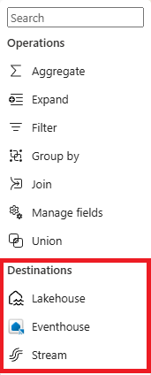
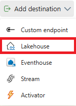
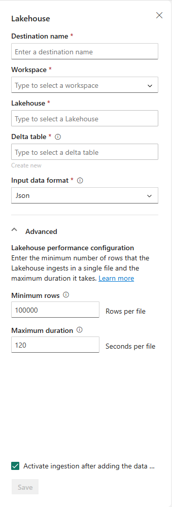
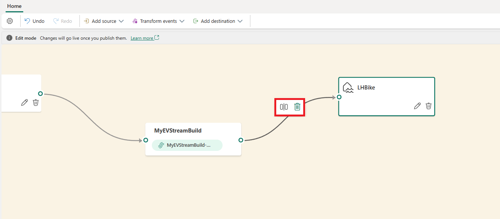
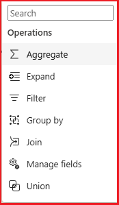
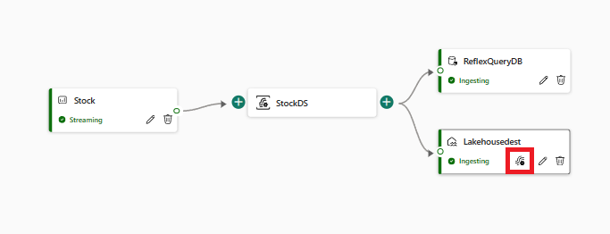

## Add and manage event destinations in eventstream

To add an eventstream destination in Microsoft Fabric, you need to follow these steps:

- Select New destination on the ribbon or  in the main editor canvas and then select the type of destination you want to add. The types of destinations that you can add to your eventstream are KQL Database, Lakehouse, Custom App, and Reflex. See the Supported destinations section for details.
- Enter a destination name, select a workspace, and choose a destination from the selected workspace. Then select Add and configure.

> ![NOTE: Make sure to read any notes that might appear on the configuration panel that appears after selecting your destination type]

- On the Ingest data page, navigate through the four tabs which include:
  - Destination: Use an existing table of your KQL database or create a new one to route and ingest your real-time data.
  - Source: Verify the real-time data source for creating a data connection to ingest data from your eventstream.
  - Schema: Select a compression type and data format, and preview how the data is sent to your selected destination. By performing this step, you can ensure you have properly formatted your data and it adheres to the expected schema, which helps prevent data loss or inaccuracies during ingestion.
  - Summary: Review the status of your data ingestion, including the table created with the schema you defined, and connection between the eventstream and the selected destination
- Review the status of your data ingestion and select Done. A destination tile will appear on the canvas, connected to your eventstream.
  For more information, you can refer to [this](/fabric/real-time-analytics/event-streams/add-manage-eventstream-destinations) article that explains how to create and manage an eventstream in Microsoft Fabric.

## Types of event destinations available in eventstream

In eventstream there are currently four current destination types supported including:

- KQL Database
- Lakehouse
- Custom App
- Reflex

## Store events in a delta table using Lakehouse as an event destination

- Create a lakehouse and an eventstream in your workspace. You can refer to this article for detailed instructions.
- Add a lakehouse destination to your eventstream by selecting New destination on the ribbon or  in the main editor canvas and then selecting **Lakehouse**.

- Enter a destination name, select a workspace, and choose a lakehouse from the selected workspace. Then select Add and configure.

On the Ingest data page, navigate through the tabs to complete the configuration for your destination. You can specify the destination table, source connection, schema, compression type, data format, and preview how the data is sent to your lakehouse. You can also define real-time events processing logic with event processor. See this article for more details.
Review the status of your data ingestion and select Done. A lakehouse destination tile will appear on the canvas, connected to your eventstream. Real-time events are converted into Delta Lake format and then stored in the designated lakehouse tables

> !NOTE: The other destination types, including KQL Database, Custom App, and Reflex can be used in combination with your source or as a stand-alone event stream.

## Add event processor operators

In several destinations you'll see the button for event processing and once a destination connection is established you'll be able to add or edit new or existing processing operations prior to it reaching its destination.

Within the event processing editor, you'll have several operations available to you to refine the data for your target sources including:

These operations include:

- **Aggregate**: This operation allows you to group the events by one or more fields and apply aggregation functions such as sum, count, average, min, max, etc. to the other fields
- **Expand**: Use the Expand array transformation to create a new row for each value within an array.
- **Filter**: This operation allows you to filter out the events that do not meet your criteria based on the field values.
- **Group by**: Use the Group by transformation to calculate aggregations across all events within a certain time window. You can group by the values in one or more fields. It's like the Aggregate transformation but provides more options for aggregation and includes more complex options for time windows. Like Aggregate, you can add more than one aggregation per transformation.
  The aggregations available in the transformation are:

  - Average
  - Count
  - Maximum
  - Minimum
  - Percentile (continuous and discrete)
  - Standard Deviation
  - Sum
  - Variance
- **Manage fields**: This operation allows you to select the fields you want to output, rename the columns, change the data type, and add new fields with built-in functions.
- **Union**: Use the Union transformation to connect two or more nodes and add events that have shared fields (with the same name and data type) into one table. Fields that don't match are dropped and not included in the output.

This processor operation will be contained within the Event Task and you can edit it by the event task icon:

