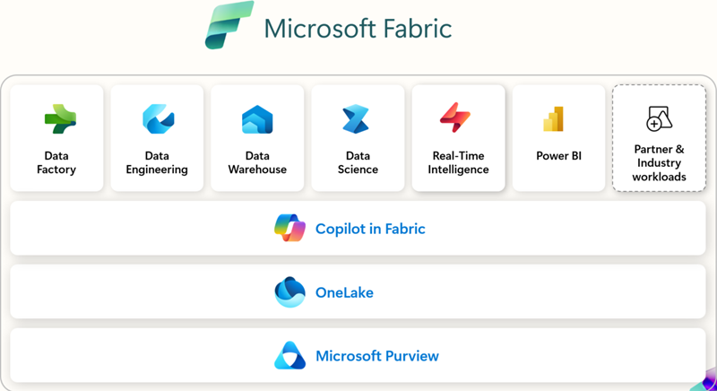

Microsoft Fabric includes a set of governance and compliance capabilities that might be sufficient for the needs of some organizations. Other governance capabilities can be accessed in Microsoft Purview.

If, for example, you work at a health care company, you have specific data governance needs because of regulatory requirements. In this unit, we'll explore Fabric's governance features so you can assess if they meet your requirements.  

## What is Microsoft Fabric?

Fabric is Microsoft's end-to-end analytics and data platform. The platform can store, move, process, ingest, transform, and analyze your data regardless of its size and current format. Once you have data in the location and format you need it, advanced business intelligence features can be used to analyze data, and generate insights to support your decision making.

### OneLake

In Fabric, all information is stored in a data lake, which can hold both structured and unstructured data. Microsoft's implementation of the data lake is called OneLake and is built on Azure Data Lake Storage (ADLS) generation 2. With all data residing in OneLake, there's a single copy of data that doesn't need to be moved or duplicated. This single underlying storage mechanism helps ensure that policies and security controls are applied universally.

## What is data governance?

The data that an organization works with is often business-critical and highly sensitive. Sensitive data must be: held securely, easily available, and processed in compliance with legislation in all the locations where an organization operates.

Data governance is the practice of managing data to ensure the quality, consistency, security, and usability of data. It involves setting up a framework that includes roles, responsibilities, processes, policies, and standards that are used to manage data throughout its lifecycle.

A data governance program usually includes:

- **Auditing**: Recording where data originates and who modifies it.
- **Evaluation**: Assessing the usefulness and accuracy of data.
- **Documentation**: Providing clear descriptions of data to support informed use.
- **Management**: Correcting inaccurate data, fulfilling access requests, and maintaining compliance with data legislation.
- **Protection**: Securing data from unauthorized access, ransomware threats, and other malicious attacks.

Well-governed data is reliable and readily accessible to those who need it.

> [!TIP]
> In large organizations, data is often stored and managed separately across different business units, creating what are known as data silos. These silos can hinder effective data governance due to inconsistent standards and policies across teams. Breaking down these silos by integrating data—while preserving security and compliance—is essential for establishing a unified and governed data environment.

Implementing data governance can lead to benefits such as:

- A single source of truth that reduces confusion and supports decision making.
- Improved data quality.
- Faster compliance with access requests.
- Reduced data storage and management costs.

## Data governance features in Microsoft Fabric

Many data governance tasks can be performed using your Microsoft Fabric license, without the need for an additional Microsoft Purview license. Let’s explore some of the built-in data governance capabilities available directly within Fabric.

### Managing the data estate

Your organization’s data estate encompasses all its data assets. Managing a large data estate can be complex and resource-intensive. Microsoft Fabric simplifies managing your data estate with these tools:

- **The Fabric Admin portal**: control tenant settings, capacities, domains, and other objects, typically reserved for administrators.
- **Tenants, domains, and workspaces**: logical containers that you can use to control access to data and capabilities. Fabric administrators, for example, should have access to all settings in the tenant whereas team level data controllers might only have control of settings on their domain or workspace.
  - Domains group data that is relevant to a single business area or subject field.
  - Workspaces group Fabric items used by a single team or department.
- **Capacities**: These objects limit compute resource usage for all Fabric workloads.
- **Metadata scanning**: Scanning extracts values such as names, identities, sensitivities, endorsements, and so on, from data lakes. You can use this metadata to analyze and set governance policies.

### Securing and protecting data

Secure data is safeguarded from unauthorized access and malicious attacks. It's also compliant with data storage regulations applicable in your region. Fabric includes the following tools to secure and protect data:

- **Data tags**: Use tags to identity the sensitivity of data and apply data retentions and protection policies.
- **Workspace roles**: Use roles to define the users who are authorized to access the data in a workspace.
- **Data-level controls**: Use controls at the level of Fabric items such as tables, rows, and columns to impose granular restrictions.
- **Certifications**: Fabric is compliant with many data management certifications, including HIPAA BAA, ISO/IEC 27017, ISO/IEC 27018, ISO/IEC 27001, and ISO/IEC 27701.

### Encouraging data discovery and use

Data only becomes valuable when users can find and analyze it. These Microsoft Fabric features help promote data discovery and encourage meaningful use:

- **OneLake data hub**: This tool makes it easy for users to find and explore the data in your estate.
- **Endorsement**: Users endorse a Fabric item to identity it as of high quality. Endorsements help other users to trust the data that the item contains.
- **Data lineage**: This feature helps users to understand the flow of data between items in a workspace and the impact that a change would have.

### Monitoring data usage

Fabric helps users track how data is being used through built-in monitoring tools:

- **Monitoring Hub:** Provides a centralized view of Microsoft Fabric activities. Users can only see activity related to Fabric items they have permission to access.

- **Capacity Metrics App:** Offers insights into Fabric usage and resource consumption, helping teams manage capacity effectively.

## Learn more

- [What is Microsoft Fabric?](/fabric/get-started/microsoft-fabric-overview)
- [What is data governance?](https://azure.microsoft.com/resources/cloud-computing-dictionary/what-is-a-data-governance/)
- [Microsoft Fabric governance documentation](/fabric/governance/)
