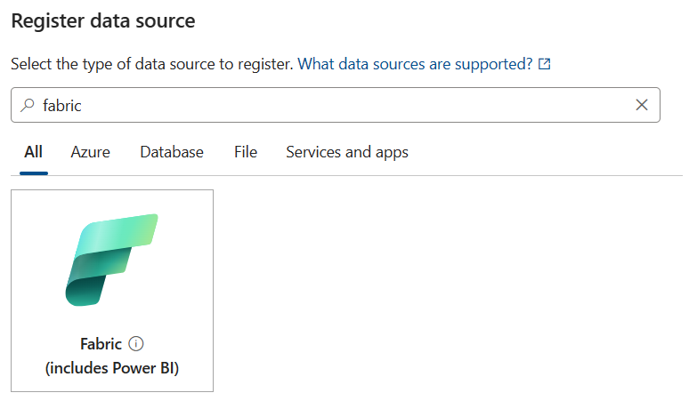
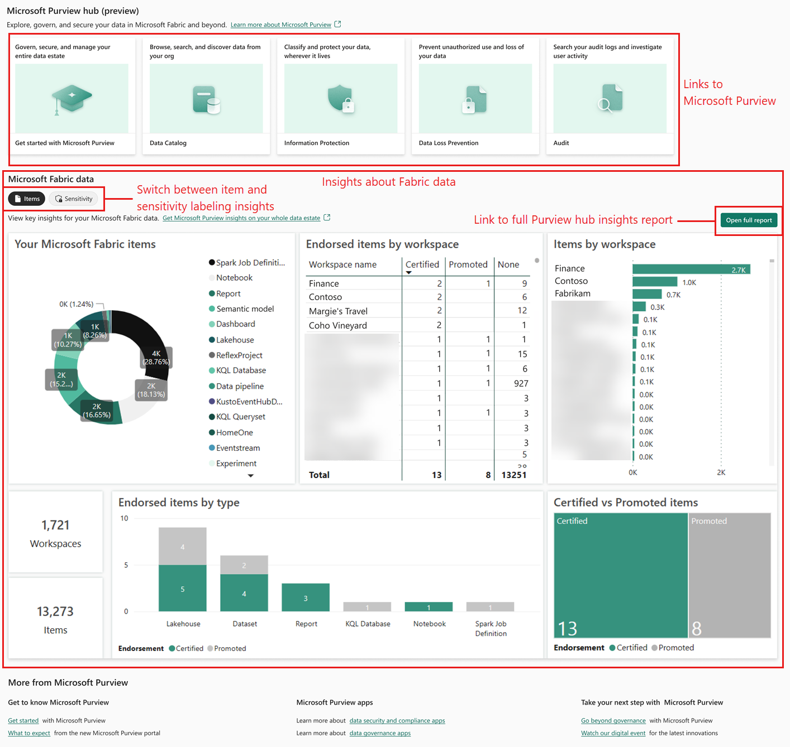

To use Microsoft Purview to govern Microsoft Fabric items, you must start by connecting them. Once you connect Purview to Fabric, a new page called the Microsoft Purview hub appears in Fabric with rich analysis of Fabric items.

In your healthcare provider, you added Purview. Now, you want to connect it to Fabric and explore the analysis that Purview generates.

In this unit, you'll explore the Purview hub.

## Connect Purview to Fabric

The steps you must complete to connect Purview to Fabric depend on their relative locations: in the same tenant or in different tenants. Let's examine connection in the same tenant first.

### Connect Purview to Fabric in the same tenant

The stages to complete are:

1. Register the Fabric tenant as a data source in Purview:

    

1. Configure Purview to authenticate with Fabric, for example by creating and selecting a managed identity in **Microsoft Entra ID**.
1. Create a scan in Purview that uses the Fabric data source.

> [!NOTE]
> Instead of using a managed identity to authenticate Purview with Fabric, you can use a service principal or delegated authentication instead. For details, see [Connect to your Microsoft Fabric tenant in the same tenant as Microsoft Purview](/purview/register-scan-fabric-tenant?context=%2Ffabric%2Fgovernance%2Fcontext%2Fcontext-purview&tabs=Scenario1#configure-credentials-for-scans-in-microsoft-purview)

### Connect Purview to Fabric in a different tenant

If Microsoft Fabric is in a different tenant from Purview, all the same functionality is supported, except that Purview's live view isn't available for Fabric items.

When you register the Fabric tenant in Purview, the system can't identify it automatically, so you must obtain and manually enter the tenant ID.

Finally, you can't use a managed identity for authentication in cross-tenant connections. Instead, use a service principal or delegated authentication.

## What is the Microsoft Purview hub in Microsoft Fabric?

Once Purview and Fabric are connected, the Purview hub in Fabric displays reports and insights about your Fabric items. It acts as a centralized location to begin data governance and access more advanced features.

To see the hub, open the Fabric settings drop-down, and then select **Microsoft Purview hub**.

The display you see in the hub depends on your role:

- Fabric administrators see information about their entire organization's Fabric data estate. At the top are links to Purview tools, including the **Data Catalog**, **Information Protection**, and **Audit**. Underneath, the main **Microsoft Fabric data** section displays tables and graphs that analyze the entire organization's items in Fabric.

    

- Other users only see information about their own Fabric items and data. At the top are links to the Purview tools the current user can access, such as **Get started with Microsoft Purview** and the **Data Catalog**. Underneath, the main **Microsoft Fabric data** section displays tables and graphs that analyze only items in Fabric that you have permission to access.

    

## Getting insights about Fabric

The main section of the Microsoft Purview hub is called **Microsoft Fabric data** and has two displays:

### Items

The **Items** display shows insights based on Fabric apps, lakehouses, warehouses, and reports. For example, you can find out how many items are in each workspace, and how many endorsed items are certified or promoted by workspace.

Workspaces in Fabric are places to collaborate with colleagues.

Users endorse data when they want to mark it as trustworthy. This endorsement encourages confidence in that data for other users.

So you use the **Items** display to evaluate how active the users in each workspace are and the quantity and quality of the data they're working with.

In your health care provider, for example, suppose you have a "Patient Communications" workspace where users interact directly with patients to discuss symptoms and treatments. You'd expect this workspace to work with a large number of items and to have high quality patient record data. If you observe on the **Items** display that the number of endorsements for this workspace is low, you might investigate further whether it's because many patient records are incorrect.

### Sensitivity

The **Sensitivity** display shows insights based on sensitivity labels. For example, you can see the proportion of labeled and unlabeled items, and the proportion of items that have each sensitivity label.

In your health care provider, for example, patient records are highly sensitive. You'd expect a high proportion of items to have high sensitivity labels assigned according to your labeling policies. If you observe a low proportion of labeled items, you should investigate whether your users need further training on handling and labeling sensitive records.

### Viewing the full report

In the **Microsoft Fabric data** section, there's a button labeled **Open full report**. Select this button to view the full Purview hub insights report, which has greater detail and further analysis:

The report is divided into several pages:

- **Overview Report**: Summary information about endorsements, labels, and workspaces. Use this report to get a broad view of your Fabric items and how they're used.
- **Endorsement Report**: Full information about item endorsements. Use this report to analyze the confidence people have in data items. If endorsements are low, for example, you might need to address data quality or train your users to certify items.
- **Sensitivity Report**: Full information about the use of sensitivity labels in Fabric items. Use this report to investigate whether items are labeled with their correct sensitivity level. If not, you must make corrections because retention and access policies might not be applied appropriately.
- **Inventory Report**: Information about all your Fabric items. This report includes filters such as date ranges and item types. Use it when you want to drill down to identify specific items that satisfy criteria. For example, you could find all items that were altered on Monday morning.
- **Items page**: Insights about the distribution of items through your organization. Use this report when you want to investigate where items are stored and how they're covered by endorsements.
- **Sensitivity Page**: Further details about sensitivity labeling throughout your organization. Use this report to analyze how sensitivity labels are being used by department and geographical area. It might identify parts of the company that don't use labels well.

> [!TIP]
> Ordinary users see the same pages and similar report sections as administrators in the full report, but the data concerns only those Fabric items that they have access to.

## Learn more

- [The Microsoft Purview hub in Microsoft Fabric](/fabric/governance/use-microsoft-purview-hub)
