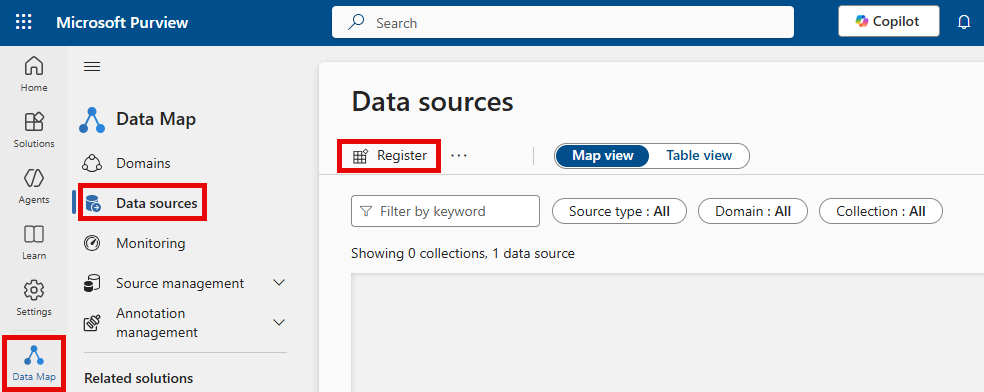

To govern Microsoft Fabric items using Microsoft Purview, you first need to establish a connection between Fabric and Purview. Once connected, the Microsoft Purview hub becomes available within Fabric, offering in-depth analysis and insights into your Fabric items. The Purview Hub acts as a gateway between Fabric and Purview.

Suppose you work for a healthcare provider, and you have licensed Purview. Now, you want to connect Purview to Fabric and explore the reports on Fabric data that Purview generates in the Microsoft Purview Hub.

In this unit, you'll explore the Purview hub.

## Connect Purview to Fabric

The steps you must complete connecting Purview to Fabric depend on whether Fabric and Purview are in the same or different tenants.

### Connect Purview to Fabric in the same tenant

The stages to complete are:

1. In Purview, register your Fabric tenant as a data source from the **Data Map** icon in the left navigation pane:

    

2. Select Fabric as a data source.

    
3. To scan Fabric, Purview needs to authenticate with it. In **Microsoft Entra ID**, configure authentication, using for example, the managed identity of your Purview account.  
4. Create a scan in Purview that uses the Fabric data source.

> [!NOTE]
> Instead of using a managed identity to authenticate Purview with Fabric, you can use a service principal or delegated authentication. For details on configuring authentication from Purview to Fabric in the same tenant, see [Connect to your Microsoft Fabric tenant in the same tenant as Microsoft Purview](/purview/register-scan-fabric-tenant?context=%2Ffabric%2Fgovernance%2Fcontext%2Fcontext-purview&tabs=Scenario1#configure-credentials-for-scans-in-microsoft-purview)

### Connect Purview to Fabric in a different tenant

If Microsoft Fabric is in a different tenant from Purview, all the same functionality is supported, except that Purview's live view isn't available for Fabric items.

When you register the Fabric tenant in Purview, the system can't identify it automatically, so you must obtain and manually enter the tenant ID.

Finally, you can't use a managed identity for authentication in cross-tenant connections. Instead, use a service principal or delegated authentication.

## What is the Microsoft Purview hub in Microsoft Fabric?

Once Purview and Fabric are connected, the Purview hub in Fabric displays reports and insights about your Fabric items. It acts as a centralized location to begin data governance and acts as a gateway to access more advanced features in Microsoft Purview.

To see the Purview hub, in Microsoft Fabric, open the Fabric settings, and then select **Microsoft Purview hub**. 

:::image type="content" source="../media/microsoft-purview-hub-general-view.png" alt-text="Screenshot of the Microsoft Purview hub admin view." lightbox="../media/microsoft-purview-hub-general-view.png":::

The tiles at the top of the Purview hub enable you to access advanced governance and compliance capabilities in Purview. The Purview hub report provides dashboards that reflect the security posture of your organization's data estate. Select the following tabs for descriptions of the report pages.

# [Overview](#tab/overview)

:::image type="content" source="../media/purview-hub-report-overview.png" alt-text="Screenshot of showing the Overview page of the Purview hub report, calling out the Take a tour button." lightbox="../media/purview-hub-report-overview.png":::

The overview page provides high-level insights about your tenant's data estate. Select the **Take a tour** button in the navigation pane for a quick introduction to the main features of the report.

# [Sensitivity labels](#tab/sensitivity-labels)

:::image type="content" source="../media/purview-hub-report-sensitivity-labels.png" alt-text="Screenshot of showing the sensitivity labels page of the Purview hub report, calling out the help button." lightbox="../media/purview-hub-report-sensitivity-labels.png":::

The sensitivity label page helps you analyze sensitivity label coverage and the distribution of confidential data throughout your tenant. The interactive, interoperable visuals help you:

* Improve label coverage: You can set the label coverage goal to flag where label coverage isn't meeting org targets. You filter by domains, workspaces, item types, or creators. Select what you wish to explore and then, in the table, you can monitor related items. Use the **Only show unlabels items** to filter for unlabeled items only.

* Monitor your classified data: You can use the label filter to select the sensitivity label you wish to explore. You can then filter by domains, workspaces, item types, or creator to find and drill down on your org's sensitive data.

The side pane shows you insights based on your selections in the report.

Select the help button at the bottom of the navigation pane for guidance about using the page.

# [Endorsement](#tab/endorsement)

:::image type="content" source="../media/purview-hub-report-endorsements.png" alt-text="Screenshot of showing the endorsements page of the Purview hub report, calling out the help button." lightbox="../media/purview-hub-report-endorsements.png":::

The endorsements page helps you monitor endorsed items (promoted, certified, and master data) and see where items with the most access might need your attention. The page helps you:

* Promote items with high visibility: You can find candidates for promotion based on view access. For example, you can set a view-access threshold to flag items with that have high visibility but no endorsement.

* Monitor your endorsed items: You can filter items by their endorsement status: promoted, certified, and master data.

The side pane shows you insights based on your selections in the report.

Select the help button at the bottom of the navigation pane for guidance about using the page.

# [Domains](#tab/domains)

:::image type="content" source="../media/purview-hub-report-domains.png" alt-text="Screenshot of showing the domains page of the Purview hub report, calling out the help button." lightbox="../media/purview-hub-report-domains.png":::

The domains page helps you visualize and understand your org's data mesh structure and the distribution of items within it. For example, you can use the hierarchy tree to find workspaces that aren't associated with any domain. Select a domain/subdomain/workspace to drill through with the items explorer page.

# [Items explorer](#tab/items-explorer)

:::image type="content" source="../media/purview-hub-report-items-explorer.png" alt-text="Screenshot of showing the items explorer page of the Purview hub report, calling out the help button." lightbox="../media/purview-hub-report-items-explorer.png":::

The items explorer page helps you monitor all the items in your tenant using granular filtering. You can use the items explorer's filters to find exactly the items you're looking for. You can see which items are located in personal workspaces, for instance, or which items were created by guest users, and much more.