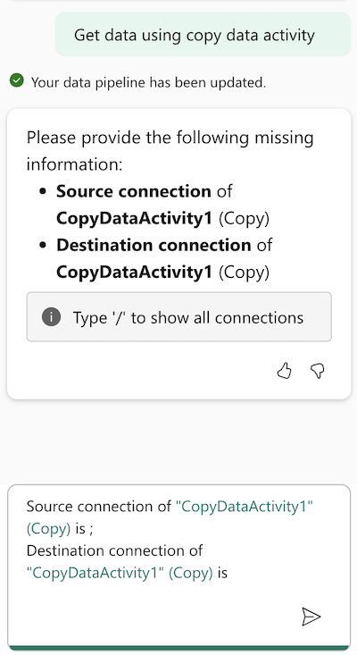

In the following scenario, we'll use Copilot to create a data pipeline that copies data from a public datasource named diabetes.tab.txt to the Lakehouse. 

## Prerequisites

The following prerequisites should be in place before you start:

- Access to a Microsoft Fabric tenant account with an active subscription. [Create a free account](https://azure.microsoft.com/free/).
- Created a Workspace with Fabric enabled: [Create a workspace](/fabric/fundamentals/create-workspaces).
- Created a Lakehouse.

## Create a connection 

In this section, you'll create a connection to the NCSU (North Carolina State University) diabetes data source. For more information about this dataset, see [Diabetes dataset](/azure/open-datasets/dataset-diabetes?tabs=azureml-opendatasets)

1. Select the gear icon in the top right corner of the Fabric portal.
2. Choose **Manage connections and gateways** from the right navigation pane.
3. Select **New** to create a new connection.
4. Choose **Cloud**.
5. **Connection name**: ncsu
6. **Connection type**: Web
7. **URL**: https://www4.stat.ncsu.edu/%7Eboos/var.select/
8. **Authentication method**: Anonymous
9. Select **Create** to create the connection and close the dialog box.

## Ingest data

1. Create a new pipeline.
2. Select the Copilot icon in the top right corner of the pipeline canvas.
3. Select the **Ingest data** suggestion and send it.
4. In the Copilot pane, notice the suggested prompt with missing information:

   > [!div class="mx-imgBorder"]
   > 

5. Locate your cursor at the end of the first sentence (source connection)
6. Type the forward slash (/) to see the list of available connections and choose the **ncsu** connection.
7. Locate your cursor at the end of the second sentence (destination connection)
8. Type the forward slash (/) to see the list of available connections and choose the **Patient_Lakehouse** connection.
   
The prompt should look something like this:

   > [!NOTE]
   > **Crafted prompt**:
   >
   > _Source connection of "CopyDataActivity" (Copy) is "ncsu" (RestService);_
   > _Destination connection of "CopyDataActivity" (Copy) is "Patient_Lakehouse" (Lakehouse)_

9. Send the prompt to Copilot.
10. In the Copilot pane, notice the suggested prompt with missing information. In this case, it needs one more piece of information: the table name in the destination lakehouse. Enter the name of the table in the destination lakehouse as **diabetes**.
   
   > [!NOTE]
   > **Crafted prompt**:
   >
   > _table of Destination connection "Patient_Lakehouse" (Lakehouse) in "CopyDataActivity" (Copy) is diabetes_

11. Select the **Copy data** activity in the pipeline canvas.
12. Navigate to the **Source** tab in the pane below.
13. Set the **Relative URL** of the source to **diabetes.txt**.
14. Set the File format to **Delimited text**.
15. Select the **Settings** button for the file format
16. Set the **Column delimiter** to **Tab (\t)** and select **OK**.
17. Select **Run this pipeline** in the copilot pane.
18. Wait for the pipeline to finish running and check the status of the pipeline in the **Output** pane.

## Transform data

1. In the copilot pane, select the **Transform data** suggestion and send it.
2. In the Copilot pane, notice the result:

   _Please click on the item in the **Pipeline validation output** to complete your pipeline settings._
   
3. Notice also the dataflow has been added to the pipeline. This dataflow is a placeholder and needs to be configured manually. Select the **Workspace** and **Dataflow**. 

4. Enter the following prompt to make sure the data gets deleted first:

   > [!NOTE]
   > **Crafted prompt**:
   >
   > Can you add a delete activity as the first activity?

5. Notice the **Delete** activity has been added to the pipeline. Select the **Delete** activity in the pipeline canvas and configure manually the **Source**.

## Summarize the pipeline

1. In the copilot pane, select the **Summarize this pipeline** suggestion and send it.
2. Notice this resulting explanation in the Copilot pane.

