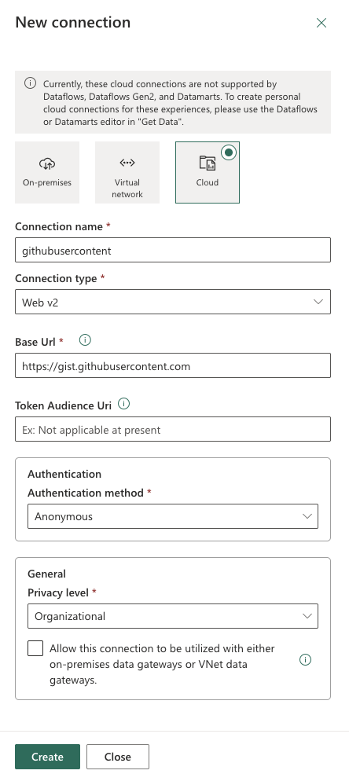

Copilot can help create a data pipeline that copies data from a public or internal datasource into a Lakehouse for analysis. Rather than a click-by-click tutorial, the focus here's on understanding the **concepts, flow, and rationale** behind each step.

Before any pipeline can run, a few foundational elements must be in place: access to a Fabric tenant with a workspace, and a Lakehouse as the destination. These are the building blocks that ensure there's both a **source** and a **target** for the data integration process.

## Create a connection

Connections are essential for linking Fabric with external data sources. Conceptually, a **connection** defines *where the data is coming from* and *how it's accessed*. Public datasets can often be ingested with anonymous authentication, while enterprise sources may require stricter credentials.

It's important to have the connections ready before you can use them in a data pipeline. Connections can be managed by selecting the **gear** icon in the top right corner of the Fabric portal, and selecting **Manage connections and gateways**. From there, you can create new connections or update existing ones.

> [!div class="mx-imgBorder"]
> [](../media/new-connection.png#lightbox)

## Ingest data with Copilot

Once the connections exist, the pipeline must know what to copy and where to put it. Copilot suggests the **Ingest data** prompt, and assists by generating a **Copy Data activity**. You still have to provide missing context such as:

* **Source connection**
* **Destination connection**
* **Target table name**

```copilot-prompt
Source connection of CopyDataActivity is [source]; destination connection is [lakehouse]; table name is [tablename].
```

> [!div class="mx-imgBorder"]
> [](../media/pipeline-00.png#lightbox)


Copilot scaffolds the activity, but the user must validate and complete it (for example, specifying file path, setting file format, and choosing the correct column delimiter). This reinforces the skill of reviewing defaults and filling in context-sensitive details.

## Transform data

Pipelines rarely stop at ingestion. Copilot can extend the workflow by suggesting **transform data** activities. As an example, you can ask Copilot the following prompt:

```copilot-prompt
Can you add a delete activity as the first activity?
```

Here, Copilot inserts a delete activity into the pipeline, demonstrating how users can restructure workflows using natural language. You still need to configure details like which source to delete from, highlighting the balance between automation and human oversight.

Conceptually, this stage shows how Copilot facilitates *pipeline orchestration* while leaving you responsible for precision and governance.

## Summarize the pipeline

Copilot can also describe the pipeline in plain language. This helps you:

- Verify that the pipeline aligns with their intent.
- Reinforce understanding of the workflow’s components.
- Reflect on how ingestion, transformation, and orchestration fit together.

As an example, consider the following prompt:

```copilot-prompt
Summarize this pipeline, turning the technical configuration into a conceptual narrative.
```

Copilot supports the **how** of building a pipeline: it scaffolds connections, ingestion, and transformation activities using natural language. It also supports the **why**: encouraging you to validate, configure, and reflect on each stage, building both confidence and transferable data engineering skills.
