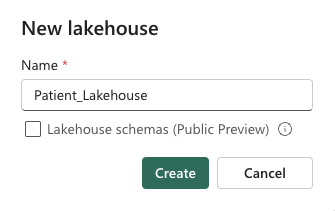
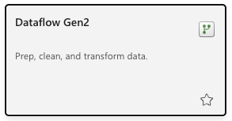
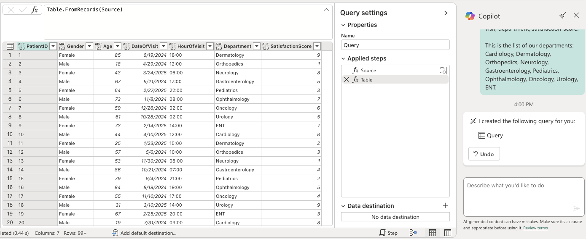
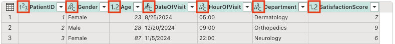
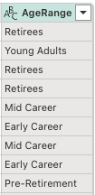
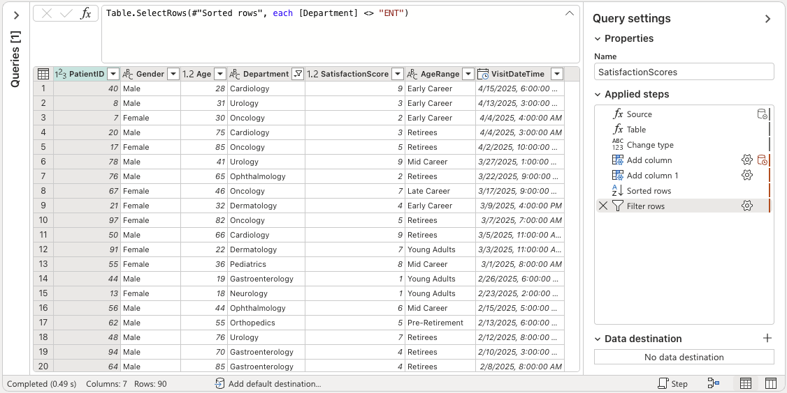
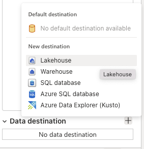

Data integration is crucial for Contoso Health to consolidate information from various sources. Dataflow Gen2 in Microsoft Fabric's Data Factory offers a visual interface for creating dataflows, enabling users to ingest and transform data seamlessly. With Copilot's integration, users can employ natural language to define data transformation steps, making the ETL process more intuitive.

In the following scenario, we'll demonstrate how Contoso Health can use Copilot to create a dataflow that extracts, transforms, and loads (ETL) patient satisfaction survey data into a Lakehouse for further analysis.

## Prerequisites

The following prerequisites should be in place before you start:

- Access to a Microsoft Fabric tenant account with an active subscription. [Create a free account](https://azure.microsoft.com/free/).
- Created a Workspace with Fabric enabled: [Create a workspace](/fabric/fundamentals/create-workspaces).

## Create a lakehouse

In this section, you create a lakehouse in Fabric.

1. In [Fabric](https://app.fabric.microsoft.com), select **Workspaces** from the navigation bar.

2. To open your workspace, enter its name in the search box located at the top and select it from the search results.

3. From the workspace, select **New item**, then select **Lakehouse**.

4. In the **New lakehouse** dialog box, enter **Patient_Lakehouse** in the **Name** field.

> [!div class="mx-imgBorder"]
> 

5. Select **Create** to create and open the new lakehouse.

## Create a dataflow

In this section, you're creating your first dataflow.

1. Navigate back to your Microsoft Fabric workspace.

2. From the workspace, select **New item**, then select **Dataflow Gen2**.

> [!div class="mx-imgBorder"]
> 

## Generate sample data

In this section, you're generating sample data for your dataflow. Normally, Contoso Health would use real data from their Electronic Health Records system, such as patient satisfaction survey data, but for this exercise, you'll generate sample data.

1. Make sure you open the Copilot pane by selecting the **Copilot** icon in the top right corner of the dataflow canvas.

2. Enter the following prompt in the Copilot pane:

    > [!NOTE]
    > **Crafted prompt**:
    >
    > _Create a new query with sample data that lists 100 patient data records and their satisfaction scores. It should include a patient-id, gender, age, date-of-visit, hour-of-visit, department, satisfaction-score._
    >
    > _This is the list of our departments: Cardiology, Dermatology, Orthopedics, Neurology, Gastroenterology, Pediatrics, Ophthalmology, Oncology, Urology, ENT._

3. Tap the send button to generate the query. Observe the sample data and the query created in the dataflow canvas (this might differ slightly depending on your environment and the latest updates to Copilot.)

> [!div class="mx-imgBorder"]
> 

## Clean and transform the data

In this section, you'll clean and transform the data using Copilot.

1. Change the data types. It's important to ensure that the data types are set correctly for each field. Enter the following prompt in the Copilot pane:

> [!NOTE]
> **Crafted prompt**:
>
> _Change the data types for the following fields:_
> 
> _- DateOfVisit and HourOfVisit to text_
> 
> _- PatientID, Age, SatisfactionScore to number_
> 
> _- Gender, Department to text_

Notice that the data types are changed in the query. We keep the DateOfVisit and HourOfVisit as text. Later, we'll merge them and convert them to DateTime data type.

> [!div class="mx-imgBorder"]
> 

2. Add a new field that takes the age and segments it into different age groups. Enter the following prompt in the Copilot pane:
   
> [!NOTE]
> **Crafted prompt**:
>
> _Add a column AgeRange (type text) that transforms the Age field:_
> _18-24: Young Adults_
> 
> _25-34: Early Career_
> 
> _35-44: Mid Career_
> 
> _45-54: Late Career_
> 
> _55-64: Pre-Retirement_
> 
> _65+: Retirees_

Notice the AgeRange column is added to the query.

> [!div class="mx-imgBorder"]
> 

3. Create a new field that combines the DateOfVisit and HourOfVisit fields. Enter the following prompt in the Copilot pane:

> [!NOTE]
> **Crafted prompt**:
>
> _Create a new field that combines the text from DateOfVisit and HourOfVisit. The new field should be called VisitDateTime and should be of type DateTime_

4. Remove the DateOfVisit and HourOfVisit fields as they are no longer needed. Then, sort the table by visit date. Enter the following prompt in the Copilot pane:
   
> [!NOTE]
> **Crafted prompt**:
>
> _Remove the DateOfVisit and HourOfVisit fields. Sort by VisitDateTime descending._

5. Remove the ENT department. Enter the following prompt in the Copilot pane:

> [!NOTE]
> **Crafted prompt**:
>
> _Remove ENT from the Departments_

6. Rename the Query to SatisfactionScores.

Your query should now look like this:

> [!div class="mx-imgBorder"]
> 

## Code explanation

For complex queries, Copilot explains the generated Mashup code, helping you understand the logic and purpose of each transformation step. 

1. Enter the following prompt in the Copilot pane:

> [!NOTE]
> **Crafted prompt**:
>
> _Describe this query_

Notice the result is generated in the Copilot pane. Here's an example of the explanation:

*Here's an explanation for **SatisfactionScores**: Generate a table of patient visit records, categorize by age range, combine date and hour into a datetime, sort by visit time, and exclude ENT department visits.*
- _**Source**: Generate a list of 100 records with patient details including ID, gender, age, date and hour of visit, department, and satisfaction score._
- _**Table**: Convert the list of records into a table._
- _**Change type**: Change the data types of the columns to appropriate types (text, number, datetime)._
- _**Add column**: Add a new column "AgeRange" categorizing patients into age groups._
- _**Add column 1**: Add a new column "VisitDateTime" combining "DateOfVisit" and "HourOfVisit" into a datetime format._
- _**Sorted rows**: Sort the table by "VisitDateTime" in descending order and remove the "DateOfVisit" and "HourOfVisit" columns._
- _**Filter rows**: Filter out rows where the department is "ENT"._

## Load the data to the Lakehouse

Now that you finished transforming and combining your data, you can configure its output destination settings. Select **Choose data destination** at the bottom of the **Query settings** pane.

> [!div class="mx-imgBorder"]
> 

Choose the **Lakehouse** option and select the **Patient_Lakehouse** lakehouse you created earlier. Select **Next**.

Within this experience, you can configure the destination lakehouse and table for your query results, in addition to the update method (Append or Replace).

Your dataflow is now ready to be published. Select **Publish**.

## Best practices

- Copilot is best equipped to handle data integration topics, so it's best to limit your questions to this area.
- If you include descriptions such as query names, column names, and values in the input, Copilot is more likely to generate useful outputs.
- Try breaking complex inputs into more granular tasks. This helps Copilot better understand your requirements and generate a more accurate output.