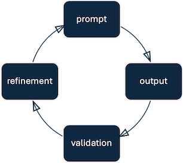

Data integration is crucial for Contoso Health to consolidate information from various sources. Dataflow Gen2 in Microsoft Fabric's Data Factory offers a visual interface for creating dataflows, enabling users to ingest and transform data seamlessly. With Copilot's integration, users can employ natural language to define data transformation steps, making the ETL process more intuitive.

Let's imagine how Contoso Health combines structured data such as patient satisfaction surveys into a unified workflow enables richer analysis and insights. Microsoft Fabric’s **Dataflow Gen2**, enhanced by **Copilot**, streamlines this process by letting users describe transformations in natural language.

Instead of focusing on every button click, this unit explores *how* the process unfolds conceptually, and *why* each step is important for building skills in data transformation. 

## How it works

Think of the process as a cycle of **prompt → output → validation → refinement**. Each stage builds on the last, and different types of transformations illustrate this cycle:

> [!div class="mx-imgBorder"]
> [](../media/prompt-cycle.png#lightbox)

**Data ingestion** is the starting point. Without data, there is nothing to transform. You might begin by generating sample records to experiment with transformations. Currently Copilot can generate sample tables, but initiating ingestion directly from an external data source through a prompt is not yet supported. Here's an example prompt:

```copilot-prompt
Create a new query with 50 patient records including patient-id, age, gender, and satisfaction-score.
```

Here's an example of what Copilot could generate:

> [!div class="mx-imgBorder"]
> [](../media/dataflow-copilot-canvas.png#lightbox)


Next, ensure the data is stored in the right formats. Correct **data types** prevent errors in calculations and make later steps more reliable. If you want, you can combine multiple data type transformations at once, like in the following example prompt:

```copilot-prompt
Change Age and SatisfactionScore to numbers; set Department as text.
```

Shaping the data often means **adding new fields** that make the dataset easier to interpret. Derived values like age groups or categories can support business-focused analysis. Here are two example prompts that add a new column, based on some classification rule you define in natural language:

```copilot-prompt
Add a new column AgeRange that groups patients into categories: 18–24 as Young Adults, 25–34 as Early Career, etc.
```

```copilot-prompt
Create a flag column that marks patients with SatisfactionScore below 4 as AtRisk.
```

**Filtering** narrows the dataset to what matters most. Removing noisy or irrelevant records improves data quality. Here are two example prompts that filter the data according to some rule you define in natural language:

```copilot-prompt
Remove rows where SatisfactionScore is less than 3.
```

```copilot-prompt
Exclude records where Department is ENT.
```

Sometimes, fields need to be combined to streamline analysis. For example, **merging** a date field with a time field avoids the need for extra joins or lookups.

```copilot-prompt
Merge DateOfVisit and HourOfVisit into a new column called VisitDateTime of type DateTime.
```

Finally, iteration is key. After each transformation, **review** the results and **refine** your prompts if something looks off. This loop helps build skill in articulating precise instructions and understanding how Copilot interprets them. Sometimes, it can be as easy as telling Copilot what to do, like in the following example prompt. You can also remove a transformation step Copilot created, and resubmit your refined prompt.

```copilot-prompt
The VisitDateTime field didn’t parse correctly—recreate it using the format yyyy-MM-dd HH:mm.
```

## Explain M code

Copilot not only executes transformations; it also explains the underlying Mashup (M) code. This transparency builds confidence by showing what happens under the hood, offers a gradual path to learn query syntax while still working in natural language, and promotes reflection as you compare your intent with the logic it generates.

```copilot-prompt
Describe this query
```

## Best practices for working with Copilot for Dataflow Gen2

- Copilot is best equipped to handle data integration topics, so it's best to limit your questions to this area.
- Start simple. Test one transformation at a time before chaining multiple steps.
- If you include descriptions such as query names, column names, and values in the input, Copilot is more likely to generate useful outputs.
- Try breaking complex inputs into more granular tasks. This helps Copilot better understand your requirements and generate a more accurate output.
- Validate after each step by reviewing the output table.
- Iterate incrementally — treat Copilot as a partner you refine with, not a one-shot generator.
- Frame prompts around clear outcomes (e.g., *“add a column that groups ages”*) instead of vague commands.
- Use the code explanations to reinforce learning and deepen technical skills.
- Regularly check how Copilot interprets prompts to improve phrasing and clarity over time.