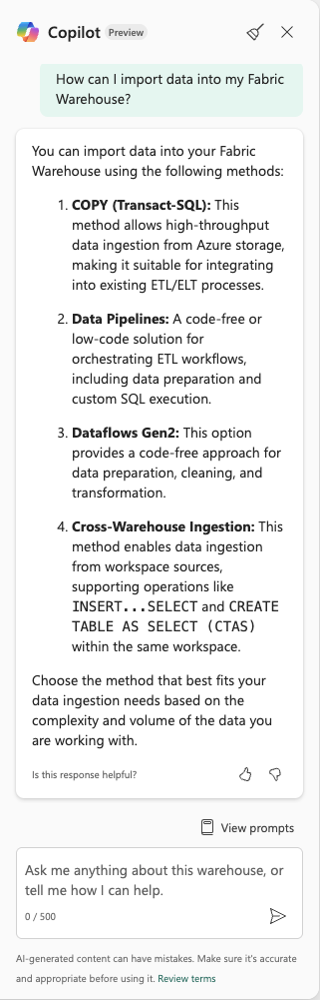
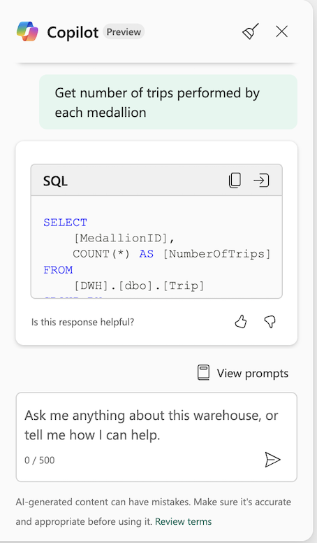
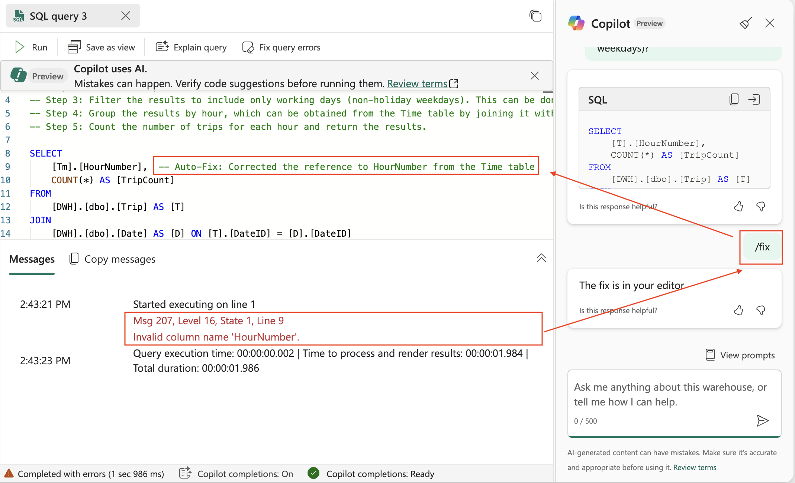

The Copilot chat pane in Microsoft Fabric's Data Warehouse allows users to interact with Copilot using natural language. This feature enables you to ask questions about your data warehouse or general data warehousing concepts. Copilot can generate SQL queries, provide explanations, and even fix errors in your queries.

## Key capabilities

The Copilot chat pane offers several capabilities. It can convert natural language prompts into T-SQL queries, enabling seamless query generation. You can ask questions about data warehousing concepts and receive detailed answers. Additionally, Copilot provides natural language explanations for T-SQL code, helping users understand complex queries. It also helps resolving T-SQL errors by offering automated suggestions to fix issues.

## How to get started

1. **Open a Warehouse**: Navigate to the Data Warehouse workload and open a warehouse.
2. **Open a New SQL Query**: Start a new SQL query.
3. **Access the Copilot Chat Pane**:
   - Select the **Copilot** button in the ribbon to open the chat pane.
   - The chat pane provides starter prompts to help you get familiar with Copilot.
4. Enter the following prompt:

> [!NOTE]
> **Crafted instruction**:
>
> _How can I import data into my Fabric Warehouse?_

> [!div class="mx-imgBorder"]
> 

You can also ask Copilot to generate T-SQL queries based on your natural language prompts. For example, you can ask for a specific query or request a summary of data.

> [!NOTE]
> **Crafted instruction**:
>
> _Get number of trips performed by each medallion._

> [!div class="mx-imgBorder"]
> 

If your query contains errors, you can ask Copilot to explain the query or fix it by using the `/` commands. In the following example, the user requested a fix for an error in the query. Copilot automatically fixed the reference to HourNumber from the Time table. 

> [!div class="mx-imgBorder"]
> 

## Advanced use cases with commands

To perform specific tasks, use the following `/` commands at the start of your chat message:

| Command          | Description                                                                 |
|-------------------|-----------------------------------------------------------------------------|
| `/generate-sql`   | Generate a SQL query from the provided prompt.                             |
| `/explain`        | Provide an explanation for the query in the active query tab.              |
| `/fix`            | Fix errors in the query in the active query tab. Optionally, add context.  |
| `/question`       | Generate a natural language response to the prompt.                        |
| `/help`           | Access documentation and guidance for using Copilot.                      |

### Examples

For `/generate-sql`, `/question`, and optionally `/fix`, include additional information regarding your intent. For example:

- `/generate-sql select numbers 1 through 10`
- `/question what types of security are supported for this warehouse?`
- `/fix using CTAS instead of ALTER TABLE`

## Summary

The Copilot chat pane in Fabric's Data Warehouse is a powerful tool for generating SQL queries, fixing errors, and learning about data warehousing. By using natural language and advanced commands, you can streamline your workflow and enhance productivity.
