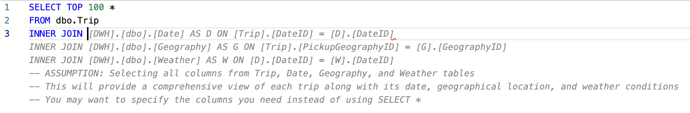
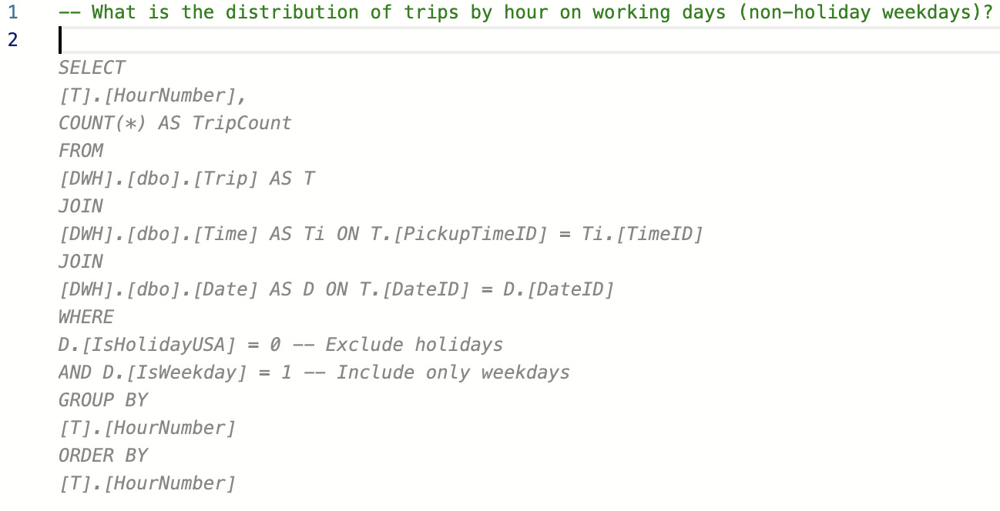

Copilot in Fabric for Data Warehouse enhances your coding experience by providing intelligent, context-aware T-SQL code suggestions directly in the query editor. It uses your warehouse schema and query context to offer inline completions, ranging from finishing a single line to generating entire blocks of code. This feature helps you write SQL faster, avoid errors, and improve the quality of your queries. Whether you're new to SQL or an experienced user, Copilot reduces the effort of writing repetitive code and allows you to focus on designing and optimizing your warehouse.

## Prerequisites
To get started, ensure your administrator has enabled the Copilot tenant switch and that your capacity is in a supported region. Paid SKUs (F64 or higher, or P1 or higher) are required, as trial SKUs aren't supported. If your tenant settings restrict data processing to specific geographic regions, confirm that the necessary permissions are enabled.

Next, make sure you have a warehouse created in your Fabric workspace. In this learn module, we'll use the [**sample warehouse**](/fabric/data-warehouse/create-warehouse-sample) provided by Microsoft. 

## How to Use Copilot Code Completion

Start typing your query in the SQL editor, and Copilot provides real-time suggestions as dimmed ghost text. You can accept a suggestion by pressing `Tab` or dismiss it by continuing to type. If you prefer to accept only part of a suggestion, use the `Ctrl+Right` shortcut (`Cmd+Right` on macOS) to accept the next word. Copilot also offers alternative suggestions for the same input, which you can preview by hovering over the suggestion and selecting the best fit.

> [!div class="mx-imgBorder"]
> 

To guide Copilot, you can leave comments in your query using `--`. For example, writing `-- What is the distribution of trips by hour on working days (non-holiday weekdays)?` prompts Copilot to generate a corresponding query. This approach helps you write clear and accurate comments while also using Copilot to create efficient SQL code.

> [!div class="mx-imgBorder"]
> 

Copilot can provide different suggestions for the same input. You can hover over the suggestion to preview the other options.
