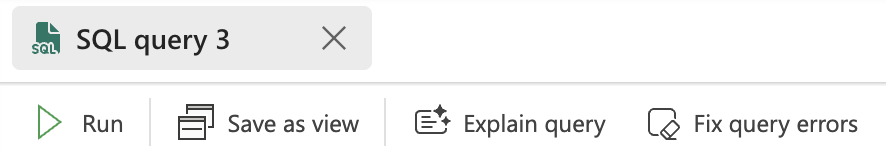
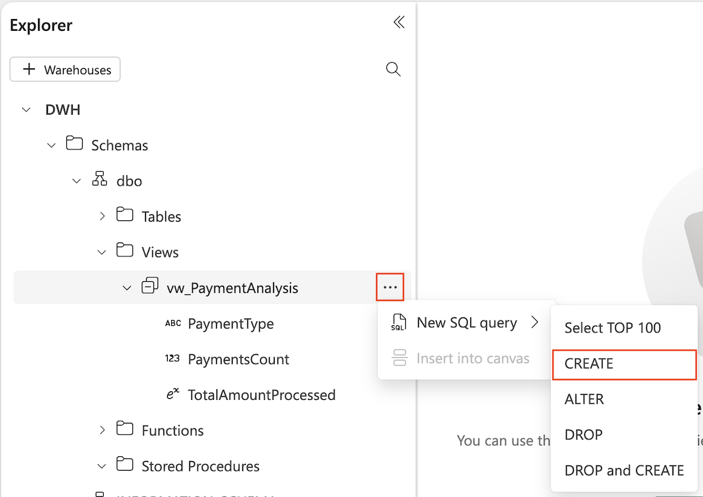

Copilot in Microsoft Fabric's Data Warehouse provides two AI-powered quick actions: **Explain** and **Fix**. These actions help you write, understand, and debug SQL queries more efficiently. Located at the top of the SQL query editor, near the **Run** button, these quick actions accelerate productivity by simplifying complex tasks.

- **Explain**: Adds a summary at the top of the query and inline comments throughout the query to describe its functionality.
- **Fix**: Automatically resolves syntax or logic errors in your query, using the SQL error message as context.

> [!div class="mx-imgBorder"]
> [](../media/fix-explain.png#lightbox)

Copilot uses your warehouse schema, query tab contents, and execution results to provide relevant feedback.

## Example

With your sample warehouse open, expand the views, and select the **vw_PaymentAnalysis** view. Select the 3 dots next to the view and select **New SQL Query** > **CREATE**. This opens a new tab with the T-SQL from the view.

> [!div class="mx-imgBorder"]
> [](../media/quick-actions.png#lightbox)

Notice the **Explain** and **Fix** buttons at the top of the query editor. When you select **Explain**, Copilot analyzes your query and generates inline comments that explain what your code does. If applicable, Copilot leaves a summary at the top of the query as well. The comments appear next to the relevant lines of code in your query editor. You can edit or delete the comments as needed. 

```sql
-- Create a view named vw_PaymentAnalysis to analyze payment data
CREATE VIEW [dbo].[vw_PaymentAnalysis] AS
SELECT
    -- Select the type of payment from the Trip table
    PaymentType,
    -- Count the number of payments for each payment type
    COUNT(T.PaymentType) AS PaymentsCount,
    -- Sum the total amount processed for each payment type
    SUM(TotalAmount) AS TotalAmountProcessed
FROM 
    dbo.Trip AS T
-- Join the Trip table with the Date table on the DateID column
JOIN 
    dbo.[Date] AS D
    ON T.[DateID] = D.[DateID]
-- Filter the results to include only records from the year 2013
WHERE 
    YEAR(D.[Date]) = 2013
-- Group the results by PaymentType to aggregate the counts and sums
GROUP BY    
    PaymentType
```

## Summary

The **Explain** and **Fix** quick actions in Copilot are powerful tools for simplifying SQL query development and debugging. By using these features, you can enhance your productivity and gain deeper insights into your queries.
