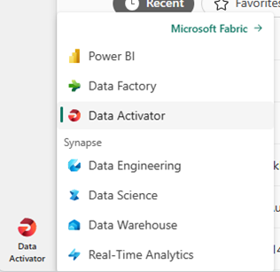
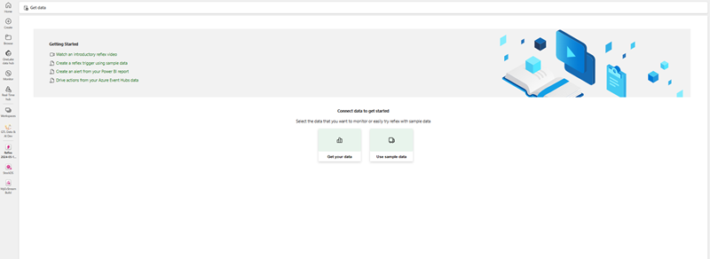
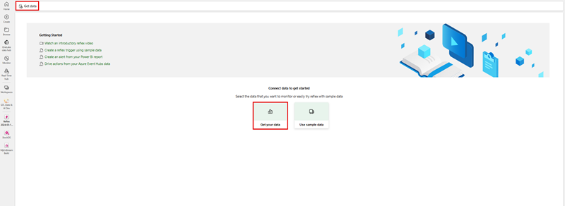
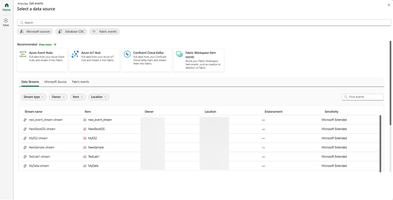
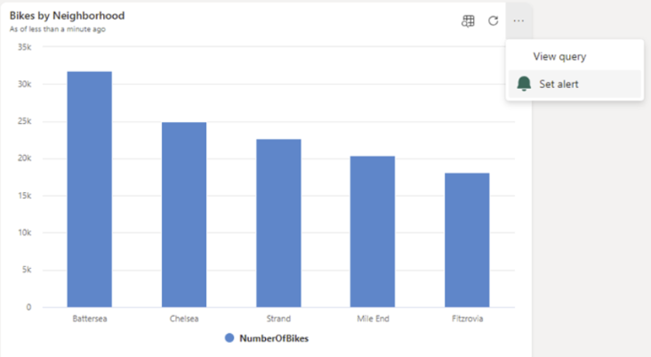
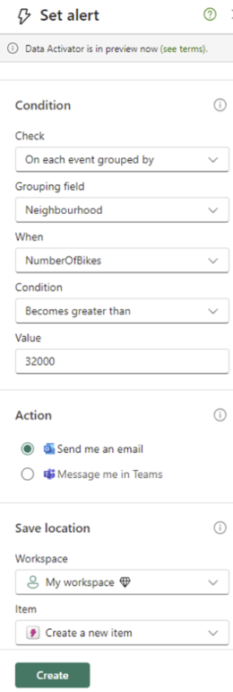

This section guides you through the initial setup process, from activation to understanding its essential elements.

> [!NOTE]
> For the public preview, verify that your organization has workspaces with a Fabric capacity and that Data Activator is available in your region, As a preview feature, Data Activator may not be available in all Azure regions.

## Select the Data Activator experience

To begin using Data Activator in Microsoft Fabric, select ***Data Activator*** from the menu. This option customizes your Fabric experience to Data Activator.

## Create a Reflex

Just like other Fabric experiences, the first thing you do with Data Activator is set up an item in your Fabric Workspace. Data Activator’s items are known as Reflexes. A Reflex item contains all the necessary details to connect to data sources, monitor conditions, and initiate actions. You're likely to set up a Reflex for each business segment or process you're monitoring.

Let's go ahead and create a Reflex item in your Fabric workspace. From the New menu in the workspace, choose the ***Reflex*** item.

[  ] (../media/get-reflex-data-large.png)

## Navigate between data mode and design mode

Once you've selected the option to create a Reflex, you see the **Get data** buttons and the **Get sample data** button in the canvas.

Next, you learn how to connect to data sources, create triggers to monitor conditions and initiate actions.

## Select a streaming data source

When you select get-data, you're presented with existing data stream events that you can add actions to.

## Select set alert on a tile in your Real-Time Dashboard

You can use Data Activator to trigger notifications when conditions are met on data in a Real-time Dashboard. For example, if you have a Real-Time Dashboard displaying real-time availability of bicycles for hire in multiple locations, you can trigger an alert if there are too few bicycles available in any one location. You can send alert notifications either to yourself, or to others in your organization, via either email or Microsoft Teams.

To begin creating a trigger from a Real-Time Dashboard:

1. Browse to your Real-Time Dashboard.
1. Toggle from ***viewing > editing*** mode in the toolbar.
1. Choose a tile on the Real-Time Dashboard for Data Activator to monitor.
1. Select the ***More menu (...)*** on the right-top of the tile, and select ***Set alert***. 

    

## Define alert conditions

Once you determine that you want alerted, you see the **Set alert** pane, and can take more steps for configuration:

1. In the ***Condition*** dropdowns and the ***Action*** radio buttons, you specify the condition and how you would like to receive the alert.
1. In the ***Action*** section, you can receive the alert via email of Microsoft Teams.
1. In the ***Save location*** you choose the workspace and whether you want to use an existing reflex item or ***create*** a new one.

 