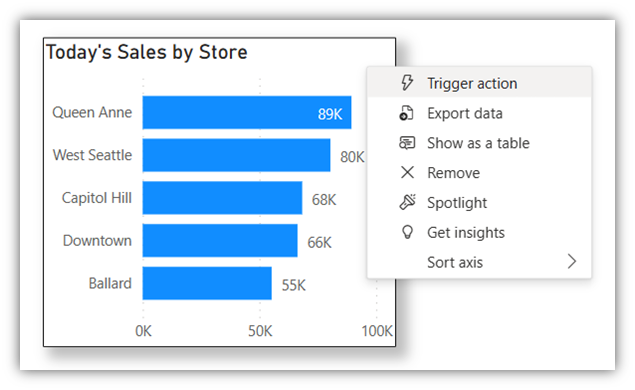
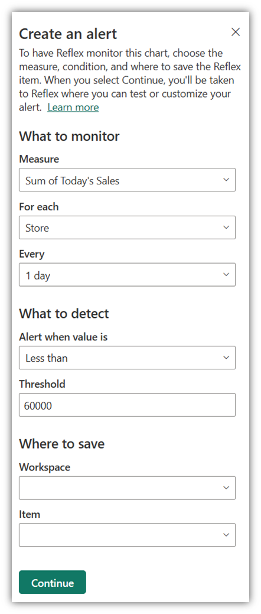
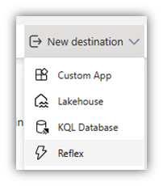
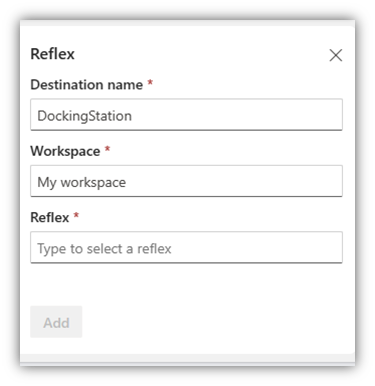

 With Data Activator, you can trigger notifications when you observe data that meets specific predetermined conditions.   This unit guides you through the process of setting up these alerts in the context of *Power BI* reports and *EventStreams*.

## Power BI Reports

Using Data Activator, you can set up notifications that get triggered based on specific conditions met by the data in a Power BI report. Consider a scenario where you have a Power BI report that tracks the monthly website traffic. You can configure Data Activator to send an alert if the traffic falls below a certain threshold at any given time, enabling you to respond promptly.

> [!NOTE]
> Ensure you have a Power BI report published online to a Fabric workspace in a Premium capacity before you start. Data Activator currently supports Power BI visuals that have both an X-axis and Y-axis, excluding time dimension visuals on the X-axis.

Let's walk through the steps of setting up a notification based on a Power BI report.

To trigger an action on a Power BI visual, you would first select **Trigger Action** on your report. For example, the following screenshot shows an example of how to trigger an action from a visual that displays today’s sales for each store in a retail chain.



Once you pick a report to monitor, you define your Data Activator trigger.  It’s here where you would define *what to monitor*, or what measure Data Activator should keep track of in that report and the frequency of checking the measure’s value. Here you also define *what to detect*, in other words the condition that triggers the alert. And you define *where to save* or store the Data Activator trigger, either by selecting an existing Reflex or creating a new one. For example, the following screenshot shows how you would create a trigger that fires daily if the sales for any store drop under $60,000.



The last thing remaining is to add an action to your trigger. Here you add an email or Teams notification to your trigger.

## EventStreams

Let’s now learn how to connect Data Activator to your real-time data in Fabric DataStreams.  With Data Activator, you can then set up notifications or actions based on specific conditions met by the data in the Fabric EventStream. For example, you might have a scenario where you have a Fabric EventStream where you track the monthly website traffic. You can configure Data Activator to send an alert if the traffic falls below a certain threshold at any given time. This action enables you to respond promptly to these or similar alerts.

> [!NOTE]
> You need two things to start using EventStreams in Fabric, an EventStream item, and an existing connection to a Source. Each event in the source must be formatted as a JSON dictionary, with one of the dictionary keys denoting a unique object ID. For example, PackageID is our unique key in the following event:

```json
{ 
  "PackageID": "PKG_123", 
  "Temperature": 25 
} 
```

All you need to set your Data Activator connection to the EventStream is to add the *Reflex* as a *New destination* on the EventStream item. You're now ready to assign your data to some objects.





In the next unit, we'll cover assigning data in Data Activator.
