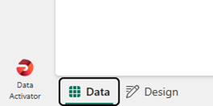
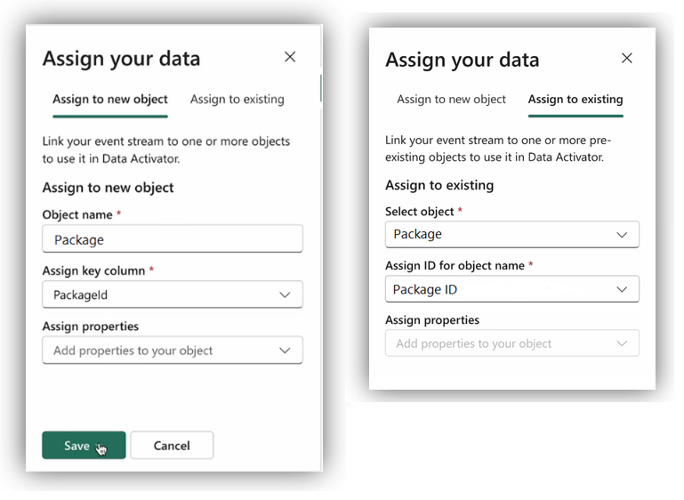
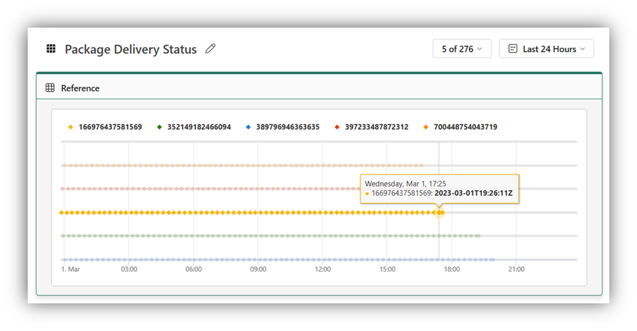

So far, we have learned how to configure Data Activator to get data from Power BI and EventStreams. In this unit, we introduce how to assign data to objects using ***Data Mode***.

## Data Mode

Your first task was to get the data, now you need to assign the events to objects. To use this mode, you start by selecting **Data Mode** from the tab at the bottom of the screen.

> [!NOTE]
> If you started from Power BI, Data Activator automatically assigns your data to a newly created object, allowing you to bypass this section unless you are also integrating with events from EventStreams.

Once you choose the events you want to track, it's time to *assign your data* to those events. You can assign your data to one or more new or existing objects. Here, you define the object name, the key column that uniquely defines the object you're monitoring and if needed, assign a *property*. We'll cover properties in more detail in the next unit.

Once an object is created, you'll switch to the **Design mode**, where you can see what’s happening for each object, over time. You notice a chart displaying event data from the past 24 hours, which can be customized according to your preferences. For example, let's consider you assigned the data for a retail company that is the tracking delivery of its packages. In the following screenshot, the status by minute of each package out for delivery is returned.

Data Activator allows you to assign data to one or more objects. You can assign several data streams to a single object or even link one event source to various objects, making it easier to monitor different data facets. However, when you're adding data to an existing object, it's critical to use the correct key column to prevent unexpected results. This approach helps you create a detailed and efficient monitoring system.

In the next unit, you learn how to create triggers to monitor conditions and initiate actions.
