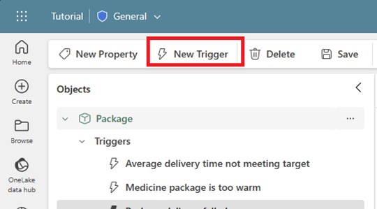
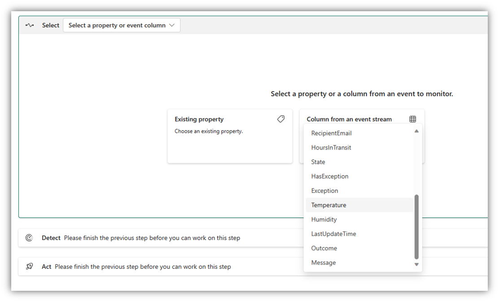
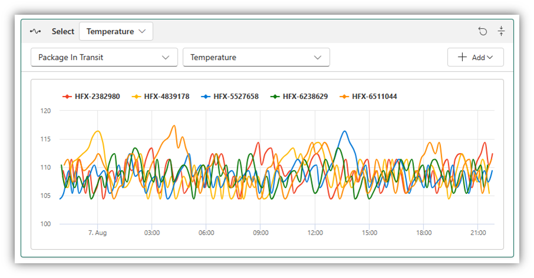
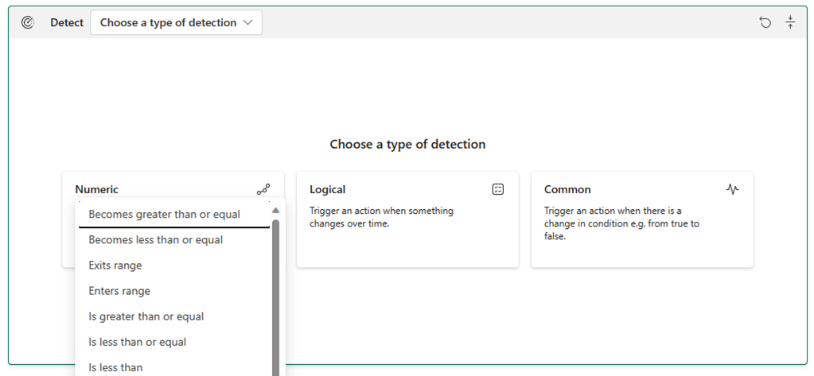
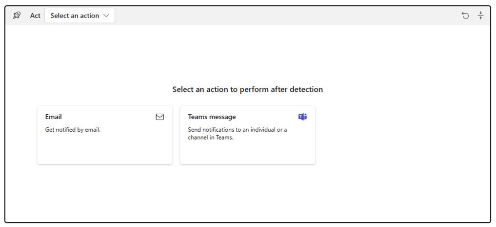
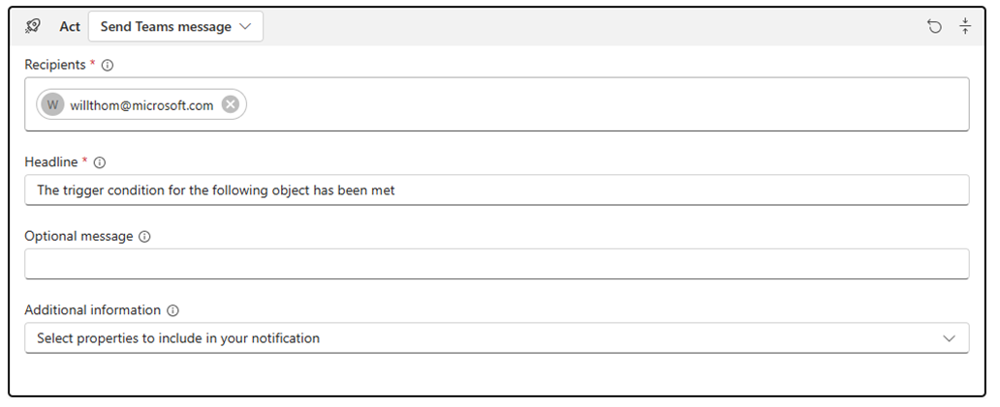
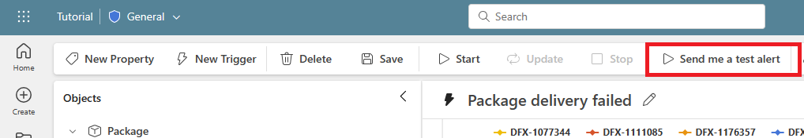
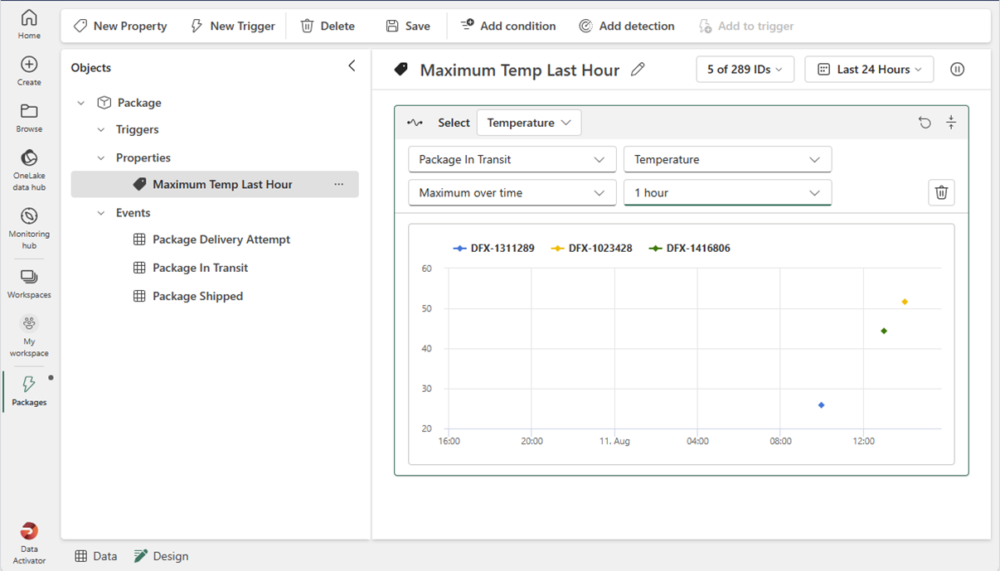
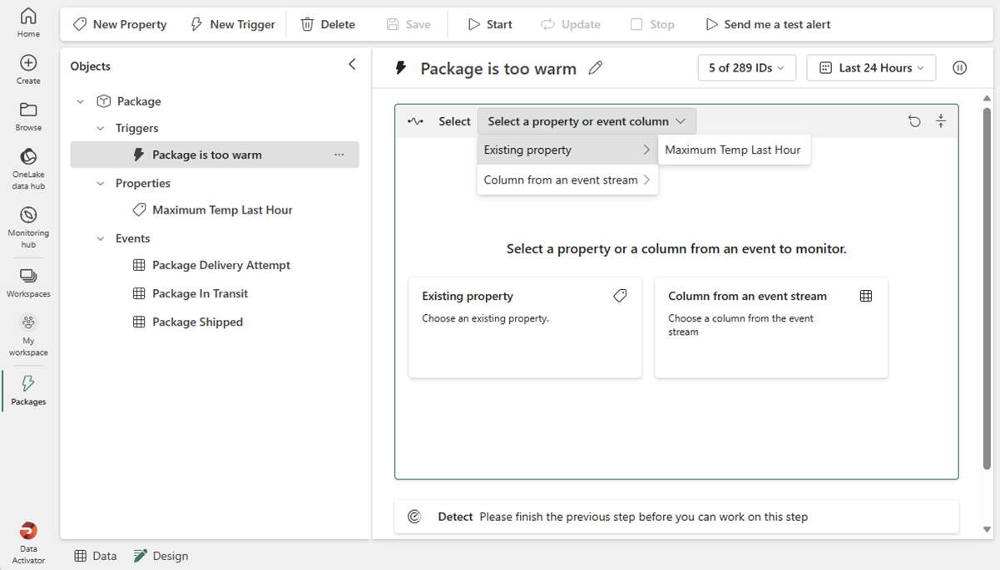

All the required pieces for Data Activator are now in place, the last thing you need to do is act on them and create our triggers against your data. You do that using Data Activator’s Design Mode.

## Design Mode

To create triggers to perform some action against our data, we select **Design Mode** from the tab at the bottom of the screen.

To get your triggers up and running you will:

- Define a trigger condition and action in Data Activator.
- Optionally, create *properties* in Data Activator.

### Define a trigger condition and action in Data Activator

Data Activator’s triggers define the conditions and actions to perform based on what’s happening in the data. Let's consider the following example, you work at pharmaceutical company and would like to monitor the temperature of multiple packages you need to ship.  You need an alert to be sent to the shipping department when the temperature exceeds 48 degrees. You start by creating a new trigger.

Then you select your data by  either choosing a column from an event, or from a property you’ve already defined. In our example, you would pick the temperature column like the next screenshot demonstrates.

Once you pick your column or property, Data Activator returns a preview of the values for a sample of the instances of the object. For example, in this screenshot, Data Activator returns the temperature of different packages in the last 24 hours.

It’s now time to define the conditions you want to detect. You can:

- Choose a *numeric* condition like when the battery level falls below 20%.
- Choose a *logical* condition like when a device average temperature goes above 150 degrees.
- Choose a *common* true/false condition like when a production line sensor has been triggered.

In our example, you choose a numeric condition, and set the value to greater than 48 degrees. Once the condition has been set, two charts are returned based on your historic data.  The first chart displays a few samples when the condition was detected. And the second chart returns the total number of triggers that would have been fired. For your packages with temperature greater than 48-degrees example, the following charts would be returned.

So far you have defined the trigger condition, now you need to define the action. You can choose to send an email, send a text message, or start a workflow. In our example, you send a Team's message to the shipping department.

Depending on the action you choose, you're prompted to provide additional information. For example, if you choose to send an email, you're asked to provide the email address of the recipient, the subject, and the body of the email. In our example, you're asked to provide the recipients, headline, optional message and any additional information you want to send.

Before you start your new trigger, it might be a good idea to test it by selecting to ***Send me a test alert***. An alert finds a historical occurrence of the condition and sends you an alert, regardless of the recipient field in the previous dialog.

Once the trigger is created, you can start it, stop it or modify it. To start it, select **Start** from the Data Activator toolbar.  When your trigger is in a running state, you can either select **Stop** to stop it, or select **Update** if you have made any changes to the trigger and want those changes to take effect on the currently running trigger.

### Create properties in Data Activator

There are many times when you would use the same trigger logic on multiple triggers. Properties allow you to define a condition or measure once and use that property across multiple triggers.

You select to create a **New Property**, then define your property logic. For example, on this screenshot, we define a property called Maximum Temp last hour on a package object.

Once you have defined a property, you can reference it from one or more triggers, via the select card. This screenshot references the property we made earlier in a Package too warm trigger.

Now that you have covered all the basics of Data Activator, it's time to put them into practice in the following exercise.
