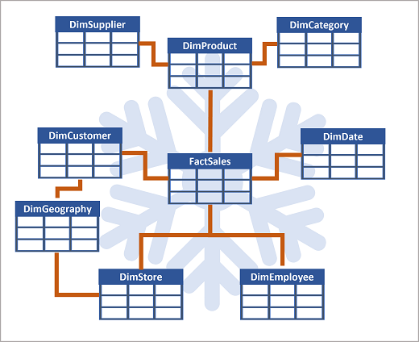

---
ms.custom:
  - build-2023
---
The process of building a modern data warehouse typically consists of:

- Data ingestion - moving data from source systems into a data warehouse.
- Data storage - storing the data in a format that is optimized for analytics.
- Data processing - transforming the data into a format that is ready for consumption by analytical tools.
- Data analysis and delivery - analyzing the data to gain insights and delivering those insights to the business.

Microsoft Fabric enables data engineers and analysts to ingest, store, transform, and visualize data all in one tool with both a low-code and traditional experience.

## Understand Fabric's data warehouse experience

Fabric's *data warehouse* is a relational data warehouse that supports the full transactional T-SQL capabilities you'd expect from an enterprise data warehouse. It's a fully managed, scalable, and highly available data warehouse that can be used to store and query data in the Lakehouse. Using the data warehouse, you're fully in control of creating tables, loading, transforming, and querying data using either the Fabric portal or T-SQL commands. You can use SQL to query and analyze the data, or use Spark to process the data and create machine learning models.

Data warehouses in Fabric facilitate collaboration between data engineers and data analysts, working together in the same experience. Data engineers build a relational layer on top of data in the Lakehouse, where analysts can use T-SQL and Power BI to explore the data.

## Design a data warehouse

Like all relational databases, Fabric's data warehouse contains tables to store your data for analytics later. Most commonly, these tables are organized in a schema that is optimized for multidimensional modeling. In this approach, numerical data related to events (e.g. sales orders) are grouped by different attributes (e.g. date, customer, store). For instance, you can analyze the total amount paid for sales orders that occurred on a specific date or at a particular store.

### Tables in a data warehouse

Tables in a data warehouse are typically organized in a way that supports efficient and effective analysis of large amounts of data. This organization is often referred to as dimensional modeling, which involves structuring tables into fact tables and dimension tables.

**Fact tables** contain the numerical data that you want to analyze. Fact tables typically have a large number of rows and are the primary source of data for analysis. For example, a fact table might contain the total amount paid for sales orders that occurred on a specific date or at a particular store.

**Dimension tables** contain descriptive information about the data in the fact tables. Dimension tables typically have a small number of rows and are used to provide context for the data in the fact tables. For example, a dimension table might contain information about the customers who placed sales orders.

In addition to attribute columns, a dimension table contains a unique key column that uniquely identifies each row in the table. In fact, it's common for a dimension table to include two key columns:

- A *surrogate key* is a unique identifier for each row in the dimension table. It's often an integer value that is automatically generated by the database management system when a new row is inserted into the table.
- An *alternate key* is often a natural or business key that identifies a specific instance of an entity in the transactional source system - such as a product code or a customer ID.

You need both surrogate and alternate keys in a data warehouse, because they serve different purposes. Surrogate keys are specific to the data warehouse and help to maintain consistency and accuracy in the data. Alternate keys on the other hand are specific to the source system and help to maintain traceability between the data warehouse and the source system.

#### Special types of dimension tables

Special types of dimensions provide additional context and enable more comprehensive data analysis.

*Time dimensions* provide information about the time period in which an event occurred. This table enables data analysts to aggregate data over temporal intervals. For example, a time dimension might include columns for the year, quarter, month, and day in which a sales order was placed.

*Slowly changing dimensions* are dimension tables that track changes to dimension attributes over time, like changes to a customer's address or a product's price. They're significant in a data warehouse because they enable users to analyze and understand changes to data over time. Slowly changing dimensions ensure that data stays up-to-date and accurate, which is imperative to making good business decisions.

### Data warehouse schema designs

In most transactional databases that are used in business applications, the data is *normalized* to reduce duplication. In a data warehouse however, the dimension data is generally *de-normalized* to reduce the number of joins required to query the data.

Often, a data warehouse is organized as a *star schema*, in which a fact table is directly related to the dimension tables, as shown in this example:

You can use the attributes of something to group together numbers in the fact table at different levels. For example, you could find the total sales revenue for a whole region or just for one customer. The information for each level can be stored in the same dimension table.

> [!TIP]
> See [What is a star schema?](https://learn.microsoft.com/power-bi/guidance/star-schema) for more information on designing star schemas for Fabric.

If there are lots of levels or some information is shared by different things, it might make sense to use a *snowflake schema* instead. Here's an example:

In this case, the **DimProduct** table has been split up (normalized) to create separate dimension tables for product categories and suppliers.

- Each row in the **DimProduct** table contains key values for the corresponding rows in the **DimCategory** and **DimSupplier tables**.

A **DimGeography** table has been added containing information on where customers and stores are located.

- Each row in the **DimCustomer** and **DimStore** tables contains a key value for the corresponding row in the **DimGeography** table.
